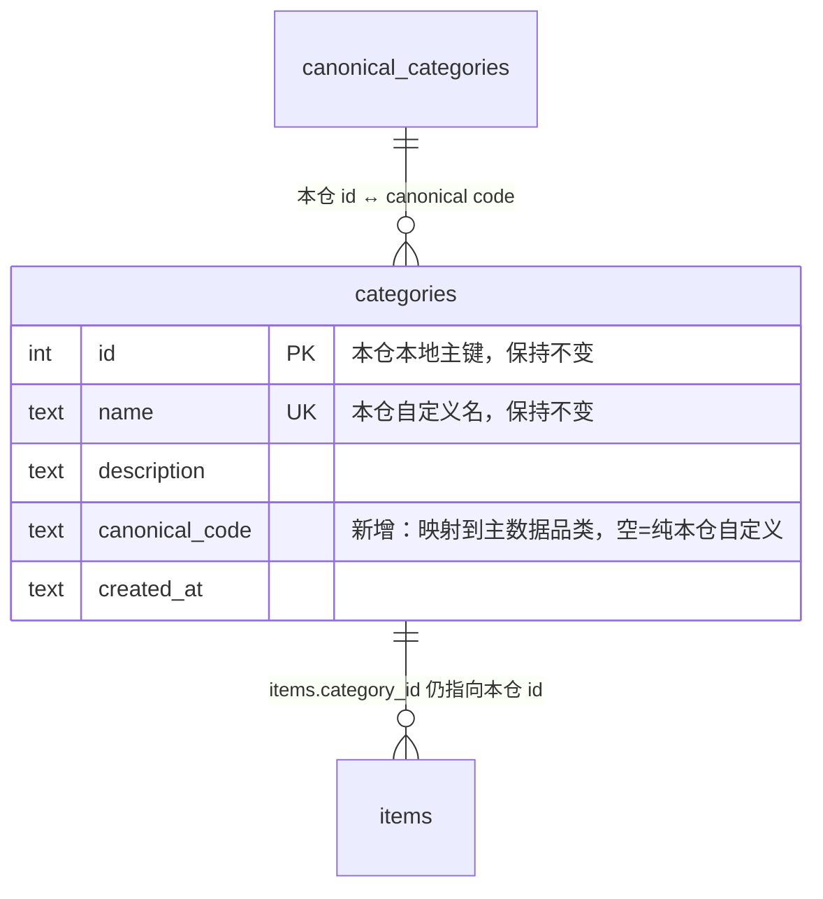
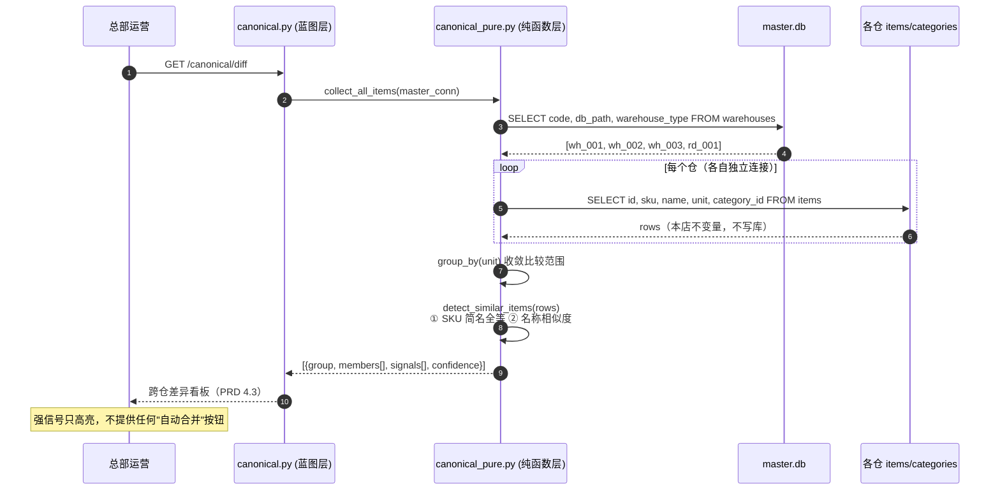
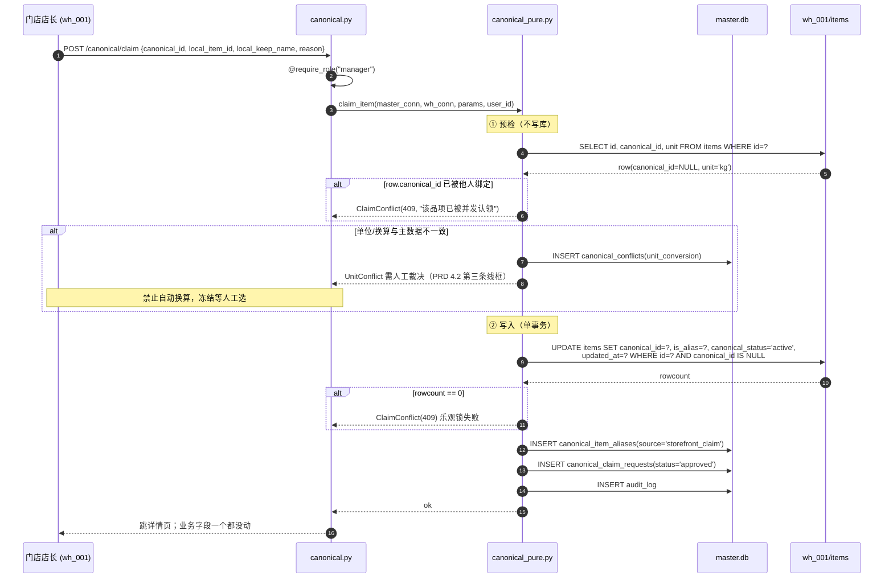
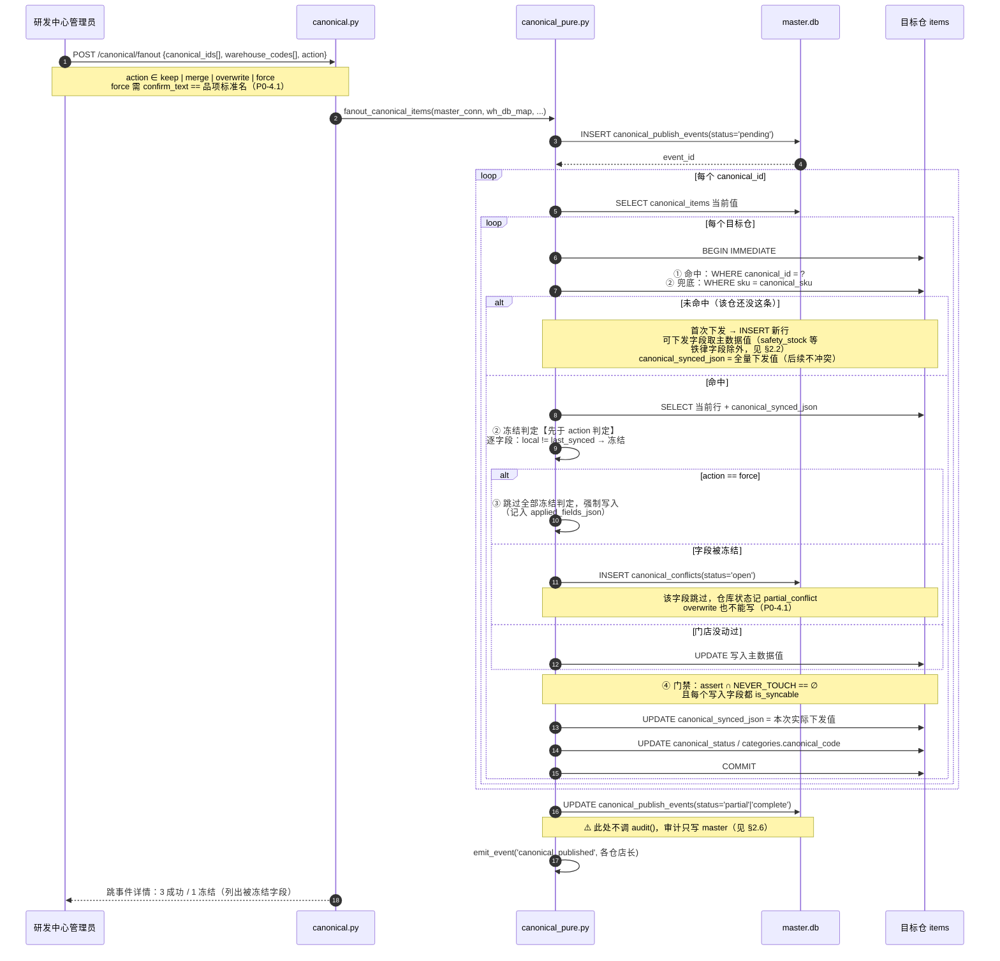
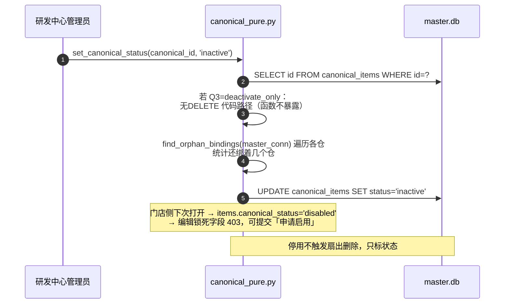
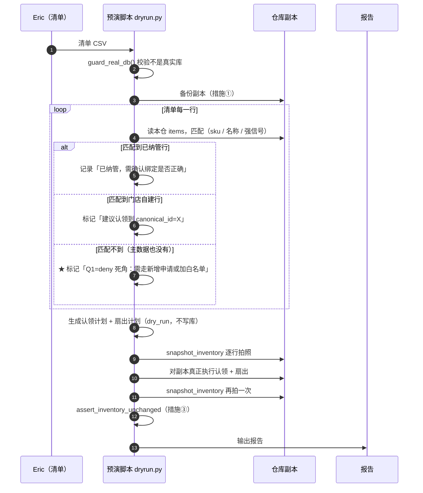

# 技术设计：库存品项跨仓统一治理（Canonical Item / 主数据）

- 日期：2026-10-04（v4 落盘）
- 作者：software-architect
- 上游PRD：`docs/2026-10-03-canonical-item-prd.md`（含 PM 修订：Q6、P0-4.1、验收口径 7 条）
- 上游事实：`docs/2026-10-03-prod-data-findings.md`（生产 8 仓 / 431 品项 / 12,451 引用的实据）
- 状态：**实施蓝图 v4**。Q1=deny / Q2=open / Q3=deactivate_only / Q4=freeze / Q6 延后 / Q7=库存零丢失，全部已拍板。
- **范围（v4 收敛）**：8 仓 → **5 仓**（`wh_000` / `wh_002` / `wh_003` / `wh_004` / `wh_006`）。`wh_001`（中央仓，已关）、`wh_010`（空店）、`rd_001`（研发中心空仓）**均不纳入本轮**。
- **报表口径（v4 收敛）**：**不写跨仓总报表**。各仓各看各的，跨仓视图只服务于「认领时的同物候选」与「冲突处理」两个动作。
- 定位：实施蓝图。给工程师直接拆任务用；**唯一允许写代码的位置是 §6.4 的 `_open_warehouse()` 修正**。
- 修订记录：
  - v2 — 纳入 PM 新增的 Q6（售价归属）与 P0-4.1（force 降级），新增 §1.5、§2.6、§3.5、§7.6
  - v3 — Eric 拍板 Q1=deny / Q2=open / Q3=deactivate_only / Q4=freeze；新增 Q7「库存数据零丢失」（最高优先级）；新增 §1.6 白名单设计、§2.7 字段扩展成本清单、§7.7 库存保护七条措施、§7.8 回滚、§7.9 清单驱动预演
  - **v4 — Eric 拍板范围收敛（8→5 仓，wh_001/010/rd_001 排除，报表口径=不写总报表）；新增 §0.4 9 条规格品项拆分定义、§1.7 aux_unit/aux_rate 锁死方案（含 items.py:68-69 gram_per_unit 耦合）、§1.8 WP0105 淡奶油 1箱=12盒 落地设计、§1.9 「明确不做」清单（含跨仓总报表）、§6.4 _open_warehouse() 完整路径修正实现代码、§4.0/§4.1 M1/M2 按生产 431 行规模校准（T22 / T6 改以 SKU 全等为主判据）、§4.4 M1 收尾 4 个流程测试（改名/改单位、冲突冻结、新增主数据、停用主数据）、§7.10 WP0231 换算率缺失处理**

---

## 0. 设计前提与被冻结的现状事实

以下均为**实测核实**的事实（2026-10-03，4 个真实仓库库文件），设计直接引用，不重复论证。

| 事实 | 出处 |
| --- | --- |
| `master.db`（用户/仓库/权限/跨仓元数据）+ 每仓独立 SQLite `db/warehouses/{code}.db` | `db/__init__.py:1-9` |
| 仓连接按请求获取，缺列自动补 | `db/__init__.py:34-51`（`get_warehouse_db()`） |
| **各仓 `items` 列已漂移，且「DDL 声明类型」与「实际存储类型」不一致** —— 详见下方专门说明 | 实测 DDL + `typeof()` |
| **门店自建品项共 24 行（8 个品项 × 3 个门店仓），SKU 形如 `WH001-冰块-9935`，各仓独立编号，同物不同 SKU** | 实测，`sku LIKE 'WH%'` |
| **门店品项被 8 张业务表引用，规模远超 items 行数本身** —— 详见下方专门说明 | 实测计数 |
| `categories` 各仓独立：rd_001/wh_002/wh_003 各 9 个，wh_001 有 12 个；同名不同 id | 现状数据 |
| 固定 9 品类定义 | `config.py:26-36`（`FIXED_CATEGORIES`） |
| 发布匹配键`WHERE sku = ?` | `blueprints/publish_recipe_pure.py:378` |
| 品类按名字符串匹配、自动创建 | `blueprints/publish_recipe_pure.py:360-374` |
| `action` 三选一`overwrite`/`keep`/`merge` | `blueprints/publish_recipe_pure.py:400/403/423` |
| 时间格式 `now_str()` = `%Y-%m-%d %H:%M:%S` | `blueprints/publish_recipe_pure.py:33` |
| 事件三表`item_publish_events` / `..._warehouses` / `..._items` | `db/__init__.py:207-238` |
| 通知 `emit_event` 白名单目前只有 `recipe_published` | `blueprints/notifications_pure.py:15` |
| master schema 变更必须进 `init_master_db()`，否则 prod 首个认证请求即 `no such column` | `db/__init__.py:443-465`（含 flock，issue #9） |
| 跨仓扇出已有「per-storefront 部分成功、不回滚」语义 | `blueprints/publish_recipe_pure.py:450+` |
| 本项目惯例：纯函数层 `*_pure.py` + 蓝图层分离，测试两层 `test_*_pure.py` / `test_*_route.py` | `forecast_pure.py` / `procurement_pure.py` / `recipe_cost_pure.py` / `publish_recipe_pure.py` |

### 0.1 ⚠️ 前提一：v4 范围（**5 仓 / 不写总报表**）

**v4 的范围与 v3 不同，写在第一页前提位置，工程师必须先建立这个认知。**

| 维度 | v3（dev 4 仓） | **v4（生产 5 仓，wh_001/010/rd_001 排除）** |
| --- | --- | --- |
| 仓库 | wh_001 / wh_002 / wh_003 / rd_001 | **wh_000 / wh_002 / wh_003 / wh_004 / wh_006** |
| 仓库数 | 4 | **5** |
| 报表口径 | US-7「全公司口径一张表」 | **不写总报表**（Eric 原话）。各仓各看各的，跨仓视图只服务于「认领候选」+「冲突处理」两个动作 |
| 种子数据规模 | 8 条（dev §0.3） | **431 条**（生产快照；§4.0/§4.1 已校准 T22 工作量） |
| 中央仓（wh_001） | 在场、12 品类多一个 `initial_quantity` 列 | **本轮不纳入**（已关，库存 33 行 / 引用 625 条**保留现状不动**） |
| 空仓（wh_010） | 未出现 | **本轮不纳入**（0 品项 0 引用，开店即生效） |
| 研发中心（rd_001） | 有 5 条 | **本轮不纳入**（生产 `rd_001.items = 0`，主数据源由 master 侧 `canonical_items` 承载，研发中心发布走现有 `publish_recipe_pure` 路径，与本设计无冲突） |

**对现有 v3 章节的影响**（必须替换的措辞）：

- §0.2、§0.3 中所有「wh_001」「4 仓」「3 仓」一律改为「5 仓」「wh_000/002/003/004/006」。
- §3.1 跨仓差异看板、四类统计的「全公司 3 个仓各造一个冰块」类示例：保留为算法示意，但报告示例中的仓列表改为 wh_000/002/003/004/006。
- §4.1 T22 验证 fixture：8 条 → 431 条（§0.3 + §4.0.2 已说明 CSV 来源）。
- §7.2、§7.3、§7.5 等历史行文：「4 仓」改为「5 仓」；「wh_001 有 initial_quantity 列」改为「**wh_001 不在范围**」（该列问题本轮不会触发，但 §0.1 列出的 `initial_quantity` 缺列陷阱**在 M1 不会受影响**，M1 不跨仓读该列）。
- **删除**：US-7「总部运营：全公司口径一张表」相关 UI 线框与字段口径描述（PRD §2 第 76 行 + PRD §4.3 跨仓差异查看页的「全公司汇总」），由各仓独立差异看板替代。

### 0.1a ⚠️ 前提一：`items` 的类型声明与实际存储不一致（**跨仓读取一律不假设类型**）

**这一条是§7.7 Q7「不做类型统一改造」的根本原因，工程师必须先建立这个认知再看 §7.7。**

v4 5 仓实测（生产快照，2026-10-03）：

| 仓 | DDL 声明 | 实际存储（`typeof`） | 浮点脏值实例 |
| --- | --- | --- | --- |
| wh_000 | `quantity REAL` | `real` | 4.33 / 0.0 |
| wh_002 | `quantity INTEGER` | **`real` ×48 + `integer` ×21** | 0.3399999999999998 / 0.4000000000000005 / 0.20000000000000212 |
| wh_003 | `quantity REAL` | `real` | 1.01 / 0.3599999999999996 / 0.12999999999999926 |
| wh_004 | `quantity REAL` | `real` | 1.2999999999999996 / 0.04000000000000048 |
| wh_006 | `quantity REAL` | `real` | 0.25 / 0.36000000000000004 |

**`initial_quantity` 列：5 仓均无**（生产快照中只有 wh_001 有这一列，但 wh_001 已排除在本轮外）。本轮跨仓读取**不会触发该陷阱**，但 §7.7.2 措施 ④ `select_item_columns` 仍要保留——为「未来 wh_001 被重新纳入」留位。

**wh_002 是最危险的一个**：DDL 声明 INTEGER，却同时存着 48 个 real 和 21 个 integer。dev 环境 wh_002 存 0.5 只是偶发，生产是**普遍现象**。

**结论（写进代码的纪律）**：

1. **光看 DDL 会误判类型** —— 声明 `INTEGER` 的列可以存 REAL 值（SQLite 弱类型）。
2. **禁止 `int(row["quantity"])` 与 `CAST(quantity AS INT)`** —— 会把 49.5 静默变 49、0.5 变 0，库存凭空少。
3. 跨仓比较**一律用 `assert_inventory_unchanged` 的字典比较**（Python `49.5 == 49.5`、`1 == 1.0` 天然为真，跨 INTEGER/REAL 安全），见 §7.7.2 措施 ③。
4. **新增**：wh_002 浮点脏值的 6 个真实值（`0.34 / 0.4 / 0.2` 等）必须作为 T3 / T23 的验证 fixture（§4.1）。

### 0.2 前提二：引用链规模（`items.id` 不变性是硬约束）

**这是 Q7「库存零丢失」的量化底数。** v4 5 仓生产数据合计引用约 **12,451 条**：

| 仓 | items 行数 | 引用总数 | 明细（部分） |
| --- | --- | --- | --- |
| wh_000 | 89 | 347 | stock_movements 167 / outbound 108 / restock 39 / product_bom 33 |
| wh_002 | 69 | **4691** | stock_movements 1707 / outbound 1249 / production_run_items 744 / restock 191 / product_bom 46 |
| wh_003 | 94 | **5336** | outbound 1320 / stock_movements 1858 / stocktakes 1144 / production_run_items 782 / product_bom 120 / restock 112 |
| wh_004 | 71 | 1158 | outbound 307 / production_run_items 239 / stock_movements 375 / stocktakes 106 |
| wh_006 | 75 | 294 | stock_movements 101 / stocktakes 48 / outbound 47 / restock 44 |
| **合计** | **398** | **≈12,451** | |

**因此 `items.id` 的不变性比 `quantity` 字段本身更重要**：

- `quantity` 错了，改回来即可（且有历史单据可对账）。
- **`items.id` 变了，这 12,451 条引用全部断链** —— wh_003 一个仓就有 5336 条引用不可逆。这类损坏**不可逆、无法从数据本身恢复**。

**这就是 §7.7.2 措施⑤（主键不变式）被列为必做项的原因**，也是 §3.2 认领铁律（只 `UPDATE`、绝不 `INSERT`/`DELETE`）的根本理由。

### 0.3 前提三：5 仓统一验收定义（v4 新增，★核心交付定义）

**这是 v4 范围下的硬验收口径。** 验收时按此逐条核对，**任一不过则视为未达 M1 完成**。

**定义 1：共用同一套主数据项集合**

- `canonical_items`（master.db 侧）是**全公司唯一**的「品项是什么」真源。
- 5 个仓是它的**子集**：每个仓的 `items.canonical_id` 必须指向 `canonical_items.id`；每条主数据项至少绑一个仓（可绑零仓，那是「仅 master 侧定义、未下发」状态）。
- **5 仓不是各仓独立造主数据**：禁止在 master 侧按「wh_000 主数据」「wh_002 主数据」分表，**全部在同一个 `canonical_items` 表内**。

**定义 2：5 仓「100% 一致」的具体含义**

| 维度 | 一致 = 验收通过 | 不一致 = 验收失败 |
| --- | --- | --- |
| `canonical_items.id` 集合 | 全 5 仓 `items.canonical_id` 引用同一集合（按 `canonical_id IS NOT NULL` 取集） | 任何一仓有 `canonical_id IS NULL` 的品项**未进 `list_unbound_storefront_items`** |
| **9 条规格品项拆分** | 9 个 SKU 各自对应 2 个 `canonical_items`（桶装 + 散装），5 仓各按规格认领 | 任何 1 个 SKU 仍指同一个 `canonical_items`（未拆） |
| **字段策略常量** | `CANONICAL_FIELD_POLICY` / `NEVER_TOUCH_COLUMNS` / `STOREFRONT_OWNED_FIELDS` 三者交集全部为空（§2.7.3 三个红线单测全过） | 任一交集非空 |
| **品类映射** | 5 仓 `categories.canonical_code` 全部指向同一套 9 个 `canonical_categories.code`（缺映射的进人工清单，**不算不一致**） | 任何一仓 `canonical_code` 误填成另一个仓的本地 code |
| **库存数值** | 5 仓 `items` `id` 集合 + 逐行 `quantity`（Python `repr` 字符串逐字比对）= 操作前 | 任何漂移 |
| **引用表行数** | 9 张引用表（`stock_movements` / `outbound_requests` / `stocktakes` / `production_run_items` / `restock_requests` / `adjustment_requests` / `product_bom` / `ic_recipe_items` / `recipe_items`）5 仓合计行数 = 操作前 | 任何减少 |
| **`canonical_items` 行数** | 等于「9 条规格品项 × 2 + 其余同物候选 × 1」 + `seed_default_canonical_items()` 8 条种子 = 上线目标值 | 与目标值不符 |

**9 条规格品项拆分（v4 核心交付，第 1 条验收项的细化）**

> 详见 §1.7 与 §2.7-a。本节先给结论：**9 条规格品项 = 8 条桶装/散装对 + 1 条 WP0105 淡奶油（1箱=12盒 单位换算特例）**。

| # | SKU | 桶装（canonical A） | 散装（canonical B） | 备注 |
| --- | --- | --- | --- | --- |
| 1 | WP0129 | 榛子巧克力 / 桶 | 榛子巧克力-散 / 罐 | — |
| 2 | WP0212 | 希腊酸奶风味酱 / 桶 | 希腊酸奶风味酱 - 散 / 罐 | — |
| 3 | WP0213 | 焦糖酱 / 桶 | 焦糖酱 - 散 / 罐 | — |
| 4 | WP0215 | （仅散，无桶对应；桶不创建） | 重瓣玫瑰花粉 - 散 / 罐 | **桶装不创建主数据项**（§1.7 解释） |
| 5 | WP0216 | 玫瑰调味酱 / 桶 | 玫瑰调味酱 - 散 / 罐 | — |
| 6 | WP0217 | 有色树莓调味酱 / 桶 | 有色树莓调味酱 - 散 / 罐 | — |
| 7 | WP0218 | 无色树莓调味酱 / 桶 | 无色树莓调味酱 - 散 / 罐 | — |
| 8 | WP0219 | 橙子酱 / 桶 | 橙子酱 - 散 / 罐 | — |
| 9 | WP0223 | 草莓风味酱 / 桶 | 草莓风味酱-散 / 罐 | — |
| **特殊** | WP0105 | 淡奶油 / 盒 + 箱（**1箱=12盒**） | （不分两品项，§1.8） | **unit_conversion 例外**：单 canonical 项 + aux_unit/aux_rate 表征换算 |

**WP0231 巧克力布朗尼酱**：与 9 条不冲突，作为「散装项无对应桶装的同物」特例在 §7.10 处理（换算率缺失的统一应对）。


## 1. 实现方案与框架选型

### 1.1 结论：主数据放 `master.db`，**同意PRD P0-1**

补充 PRD 未展开的三条理由：

1. **连接成本为零**。`get_master_db()` 已经挂在 `g` 上（`db/__init__.py:24-31`），主数据读写不需要新的连接管理代码。独立库意味着多一套 `get_canonical_db()`、多一套 `close_dbs` 键、多一套 flock、多一套备份脚本——在这个项目里全是纯负担。
2. **扇出天然是「master 读 → 各仓写」的单向**。主数据在master，扇出函数的入参就是已有的 master 连接，不需要为「先写主库再开仓库」设计两阶段。放独立库时每次扇出要多开一个连接且无法与 `recipe_publish_events` 同事务。
3. **反向不成立**。门店仓可以整仓拷走做灾备，但主数据本来就不该跟着门店仓走——门店仓的 `items` 降级为「本地视图 + 库存」，主数据在 master 才是正确方向。

**不做的**：不引入独立主数据库、不做主库读写分离、不做 master 多副本。触发重新评估的条件写死在文档里：门店数 > 30，或 `canonical_items` 行数 > 5000 且 `init_master_db()` 启动耗时 > 200ms。任一发生再拆。

### 1.2 绑定关系存在哪里：**只存各仓 `items.canonical_id`，不建 master 侧 bindings 表**

这是本设计最关键的一个取舍，明确论证：

**候选A｜各仓 `items` 加 `canonical_id` 列（采纳）**
**候选 B｜master 侧建 `canonical_item_bindings`（warehouse_code + item_id → canonical_id）**

采纳 A，理由：

- 扇出时无论如何都要打开目标仓去 `UPDATE items`，A 是写入路径上的必需状态，不是冗余。
- B能省掉「遍历 4 个仓」的读开销，但4 个仓 × 一次 `SELECT ... WHERE canonical_id = ?`（走索引）= 4 次索引查询，实测在毫秒级，**换不来任何可感知收益**。
- B 是**双写真源**：扇出时要写 master 还要写各仓，两边不一致时（写完 master 写仓失败）需要额外的对账逻辑。A 只有一份真源，没有对账问题。
- 「跨仓口径」统计（PRD 验收 2、US-7 看板）确实需要全局视图，但这是一个**只读函数**遍历各仓即可（`canonical_pure.collect_bindings(master_conn)`），不是必须落表的理由。

**代价与接受理由**：孤儿引用检查、停用影响面分析都要遍历各仓。这是刻意接受的——用「多写一个纯函数」换「消掉一整类双写 bug」，在单人维护的系统里这个交换是划算的。

### 1.3 「上次下发值」存在哪里：各仓 `items.canonical_synced_json` 单列 JSON

**结论：不加6 个 `last_canonical_*` 列，也不建独立快照表。**

| 候选 | 判定 | 理由 |
| --- | --- | --- |
| 各仓加 5-6 个 `last_canonical_*` 列 | ✗ | 每增删一个可下发字段，就要改「全仓迁移 + 比较函数 + 冲突列展示 + 差异看板」四处。Q1-Q4 拍板会增删字段，这四处会反复改。 |
| 各仓单独快照表 `canonical_item_field_snapshots` | ✗ | 冲突检测就发生在同一条 `UPDATE items` 语句的前一刻，多一次 join 换不来语义收益；且快照表会有「快照行与items 行 1:1」的一致性负担。 |
| **各仓 `items` 加1 个 `canonical_synced_json TEXT`** | ✓ | 字段集合随配置伸缩，改一处代码即可；写在items 行上，天然随事务提交/回滚。 |

**JSON 里存什么**（关键：只存**可下发字段**，门店自治字段一律不入）：

```json
{"name": "冰块", "unit": "kg", "gram_per_unit": 0, "aux_unit": null, "aux_rate": 0}
```

**门店自治字段（`category_id` / `selling_price` / `unit_cost` / `safety_stock`）不入 JSON**，因此它们**永远不可能触发冲突**——这正是 PRD 要的「门店售价/安全库存/库存数量一个都不被改」（PRD 验收 3）。

**「认领前的历史值怎么留档」——答案是「不需要留档」**：

认领操作对门店行的写入被严格限定为 3 列：`canonical_id`、`is_alias`、`canonical_status`。**业务字段（`name` / `unit` / 售价 / 库存 / 分类）一个都不写**。因此「认领前的值」= 「认领后的值」，历史值天然原地保留，不存在需要另存快照的时刻。

门店想保留的本地叫法（PRD 4.2「本地保留名」），走`canonical_item_aliases` 表（master 侧，`source='storefront_claim'`），**`items.name` 永远不动**。

### 1.4 明确不做的（标准做法但对本项目是负担）
| 不做 | 理由 |
| --- | --- |
| 消息队列 / 异步任务 | 4 个仓、单人维护，扇出是秒级同步操作。Celery/RQ 的部署与排障成本远超收益。 |
| 分布式事务 / 两阶段提交 | 现有扇出已经是「per-storefront 部分成功、不回滚」（`publish_recipe_pure.py:450+`）。沿用同一语义，改成 2PC 只会把「3 个仓成功 1 个失败」变成「全部回滚」，而库存/单据已经产生的写入无法回滚。 |
| 跨库外键约束 | SQLite 不支持跨文件外键。绑定关系是**引用完整性靠应用层保证**的，靠`find_orphan_bindings()` 巡检，不靠 DB 约束。 |
| 跨仓合并为一个物理 item 行 | 会断掉 `stock_movements` / `recipe_items` / `product_bom` 的外键链（`db/__init__.py:266-440`）。**永远不合并行，只合并身份。** |
| `rapidfuzz` / `python-Levenshtein` 依赖 | 见 §7.3，`difflib` 够用。 |
| 跨仓品项分布式锁 | 见 §7.4，乐观锁（`WHERE canonical_id IS NULL` 的 `rowcount`）足够。 |
| 门店自建品项审批流 | PRD 已明确排到 P2-4。 |
| 独立的「主数据编辑 → 版本 → 回滚」体系 | P0 阶段主数据编辑直接改 `canonical_items` + 走 `audit_log`。版本历史排 P2-1。 |

### 1.5 Q6 分支设计：售价到底进不进 `canonical_synced_json`

PM 新增的 Q6（PRD 第329-336 行）是**唯一会改变数据模型形态**的分叉，PM 也判断「这是本 PRD 里唯一可能需要重写矩阵的分支」。本节把它收敛成一个布尔开关，**拍板后不用改设计，只填值**。

**关键设计判断：把售价是否入JSON 做成「策略决定的，不是二选一写死的」**

我在 §1.3 定的铁律是「门店自治字段与库存字段一律不入 JSON」。Q6 若答案是「研发统一定价」，售价就要变成**可下发字段**，按§1.3 的定义就**必须入 JSON**（否则冲突检测失去比较基准）。所以这条铁律的准确表述必须是：

> **凡是「可被主数据下发」的字段，一律入 `canonical_synced_json`；凡是「永不下发」的字段，一律不入。**
> 而「是否可下发」由 `CANONICAL_FIELD_POLICY` 单点决定，**不允许在别处硬编码**。

这条表述让 Q6 变成一次常量赋值，而不是一次重构。

```python
# config.py —— ★ Q1-Q4 已由 Eric 拍板（2026-10-03）；Q6 仍待定
CANONICAL_POLICY = {
    # ── Eric 已拍板 ──
    "q1_storefront_new_item": "deny",        # deny（Eric：「门店不能自建全新品项」）
    "q2_storefront_field_count": "open",     # open（Eric：「允许门店自定义字段」）
    "q3_canonical_delete": "deactivate_only",# 「只允许停用，禁止物理删除」
    "q4_fanout_conflict": "freeze",          # 「冻结，然后人工处理」
    "q7_inventory_protection": "strict",     # 「不希望这次改动让库存数据丢失」

    # ── Q1=deny 的强制配套（见 §1.6）──
    "storefront_new_item_whitelist": (),     # 紧急通道，默认空。Q1=deny 必配

    # ── 待定 ──
    "q6_price_ownership": "storefront_autonomous",  # PRD 倾向，延后到 M1 后拍板
}
```

**Q1=deny 的直接后果（本设计最重要的一条影响）**：

门店**不能**再创建主数据里没有的品项。这把「主数据完整度」从「治理质量问题」升级为「**门店能否正常营业**」的前置条件。三个连带设计义务：

1. **必须配套白名单通道**（§1.6）——否则门店遇到真实缺料时只能绕过系统私记，脏数据比 Q1=allow 更糟。
2. **主数据必须先有存量**——M1 需要「批量创建主数据项」的能力（原计划没有，见 §4.0.2 与任务 T22）。
3. **现有门店自建品项（wh_001 12 条 / wh_002 13 条 / wh_003 13 条 / rd_001 5 条）必须全部纳管或标记豁免**，否则这些品项在门店的「新建/选用」流程里会出现「搜不到、又不能建」的死角（§7.7.4 给了这条的兜底设计）。


**两种取值下的完整差异**（这是给工程师的 if/else 清单）：

| 维度 | `storefront_autonomous`（PRD 倾向） | `canonical_managed`（Q6 另一答案） |
| --- | --- | --- |
| `canonical_items` 新增列 | 无 | **`selling_price` / `unit_cost` 两列**（nullable，NULL=未定价） |
| `CANONICAL_FIELD_POLICY["selling_price"]` | 不设条目 | `("overwritable", "selling_price")` |
| `CANONICAL_FIELD_POLICY["unit_cost"]` | 不设条目 | `("overwritable", "unit_cost")` |
| **是否入 `canonical_synced_json`** | **否**（§1.3 铁律） | **是**（它们变成可下发字段） |
| `NEVER_TOUCH_COLUMNS` | 含 `selling_price` / `unit_cost` | **必须移除这两项**，否则 `assert_no_never_touch` 会把自己的策略挡掉 |
| `STOREFRONT_OWNED_FIELDS` | 6 项（Q2 锁 6） | **降为 4 项**（售价/采购价升为「主数据定价 + 门店可覆盖」）→ Q2 的 6 也随之变5 |
| 各仓 `items` 新增列 | 5 列（§2.2） | **6 列**，多一列 `price_follow_canonical INTEGER NOT NULL DEFAULT 0`（门店是否跟随主数据售价） |
| 门店侧 UI（`edit_item.html`） | 售价自由编辑 | 售价编辑框**多一个「跟随主数据」勾选**；勾选时输入框只读 |
| 冲突检测 | 售价**永不产生冲突** | 门店取消跟随时售价进冲突页；**跟随中**改主数据售价会正常下发（这是 Q6=canonical_managed 的目的） |
| 跨仓差异页 | 售价差异只作展示 | **多一个「全公司统一售价」视图**（PM 明确要求） |
| 扇出时 `safety_stock` | 永不下发 | **仍然永不下发**（Q6 只涉及售价/采购价，Q2 的安全库存不受影响） |

**Q6=canonical_managed 的额外工作量：约 +1.25 人日**（T4 加 2 列 +0.25；T3 加 1 列 +0.25；T8 扇出加跟随分支 +0.5；T10 UI 加勾选与统一售价视图 +0.25）。

**我的倾向（与 PRD 一致，但给一个 PM 没提到的补充）**：

倾向 `storefront_autonomous`。**补充一条 PRD 未提的判断依据**：Q6=canonical_managed 有一个隐藏代价——它把 `selling_price` 变成可下发字段后，**售价就进入了冲突检测范围**，于是「主数据改售价 → 门店跟随时被改价」这个动作会变得极其敏感（改错一次价就是全公司门店价格错一次，且要走完 4 个仓）。而§1.1 的核心论点是「统一『是什么』，不统一『多少钱』」，Q6=canonical_managed 与这个论点直接冲突。

**但这不构成反对理由，只影响默认值的风险评估**。所以我的建议是：**先按 `storefront_autonomous` 实现（M1 阶段本来就不做扇出，Q6 完全不影响 M1 交付）**，把 Q6 推迟到 M2 开始前再拍。理由：M1 有 1-2 周的自然观察期，Eric 可以在真实数据上看一眼「门店现在实际在用谁的售价」，那时回答 Q6 有事实依据，而不是靠回忆。

**这一条建议写进§4 的 M1/M2 拆分理由里。**

### 1.6 Q1=deny 的白名单通道设计（★Q1 拍板为 deny，此节成为必做项）

Eric 拍板「门店不能自建全新品项」。我在 v2 §7.5 第 8 条写过：**Q1=deny 必须同时提供紧急通道，否则门店遇到主数据里确实没有的物料时只能绕过系统私记，脏数据比允许自建更糟。** 这里把它落成设计。

#### 1.6.1 白名单粒度：按「品类」放行，不按品项名

**倾向：按品类放行（`category_code` 白名单），不按具体品项名。**

| 方案 | 优点 | 缺点 | 判定 |
| --- | --- | --- | --- |
| **按品类**（`whitelist_categories = ("包材", "辅料")`） | 白名单是**小集合**（2-5 项），可枚举、可审计、可与 `canonical_categories` 对账；门店在授权品类下**仍需填品名/单位/数量**，总部只需审「这个品类下新增了什么」 | 需要门店自己判断品类对不对，可能填错品类绕开 |✅ **采纳** |
| 按品项名（`whitelist_items = ("冰块-大块", "珍珠-散装")`） | 精确 | 白名单会长成一份**影子主数据**，与主数据重复维护，且必然滞后（每加一个例外就要改 config） | ✗ |
| 按门店（`whitelist_warehouses = ("wh_003",)`） | 实现最简单 | 粒度太粗，等于对某些仓放开全部自建，Q1=deny 的治理目标落空 | ✗ |

**关键理由**：按品项名白名单会**变成第二份主数据**，与 Eric 建立主数据的目的直接矛盾。品类白名单则是「授权范围」而不是「物品清单」——**白名单回答「谁有资格提新品」，主数据回答「现在有什么」，两者职责不重叠。**

#### 1.6.2 白名单的存储与读取

```python
# config.py
CANONICAL_POLICY = {
    ...
    # 紧急通道：授权品类。新建品项时若本仓品类在白名单内，允许创建。
    # 该品项立即被标记 is_store_exclusive=1（门店专属，不进主数据），
    # 并出现在总部「门店专属品项」巡检列表里（P1-3 收编/豁免流程的输入）。
    "storefront_new_item_whitelist": (
        # 存 category_code（与 canonical_categories.code 同源），不是中文名
    ),
}
```

**为什么存 `code` 而不是中文品类名**：`categories.name` 各仓不同（PRD P0-2 事实），只有 `code` 是跨仓稳定键（§6.1）。若存中文名，wh_001 的「生产工具」和 wh_002 的「工具」会变成两条白名单项。

**改为数据库表还是 config 常量？** 倾向**先用 config 常量**（`()` 元组，4 个仓规模下够用），理由：白名单是「低频变更、高影响」的配置，放 config 意味着**改一次要重启服务**，这恰好是 Eric 想要的白名单应有的份量（不会被随手加）。**若将来 Eric 觉得需要热改，再从 config 迁到 master 侧一张两行的表**——`CANONICAL_POLICY` 里的读取函数 `whitelist_categories()` 已经把这层间接留好了。

#### 1.6.3 `is_store_exclusive` 列：v2 说 deny 不预埋，现在改为**必须预埋**

**v2 的判断已失效，重新判断结论：Q1=deny 反而更应该预埋。**

v2 的逻辑是「deny 就不需要这个标记字段」，但引入白名单后逻辑变了：

| 情况 | 有白名单 | 无白名单 |
| --- | --- | --- |
| 门店通过白名单新建品项 | **需要标记这是「门店专属、不进主数据」**，否则总部无法巡检、无法收编 | — |
| 现状的存量门店自建品项 | — | **仍需要标记**（否则与主数据项混在一起，差异页无法区分「纳管」与「私货」） |

**结论：无论白名单是否启用，`is_store_exclusive` 都要预埋。** 理由是存量纳管（M1 的核心工作）本身就需要这个标记——`is_store_exclusive=1` 表示「这家门店自己造的，总部尚未收编」，这是 US-8/PRD P1-3 的输入数据。

```python
# is_store_exclusive 的三种取值语义（Q1=deny 后语义变清晰）
# 0 = 已纳管主数据（canonical_id IS NOT NULL 且 status='active'）
# 1 = 门店专属（白名单新建，或存量私货尚未收编）
# NULL = 未标记（迁移前的存量行，NULL 视为「未纳管」，需巡检归类）
```

#### 1.6.4 拦截 UX：拒绝时给门店三条出路

Q1=deny 后，门店在 `items.py` POST 被拒时**必须**有出路，否则运营会被卡死。设计三条，按优先级：

```python
# blueprints/items.py POST 分支
policy = check_new_item_policy(category_id, name, canonical_id)
if not policy["allowed"]:
    flash(policy["reason"])
    # reason 文本里必须包含下面三条出路中的至少一条
```

| 出路 | 触发条件 | 落点 |
| --- | --- | --- |
| **① 引导选用主数据** | 主数据里有相近项（`policy["suggestions"]` 非空，来自 T6 强信号检测） | 渲染候选列表，一键「选用已有」→ 走 T7 认领，**不新建行** |
| **② 提示品类未授权 + 走申请单** | 品类在白名单内 | 允许直接建（`is_store_exclusive=1`），同时提示「此品项为门店专属，总部会定期巡检」 |
| **③ 品类未授权 → 提交新增申请给总部** | 品类不在白名单内 | **不硬堵**。提供「提交新增申请」表单 → 写一条 `canonical_claim_requests`（`request_type='new_item'`，见下）→ 总部在品项主数据页批准后，门店刷新即可选用 |

**「申请单」的数据落点**：复用 `canonical_claim_requests` 表（§2.1 已有），加一个 `request_type` 字段区分 `'claim'`（绑已有）与 `'new_item'`（要新建）。`new_item` 申请批准后：总部在 `canonical_items` 建项 → 扇出到该仓（走 T8，Q4=freeze 下新仓行是 `last_synced=None` 分支，不冲突）→ 门店刷新。

**为什么不硬堵**：Eric 说「门店不能自建」，但没说「门店不能提需求」。**把申请做成主数据的一个来源，比让门店线下私记好得多**——这也是 P1-3「收编/豁免」的自然入口。

#### 1.6.5 Q1=deny 的完整判定表

| 场景 | 本仓品类 | 主数据有相近项 | 判定 |
| --- | --- | --- | --- |
| 门店新建品项 | 在白名单 | 否 | ✅ 允许，`is_store_exclusive=1` |
| 门店新建品项 | 在白名单 | 是 | ⚠️ 先提示「主数据已有 X，是否直接选用？」——**这是 US-2 的场景，但仍允许建**（门店可能有规格差异） |
| 门店新建品项 | 不在白名单 | 否 | ❌ 拒绝 + 提供「提交新增申请」（③） |
| 门店新建品项 | 不在白名单 | 是 | ❌ 拒绝 + 引导选用已有（①）。**这是最常见的正常路径，不该让门店申请** |
| 门店编辑**已纳管**品项 | — | — | ✅ 允许编辑门店自治字段（Q2=open） |

**存量死角的兜底**：现状 43 条门店自建品项（12+13+13+5）在 Q1=deny 后仍然可用（它们已经存在，`delete_item` 受 `usage > 0` 保护，见 §7.7.1）。**唯一风险是某条品项被手工删掉后又需要重建**——那时若主数据没有、品类也不在白名单，门店只能走申请单③。**这是可接受的**，且申请单会自然沉淀成主数据的补录清单。

**v4 修正（5 仓 / 397 条清单）**：「43 条」改写为「**生产快照共 431 条门店自建品项**」（§0.3 + prod-data-findings §4）。其中 397 条已在 `docs/2026-10-03-claim-legacy-csv-preview.csv` 中可解析（按 WP 编号去重后 = 397 行；该 CSV 的多仓展开行 = 397 × N）。M1 收尾时这 397 条**全部走 `is_store_exclusive=1` 的存量白名单**（§1.6.5 第 1 行）一次性收编，**不走申请单**——这是 §1.6.5 判定表为 Q1=deny 配的「紧急存量通道」，是 Eric 拍板接受的设计。

---

### 1.7 ★ 9 条规格品项拆两品项（v4 核心交付）

**v4 范围（5 仓）下，397 条 CSV 中有 9 条 SKU 必须各拆成两个主数据项（桶装/散装分开）。** 这是 v4 与 v3 最大的设计差异。

#### 1.7.1 9 条规格品项的来源与拆分原则

| 拆分原则 | 含义 | 触发条件 |
| --- | --- | --- |
| **单位不同 = 不同主数据项** | 同一 SKU 在不同仓用了不同单位（如「榛子巧克力」桶 vs 罐），本质是不同商品 | SKU 名相同且单位不同 |
| **规格标识不同 = 不同主数据项** | 同一 SKU 在不同仓加了 `-散`/`散装` 后缀，是不同规格（散装通常零售、桶装通常店内加工） | SKU 名后缀不同 |
| **WP0105 例外** | 1箱=12盒是同一商品的两个单位，**不拆**，作为 `unit_conversion` 单 canonical 项 + `aux_unit`/`aux_rate` 表征 | 单位互为整除换算 |

#### 1.7.2 主数据表的具体设计

**9 条规格品项 → 17 个 `canonical_items` 行**（其中 WP0215 桶装不创建）：

```
canonical_items（共 17 行，对应 9 个 SKU 拆分）：

桶装（canonical A，unit = 桶）：
  IC-XXXXX1 榛子巧克力            unit=桶
  IC-XXXXX2 希腊酸奶风味酱         unit=桶
  IC-XXXXX3 焦糖酱                unit=桶
  IC-XXXXX4 （重瓣玫瑰花粉 桶 — 跳过，§1.7.4）
  IC-XXXXX5 玫瑰调味酱             unit=桶
  IC-XXXXX6 有色树莓调味酱         unit=桶
  IC-XXXXX7 无色树莓调味酱         unit=桶
  IC-XXXXX8 橙子酱                 unit=桶
  IC-XXXXX9 草莓风味酱             unit=桶

散装（canonical B，unit = 罐）：
  IC-XXXXY1 榛子巧克力-散           unit=罐
  IC-XXXXY2 希腊酸奶风味酱 - 散    unit=罐
  IC-XXXXY3 焦糖酱 - 散            unit=罐
  IC-XXXXY4 重瓣玫瑰花粉 - 散      unit=罐
  IC-XXXXY5 玫瑰调味酱 - 散        unit=罐
  IC-XXXXY6 有色树莓调味酱 - 散    unit=罐
  IC-XXXXY7 无色树莓调味酱 - 散    unit=罐
  IC-XXXXY8 橙子酱 - 散            unit=罐
  IC-XXXXY9 草莓风味酱-散          unit=罐
```

**`name` 字段直接保留门店原写法（含 `- 散` 后缀、空格、连字符的精确位置）**——不归一化、不 slugify。**理由**：归一化会把 `希腊酸奶风味酱 - 散` 变成 `希腊酸奶风味酱-散`，门店 5 仓现有的写法本身就是这种状态（wh_000 是 `希腊酸奶风味酱`，wh_002 是 `希腊酸奶风味酱 - 散`，wh_004 是 `希腊酸奶风味酱 - 散`，中间有空格），**保留原写法等于保留事实**。

#### 1.7.3 绑定关系的设计

**严格按规格各自绑定，互不串**：

| 仓 | 桶装行（5 行） | 散装行（5 行） |
| --- | --- | --- |
| wh_000 | `canonical_id = A1..A9`（除 WP0215） | 0 行（散装在该仓不存在） |
| wh_002 | 0 行（桶装在该仓不存在） | `canonical_id = B1..B9` |
| wh_003 | `canonical_id = A1..A9`（除 WP0215） | 0 行（散装在该仓不存在） |
| wh_004 | 0 行 | `canonical_id = B1..B9` |
| wh_006 | 0 行 | `canonical_id = B1..B9` |

**绑定铁律**：
1. **同一 `items.sku` 不能同时绑桶装 canonical 与散装 canonical**——T7 认领时校验 `items.sku` 唯一命中。CSV 中 `WP0129` 在 wh_000 是「榛子巧克力 / 桶」、在 wh_004 是「榛子巧克力-散 / 罐」，SKU 后缀是不同写法，**不属于冲突**；但若 CSV 出现同一仓同 SKU 既有桶又有散（例如脏数据），T7 必须拒绝并标记「同 SKU 多单位」冲突进 §7.10 流程。
2. **`items.unit` 必须等于对应 canonical 的 `unit`**——T7 预检时比对 `items.unit == canonical.unit`，不等则按 §2.4 单位族规则**整组冻结并写 `canonical_conflicts(conflict_type='unit_conversion')`**。
3. **`items.name` 允许不等于 `canonical.name`**（门店可能继续用叫法），通过 `is_alias=1` 表达，原样保留 `items.name`。

#### 1.7.4 WP0215 桶装不创建的特例

**事实**：CSV 中 `WP0215 重瓣玫瑰花粉 - 散` 在 5 仓**全部为「罐」单位**，无任何桶装行存在。

**决策**：**桶装 canonical 不创建**（不是 defer，是 never create）。理由：
- 桶装在本轮 5 仓没有任何业务场景（无 `items` 行可绑），**创建孤儿主数据项**会增加 `canonical_items` 行数却不提供业务价值。
- 未来若门店新增桶装形态，走 §1.6.4 出路③「提交新增申请」即可，那时再创建不迟。

**带来的设计影响**：
- T22 `bulk_create_canonical_items()` 处理 9 条规格品项时，**桶装集合只生成 8 行（不含 WP0215）**。
- T4 `seed_default_canonical_items()` 接受「规格品项 → 主数据项」映射表，**桶装列里 WP0215 标记 `skip=True`**。

#### 1.7.5 品类映射的处理

**桶装 / 散装的 `category_code` 必须相同**（都是同一 SKU 的不同规格，品类无差异）。

`bulk_create_canonical_items()` 处理 9 条规格品项时：
- 先读 CSV 中的品类列（已校对，见 `docs/2026-10-03-claim-legacy-csv-preview.csv`），将其映射到 `canonical_categories.code`（走 T5 的 `CATEGORY_CODE_MAP`）。
- 同 SKU 的桶装 A、散装 B **共享同一个 `category_code`**。
- 绑定时 `categories.canonical_code` 也要同步更新（与 T5 一致）。

#### 1.7.6 WP0231 换算率缺失处理

**事实**：CSV 中 `WP0231` 有两种 SKU 写法：
- `巧克力布朗尼酱 / 桶`（wh_000、wh_003）
- `巧克力布朗尼酱 罐装 / 罐`（wh_002、wh_004、wh_006）

**问题**：
1. 两个 SKU 名都含「巧克力布朗尼酱」，看上去是同物。
3. 但**单位不同**（桶 vs 罐），**没有可考的换算率**（1 桶 = ? 罐不可考）。
4. 严格按 §1.7.1 第 1 条「单位不同 = 不同主数据项」，应该**拆成两个 canonical**。
5. 但 SKU 名是同一个 `WP0231`，且没有 `- 散`/`桶装` 标识区分。

**决策**（与 §7.10 联动）：
- **拆成两个 canonical**：「巧克力布朗尼酱 / 桶」+「巧克力布朗尼酱 罐装 / 罐」分别两个主数据项。**这是默认行为**。
- `aux_rate` 字段留空（NULL），**不臆测换算率**。这是「不可考就留 NULL」的统一应对——避免上线一个错误换算系数被全公司使用。
- 后续若 Eric 拿到正确的换算率（向供应商确认），可走 §7.10 流程「补填 aux_rate」单点更新。

**§7.10 是 WP0231 专属的处理流程**，核心定义：
- `aux_rate IS NULL` 的主数据项扇出时，**`aux_rate` 字段不入 `canonical_synced_json`**（避免冲突页误报）。
- `aux_unit` 同理：若 `aux_unit IS NULL`，扇出时不动门店 `aux_unit`。
- 「补填 aux_rate」是 M2 的一个独立动作（不走认领、不走扇出，走 §7.10 流程）。

---

### 1.8 ★ `aux_unit` / `aux_rate` 锁死方案（含 `items.py:68-69` 的 `gram_per_unit` 耦合）

**`aux_unit` 与 `aux_rate` 与 `gram_per_unit` 三个字段在 `items.py` 是耦合的**，必须作为「单位族」一起锁死，否则会出现 `unit='kg'` 但 `gram_per_unit=0` 或 `aux_unit='克'` 但 `aux_rate=0` 这种**半组状态**——后续配方成本计算全错。

#### 1.8.1 `items.py:68-69` 的耦合事实

```python
# blueprints/items.py:68-69（现状）
gram_per_unit = aux_rate if aux_unit == "克" else 0.0
```

**这条代码的含义**：
- `aux_unit = "克"` 且 `aux_rate > 0` ⟹ `gram_per_unit = aux_rate`（**派生态**，从 `aux_rate` 计算得来）
- 其他情况 ⟹ `gram_per_unit = 0`（隐含「不启用克」）

**因此 `gram_per_unit` 不是独立字段**——它是 `aux_rate` 当 `aux_unit='克'` 时的别名。**锁死方案必须把三个字段一起考虑**。

#### 1.8.2 锁死方案（v4 决策）

**决策**：将「`unit` / `gram_per_unit` / `aux_unit` / `aux_rate`」4 个字段整体作为「单位族」，**全锁死、全下发、全入 `canonical_synced_json`**。

| 字段 | 来源 | 锁死方式 | 入 `canonical_synced_json` | 冲突冻结行为 |
| --- | --- | --- | --- | --- |
| `unit` | `canonical_items.unit` | `CANONICAL_FIELD_POLICY["unit"] = ("overwritable", "unit")` | ✅ 是 | 任意冲突 → 整组冻结（§2.4 规则） |
| `gram_per_unit` | 派生 = `aux_rate if aux_unit=='克' else 0` | **派生字段，绑定 `aux_unit`/`aux_rate`** | ✅ 是 | 同上 |
| `aux_unit` | `canonical_items.aux_unit` | `CANONICAL_FIELD_POLICY["aux_unit"] = ("overwritable", "aux_unit")` | ✅ 是 | 同上 |
| `aux_rate` | `canonical_items.aux_rate` | `CANONICAL_FIELD_POLICY["aux_rate"] = ("overwritable", "aux_rate")` | ✅ 是 | 同上 |

**派生关系在扇出时同步保持**：`apply_canonical_to_warehouse` 写完 `aux_unit` + `aux_rate` 后，**强制再写一次 `gram_per_unit = aux_rate if aux_unit=='克' else 0`**，保证「`gram_per_unit` 与 `aux_unit`/`aux_rate` 永远一致」。

#### 1.8.3 实现细节（写进 `canonical_pure.py`）

```python
# canonical_pure.py
def apply_canonical_to_warehouse(target_conn, canonical, last_snapshot, action):
    """单位族 4 字段派生关系：gram_per_unit = aux_rate if aux_unit=='克' else 0"""
    updates = compute_written_fields(canonical, last_snapshot, action)
    if "aux_unit" in updates or "aux_rate" in updates:
        # 强制 gram_per_unit 与 aux_unit/aux_rate 保持派生一致
        new_aux_unit = updates.get("aux_unit", target_row["aux_unit"])
        new_aux_rate = updates.get("aux_rate", target_row["aux_rate"])
        updates["gram_per_unit"] = new_aux_rate if new_aux_unit == "克" else 0.0
    assert_no_never_touch(updates)  # §2.4 双向断言
    ...
```

**`items.py` 的 POST 流程不变**——`items.py:68-69` 仍然计算 `gram_per_unit` 派生值，因为门店新增/编辑流程里**没有 canonical 介入**（门店新建时 `canonical_id IS NULL`，主数据下发不参与）。**两边独立维护同一个派生公式**，靠 §2.7.3 的红线单测钉死公式一致性。

#### 1.8.4 9 条规格品项的单位族处理

**桶装（unit=桶）**：`aux_unit`/`aux_rate` 都为 NULL，`gram_per_unit=0`。无换算关系。

**散装（unit=罐）**：同上，无换算。

**WP0105 淡奶油（特殊）**：见 §1.8.5。

#### 1.8.5 WP0105 淡奶油 1箱=12盒 的落地设计（★独立小节）

**事实**：CSV 中 `WP0105 淡奶油` 有两仓是「盒」（wh_000、wh_003）、三仓是「箱」（wh_002、wh_004、wh_006）。**盒与箱是同一商品的两个包装单位**——1 箱 = 12 盒（业务事实，源自产品规格）。

**决策**（v4 拍板）：**WP0105 不拆成两个 canonical 项，而是单一 canonical + `unit`/`aux_unit`/`aux_rate` 三字段表征换算**：

| 字段 | 值 | 备注 |
| --- | --- | --- |
| `canonical_items.unit`（主单位） | `"盒"` | 取出现频繁的 3 个仓中**最低粒度**的单位。理由：盒是更精细的库存单位，更适合门店记库存 |
| `canonical_items.aux_unit`（辅单位） | `"箱"` | 整箱采购/搬运时使用 |
| `canonical_items.aux_rate` | `12` | **1 箱 = 12 盒** |
| `canonical_items.gram_per_unit` | `0` | 派生 = `aux_rate if aux_unit=='克' else 0` = `12 if '箱'=='克' else 0` = 0 |

**为什么是「盒」为主单位而非「箱」**：
- wh_000、wh_003 用「盒」记库存，wh_002、wh_004、wh_006 用「箱」记库存。
- §2.4 规则要求门店 `items.unit` 必须等于 canonical `unit`。如果选「箱」作主单位，wh_000、wh_003 会被冻结（因为它们的 `unit='盒'` ≠ `canonical.unit='箱'`）；选「盒」作主单位，**wh_002、wh_004、wh_006 三仓的「箱」与 canonical「盒」不一致——也会被冻结**。
- **结论**：无论选哪个，都至少有 2 仓会被冻结。**选「盒」**（低粒度）的理由：
  1. 门店实际库存更可能是「单盒售卖」（生产领料按盒记），盒粒度更细。
  2. 箱与盒是 12:1 换算，**门店用箱记库存不会丢精度**（系统内部会把箱数 ×12 折算成盒数即可，**但本设计不引入自动换算，见 §2.4 规则**——换算只显示不写库）。
  3. 9 条规格品项里「桶 vs 罐」也是**冻结触发**，WP0105 同样适用冻结规则；选「盒」能让更多仓（3/5）以原始 `unit` 通过，冲突面更小。

**冻结场景（不豁免）**：wh_002、wh_004、wh_006 三仓的 `items.unit='箱'` 与 canonical `unit='盒'` 不一致，T7 认领时按 §2.4 单位族规则**整组冻结 4 字段**（unit/gram_per_unit/aux_unit/aux_rate），写 `canonical_conflicts(conflict_type='unit_conversion')`。

**这 3 仓的解冻路径**：
1. **改本仓 `unit` 为「盒」**：但需要把库存数从「箱」换算到「盒」（×12）。本设计**不自动换算**（§2.4 规则），所以这一步要人工走 `canonical.py` 冲突裁决页，确认后由系统**仅改 `unit` 不改 `quantity`**——`quantity` 必须人工同步换算（这是 Eric 接受的范围，§2.4 注释）。
2. **保留「箱」并冻结**：永久冻结这 4 字段，本仓 `unit` 永远不与主数据同步。**这条路径 Eric 可选**，但跨仓报表里这三仓的淡奶油会显示「不一致」（§0.3 验收项）。

#### 1.8.6 9 条规格品项单位族的 canonical_synced_json 形状

桶装（unit=桶）：

```json
{
  "name": "榛子巧克力",
  "unit": "桶",
  "gram_per_unit": 0,
  "aux_unit": null,
  "aux_rate": 0
}
```

散装（unit=罐）：

```json
{
  "name": "榛子巧克力-散",
  "unit": "罐",
  "gram_per_unit": 0,
  "aux_unit": null,
  "aux_rate": 0
}
```

WP0105 淡奶油：

```json
{
  "name": "淡奶油",
  "unit": "盒",
  "gram_per_unit": 0,
  "aux_unit": "箱",
  "aux_rate": 12
}
```

#### 1.8.7 与 §1.3 的派生关系一致性

§1.3 定义的 `canonical_synced_json` 只存**可下发字段**。单位族 4 字段全部「可下发 + 入 JSON」。**派生关系**保证：JSON 里 4 个字段永远满足 `gram_per_unit = aux_rate if aux_unit=='克' else 0`。§2.7.3 红线单测要加一条：

```python
def test_unit_family_grammar():
    """单位族 4 字段永远满足派生关系。"""
    for canon in list_all_canonical_items(master_conn):
        row = read_canonical_row(master_conn, canon["id"])
        assert row["gram_per_unit"] == (
            row["aux_rate"] if row["aux_unit"] == "克" else 0.0
        ), f"canonical id={canon['id']} 单位族不一致"
```

---

### 1.9 「明确不做」清单（v4 新增）

**这一节集中列出本设计明确放弃的事，**避免工程师「顺手加」「为完备性做」。**Eric 拍板这些不做**（2026-10-03 拍板口径）。

| 不做 | 理由 | 触发重新评估的条件 |
| --- | --- | --- |
| **跨仓总报表（US-7「全公司口径一张表」+ PRD §4.3「全公司汇总」）** | Eric 原话「**我不需要一个总的总报表**」。各仓各看各的差异即可，总报表会重新制造「全公司应该一致」的隐性预期，反而拖慢治理节奏 | Eric 主动要求、或门店数 > 10 且要求月度盘点一致性 |
| **`wh_001`（中央仓）治理** | wh_001 已关，本轮不纳入。库存 33 行 / 引用 625 条**保留现状不动**（§0.1 范围表） | wh_001 重新开门 |
| **`wh_010`（泰柯富阳店，空仓）治理** | 0 品项 0 引用，无任何业务场景 | 该仓开始录单 |
| **`rd_001`（研发中心）治理** | 生产 `rd_001.items = 0`，主数据源由 master 侧 `canonical_items` 承载，研发中心发布走现有 `publish_recipe_pure` 路径 | 研发中心要自己造主数据 |
| **门店 SKU 统一化（把 `WH000-冰块-9935` 等改成 `IC-000001`）** | §6.1.1 论证过的 4 条理由（UNIQUE 约束、发布链路兜底匹配、对账断裂、改 id 同级） | 不可触发——这是不可逆决策 |
| **库存类型统一化为 REAL** | §7.7.3 论证过：会重写存量数据、没业务收益、风险不对称 | 不可触发 |
| **`selling_price` / `unit_cost` 入 `canonical_synced_json`（Q6=canonical_managed 路径）** | Q6 拍板为「延后」，M1/M2 都按 `storefront_autonomous` 默认实现 | Eric 在 M1 之后主动拍板 Q6 |
| **`barcode` 下发到门店** | PRD P0-5 标 🚫；门店 `items` 现无条码列 | P2-3 启动 |
| **主数据版本历史 / 回滚（PRD P2-1）** | 复杂度高，本轮不做 | Eric 主动要求 |
| **门店自建新品项审批流（PRD P2-4）** | 复杂度高，Q1=deny 已通过申请单通道覆盖 80% 场景 | Eric 主动要求 |
| **跨仓合并为单行 items** | §1.4 已论证：会断掉 `stock_movements` / `recipe_items` / `product_bom` 外键链 | 不可触发 |
| **Celery / RQ 异步任务** | §1.4：4 个仓、单机 SQLite，扇出是秒级同步 | 扇出耗时 > 30 秒 |
| **跨库外键约束** | SQLite 不支持跨文件外键 | 改用 Postgres（不会发生） |
| **门店自建品项重命名为「白名单品类」** | 与 Q1=deny + 白名单通道冲突 | 不可触发 |
| **`categories.name` 统一化（把 wh_001 的「原料」改成「生产消耗品」）** | §2.3 已论证：门店可继续用本仓自定义分类，映射关系缺失时 `canonical_code` 留空 | 不可触发 |
| **9 条规格品项的桶装 + 散装之间建换算关系** | 桶/罐无通用换算（不同商品不同重量），不可假设 | 不可触发 |
| **WP0105 淡奶油「箱」为主单位的备选方案** | §1.8.5 已论证选「盒」的理由（让更多仓以原始 `unit` 通过） | 不可触发 |
| **`initial_quantity` 列同步给 5 仓** | wh_001 才有该列；wh_001 本轮不纳入；5 仓均无该列 | wh_001 重新纳入 |

**这条清单是 §1.4 「不做表」的 v4 强化版**——v3 是泛泛的「标准做法但本项目不做」，v4 是**每一条都对应一个具体拍板**。**任何「但我觉得应该做 X」的提案，先查这条清单**——查到了就停。

---

## 2. 数据模型设计

### 2.1 `master.db` 侧新增表

全部5 张表必须写进 `MASTER_SCHEMA`（`db/__init__.py:66`），**所有后续 ALTER 必须同时写进 `init_master_db()` 的 flock 块内**（`db/__init__.py:463-539`），否则 prod 部署后第一个认证请求就会 `no such column`。

```mermaid
erDiagram
    canonical_categories ||--o{ canonical_items : "分类归属"
    canonical_items ||--o{ canonical_item_aliases : "别名"
    canonical_items ||--o{ canonical_claim_requests : "被认领申请"
    canonical_items ||--o{ canonical_conflicts : "字段/单位冲突"
    canonical_items ||--o{ canonical_publish_events : "扇出事件"
    canonical_publish_events ||--o{ canonical_publish_event_warehouses : "per-storefront"
    canonical_publish_event_warehouses ||--o{ canonical_publish_event_items : "per-item"
    canonical_claim_requests ||--o| canonical_conflicts : "申请驳回可产生冲突"
    users ||--o{ canonical_items : "created_by"
    users ||--o{ canonical_claim_requests : "submitted_by"

    canonical_categories {
        int id PK
        text code UK "如 PRODUCE_CONSUMABLE，全局稳定标识"
        text name "标准名，如 生产消耗品"
        text description
        text created_at
        text updated_at
    }

    canonical_items {
        int id PK
        text canonical_sku UK "IC-000001，业务上只读"
        text name "标准名，全局锁死"
        text category_code FK "指向 canonical_categories.code，不用 id"
        text unit "锁死"
        real gram_per_unit "锁死"
        text aux_unit "锁死"
        real aux_rate "锁死"
        text barcode "P0 存master，不下发"
        text status "active | inactive"
        text created_from "rd_manual | rd_publish | claim_merge"
        int created_by FK
        text created_at
        text updated_at
    }

    canonical_item_aliases {
        int id PK
        int canonical_id FK
        text alias "归一化前的原始写法"
        text normalized_alias "归一化后，用于查重与匹配"
        text warehouse_code "空=全局别名；非空=某仓独有"
        text source "rd_manual | storefront_claim | system_suggested"
        text created_at
    }

    canonical_claim_requests {
        int id PK
        text warehouse_code "申请方"
        int local_item_id "申请方仓内 items.id"
        text local_sku
        text local_name
        int canonical_id FK "目标主数据"
        text local_keep_name "申请方想保留的叫法，空=跟随主数据"
        text reason
        text status "pending | approved | rejected | cancelled"
        int submitted_by FK
        int reviewed_by
        text reviewed_at
        text review_note
        text created_at
    }

    canonical_conflicts {
        int id PK
        int canonical_id FK
        text warehouse_code
        int local_item_id
        text publish_event_id "产生该冲突的扇出事件"
        text field "冲突字段名"
        text conflict_type "value | unit_conversion | double_bind"
        text canonical_value "下发值"
        text local_value "门店本地值"
        text last_synced_value "上次下发值"
        text status "open | resolved_keep_local | resolved_accept_canonical | waived"
        text resolution_note
        int resolved_by
        text created_at
        text resolved_at
    }

    canonical_publish_events {
        int id PK
        text summary
        text status "pending | partial | complete | failed"
        int started_by FK
        text started_at
        text completed_at
        text target_warehouse_codes_json
        int item_count
    }

    canonical_publish_event_warehouses {
        int id PK
        int publish_event_id FK
        text warehouse_code
        text status "success | failed | partial_conflict"
        text error_message
        text applied_at
    }

    canonical_publish_event_items {
        int id PK
        int publish_event_id FK
        int canonical_id FK
        text target_warehouse_code
        int local_item_id "命中/新建的仓内 items.id"
        text status "success | failed | conflict | skipped"
        text applied_fields_json "实际写入的字段"
        text skipped_fields_json "因冲突冻结的字段"
        text error_message
    }
```



**设计要点**

- `canonical_categories` 用 **`code`（业务字符串）** 做被引用键，不做 `id`。原因：`id` 是 master 自增的，各仓 `categories.canonical_code` 存 code 后，跨仓比对不依赖任何本地映射，且新增品类不会让已有绑定失效。
- `canonical_items.category_code` 同理存 code 不存 id。
- `canonical_conflicts` 同时存 `canonical_value` / `local_value` / `last_synced_value` 三个值。**冲突页不需要回放任何历史就能直接渲染**（对比：只存 `last_synced_value` 就得再去查扇出事件）。
- `canonical_publish_event_items` 与现有 `item_publish_event_items`（`db/__init__.py:228-238`）**结构对齐但不复用同一张表**：语义不同（扇出源是 master 主数据而非源仓 items 行，`item_id` 无意义），且现有表的外键指向 `item_publish_events`。**理由写在这里，避免后来者「顺手复用」。**

### 2.2 各仓 `items` 新增列

经§1.3 与 §7.1 收敛后，**共 5 个新列**（Q6=`canonical_managed` 时为 6 列，见 §1.5），全部通过 `migrate_warehouse_db_columns()`（`db/__init__.py:577`）幂等补齐：

| 列名 | 类型 | 默认 | 用途 | 随Q 变化 |
| --- | --- | --- | --- | --- |
| `canonical_id` | INTEGER | NULL | 绑定的主数据 id。NULL = 门店自建未纳管 | 无 |
| `is_alias` | INTEGER NOT NULL | 0 | 1 = `items.name` 仅为门店叫法（≠ 主数据标准名） | 无 |
| `canonical_status` | TEXT | NULL | `'active'` / `'disabled'`。`'disabled'` 时冻结门店编辑 | Q3 |
| `canonical_synced_json` | TEXT | NULL | 上次下发的**可下发字段**快照，见 §1.3 | 无（但**存哪些字段**随 Q6 变） |
| `is_store_exclusive` | INTEGER NOT NULL | 0 | 1 = 门店专属，不进主数据 | **Q1** |
| `price_follow_canonical` | INTEGER NOT NULL | 0 | 1 = 门店售价跟随主数据 | **Q6**（仅 `canonical_managed` 时加） |

**不新增的列**（明确否掉，避免工程师顺手加）：
- ❌ `local_name` — 门店名就是 `items.name`，别名在 master 侧 `canonical_item_aliases`，`is_alias` 已足够区分语义。
- ❌ 5-6 个 `last_canonical_*` — 见 §1.3。
- ❌ `barcode` — PRD P0-5 已降级为「P0 不下发」，且门店侧 `items` **现无此列**（现状 DDL 无此字段），业务上从未启用。**PM 已确认这个降级**（PRD 第 153 行标为 🚫）。完整对接指到 P2-3。
- ❌ `quantity` / `safety_stock` / `initial_quantity` 的任何改动 — 这三列是 P0 验收 4 的断言对象，**只读不写**。

**索引**：需要在 `migrate_warehouse_db_columns()` 里加
`CREATE INDEX IF NOT EXISTS idx_items_canonical_id ON items(canonical_id)`。
扇出按 `canonical_id` 命中（PRD P0-4 的新匹配键），没索引会退化成全表扫。

**`is_store_exclusive` 的预埋决策**：Q1 无论拍成「允许但强制声明」还是「一律不允许」，这一列都先加上。理由：`ALTER TABLE ADD COLUMN ... DEFAULT 0` 的边际成本≈0，而 Q1 若选「允许」，上线后再补列需要对 4 个已存在的仓库跑一次迁移（且迁移代码要在`migrate_warehouse_db_columns` 里长期驻留）。**若Q1 拍成「一律不允许」，此列不写入 schema，policy 返回禁止即可**（见 §6 T1 的开关设计）。

### 2.3 各仓 `categories` 降级为映射表



**关键决策：`items.category_id` 外键方向完全不变，仍指向本仓 `categories.id`。**

理由（这是本设计最省事的一处）：
- `items.category_id` 被 `product_bom` / `recipe_items` 等 6 张表引用（`db/__init__.py:359/407/426`），换外键方向要改 6 张表 DDL + 全仓数据迁移，收益只是「报表可以按主数据口径分组」——而那个需求用一个 JOIN 就满足了。
- 门店可以继续用本仓自定义分类（PRD P0-2 明确要求「保留门店继续用自己的分类习惯」），映射关系缺失时 `canonical_code` 留空即可。

**只加 1 列** `categories.canonical_code TEXT`，加在 `migrate_warehouse_db_columns()` 里。

**映射建立方式（`backfill_category_mappings`）**：
1. `canonical_categories` 首次初始化时，以 `config.FIXED_CATEGORIES`（`config.py:26-36`）的 9 个名字为标准名播种，`code` 由 `slugify(name)` 风格的确定性函数生成（见 §6 T5）。
2. 对每个仓：`UPDATE categories SET canonical_code = ? WHERE name = ?`，**仅当 name 完全一致**。
3. 匹配不上的（如 wh_001 的「原料」「工具」「成品」）`canonical_code` 留空，进「品类映射缺失」清单（PRD 4.3 概览第 4 类），**由人工在 UI 上映射，不猜**。这与 PRD「单位冲突绝不猜」是同一条原则。
4. 映射只**新增/更新 `canonical_code` 列，从不改 `categories.name`、不删行、不改 `id`**。

### 2.4 字段权限矩阵（P0-5 那 13 行）如何落到 schema

**不落到 schema，落到 `canonical_pure.py` 的两个策略常量**——因为它本质是代码分支，不是数据。

```python
# canonical_pure.py

# 铁律：任何 action、任何分支（含 force）都不得出现在任何 UPDATE 的 SET 列表里。
# ⚠️ selling_price / unit_cost 是否在此列表内取决于 Q6，见 §1.5
NEVER_TOUCH_COLUMNS = (
    "id", "sku", "quantity", "safety_stock", "initial_quantity",
    "selling_price", "unit_cost", "category_id",
)

# 可下发字段：主数据字段名 -> (策略, 目标列名)
CANONICAL_FIELD_POLICY = {
    "name":          ("overwritable", "name"),
    "unit":          ("overwritable", "unit"),
    "gram_per_unit": ("overwritable", "gram_per_unit"),
    "aux_unit":      ("overwritable", "aux_unit"),
    "aux_rate":      ("overwritable", "aux_rate"),
    "status":        ("overwritable", "__canonical_status__"),  # 写 canonical_status
    "category_code": ("mapping_only",  None),                    # 只改 categories.canonical_code
    "barcode":       ("not_synced",   None),                    # P0 不下发，见 §2.2
    # ★ Q6=canonical_managed 时追加下面两行；Q6=storefront_autonomous 时不存在。
    # 见 §1.5 —— 这是 Q6 的唯一实现落点，别处不许再写if。
    # "selling_price": ("overwritable", "selling_price"),
    # "unit_cost":     ("overwritable", "unit_cost"),
}

# 门店自治字段：Q2 拍板后即为最终集合。Q6=canonical_managed 时降为 4 项
STOREFRONT_OWNED_FIELDS = (
    "local_alias",        # = items.name（当 is_alias=1 时）
    "category_id",
    "selling_price",      # 门店售价；Q6=canonical_managed 时移出本集合
    "unit_cost",          # 门店采购价；Q6=canonical_managed 时移出本集合
    "safety_stock",
    "item_note",          # 门店备注
)
```

**★ 单一决策函数（Q6 的可执行落点，工程师必须照抄这个结构）**

「某字段是否入 `canonical_synced_json`」**不能**在扇出/冲突检测/认领里各写一遍 `if`，必须收敛到一个函数：

```python
def is_syncable_field(field: str) -> bool:
    """该字段是否可被主数据下发 → 决定它是否进 canonical_synced_json。

    这是 §1.3 铁律的可执行形式。唯一真相源是 CANONICAL_FIELD_POLICY。
    """
    entry = CANONICAL_FIELD_POLICY.get(field)
    return entry is not None and entry[0] == "overwritable"
```

**为什么这条至关重要**：某字段「可下发但没进 JSON」→ 冲突检测失去比较基准，把门店正常修改误判成冲突；「不可下发却进了 JSON」→ 门店改它就产生假冲突。**Q6 拍板后这个函数是唯一需要改的地方**：`CANONICAL_FIELD_POLICY` 加两行，JSON 存哪些字段自动跟着变，`STOREFRONT_OWNED_FIELDS` 与 `NEVER_TOUCH_COLUMNS` 各减两项，扇出引擎零改动。

矩阵 13 行到策略的映射表：

| PRD P0-5 字段 | 落地方式 |
| --- | --- |
| 标准名 `name` | `CANONICAL_FIELD_POLICY["name"] = ("overwritable", "name")` + 冲突冻结 |
| 全局 SKU `canonical_sku` | **只读字段**，扇出时若目标仓该行 `sku` 与 `canonical_sku` 不同→ 记`double_bind` 冲突，不改（门店SKU 一旦有历史单据就不能改） |
| 主数据品类 | `("mapping_only", None)` + `backfill_category_mappings` 人工确认，绝不覆盖门店分类 |
| `unit`/`gram_per_unit`/`aux_unit`/`aux_rate` | `("overwritable", ...)` **+ 单位族特殊规则**：4 个字段中任一冲突 → 整组冻结并进 `canonical_conflicts`（`conflict_type='unit_conversion'`），**禁止逐字段下发**（否则会出现 `unit=kg` 但 `gram_per_unit` 还是 g 的混搭状态，成本计算全错） |
| 条码 `barcode` | `("not_synced", None)`，P0 不下发（PM 已确认降级） |
| 启用状态 `status` | `("overwritable", "__canonical_status__")`，写 `items.canonical_status`，**不删行、不动门店可编辑性之外的东西**；`canonical_status='disabled'` 时 items 编辑路由 403/只读 |
| 门店 6 个可改字段 | 进 `STOREFRONT_OWNED_FIELDS`，**扇出引擎读都不读** |
| 门店售价 `selling_price` | Q6 决定：自治则入 `NEVER_TOUCH_COLUMNS`；统一定价则入 `CANONICAL_FIELD_POLICY`。**见 §1.5** |
| 门店采购价 `unit_cost` | 同上 |
| `quantity`/`initial_quantity` | 进 `NEVER_TOUCH_COLUMNS`，并在 `apply_canonical_to_warehouse` 里加一条 `assert not (set(updates) & set(NEVER_TOUCH_COLUMNS))` 的**运行时断言**（防未来有人手滑往 SET 里加字段） |

**断言的双向保护**（Q6 场景下必须两条都写，否则 Q6=canonical_managed 时断言会把自己的策略挡掉）：

```python
# 正向：不得写铁律字段
assert not (set(updates) & set(NEVER_TOUCH_COLUMNS)), "扇出试图写入门禁字段"
# 反向：不得漏写可下发字段（Q6 场景下 selling_price 是可下发的，
#但它同时在 NEVER_TOUCH 里—— 两个常量必须由is_syncable_field 保持一致）
for f in updates:
    assert is_syncable_field(f), f"{f} 不在 CANONICAL_FIELD_POLICY 里却被写入"
```

### 2.5 门禁状态机（Q1/Q3 的落点）

`items.canonical_status` 值的含义与门禁：

| 值 | 含义 | 门禁 |
| --- | --- | --- |
| NULL | 未纳管（门店自建） | 门店可正常编辑。**若 Q1=deny，则此处拦截新建** |
| `'active'` | 已纳管且启用 | 门店可编辑自治字段；**锁死字段（`name`/`unit`/换算）在编辑页只读** |
| `'disabled'` | 主数据已停用 | 门店可查看、可提交「申请启用」；**新建引用、编辑锁死字段一律拒绝** |

Q3=只停用时，**`canonical_items` 永远不存在 `status` 之外的状态，也不提供 `DELETE` 路径**（函数签名上不暴露 `delete_canonical_item`，而不是暴露了内部 `raise`）。

### 2.6 `force` 动作的审计落点（PRD P0-4.1 新增，⚠️ 有现成的坑）

PRD P0-4.1 要求 force 走「二次确认 + 记录操作人 + 写审计日志 + 事后可回溯」。前两项是 UI 层的，但「写审计日志」有一个**现成的陷阱**：

**`audit()` 写的是「当前请求的仓」，不是「被改的仓」**（`blueprints/auth.py:209-213`：`if g.warehouse_db_path is None: return`，然后 `get_warehouse_db()`）。而 force 扇出是**从 rd 仓发起、写多个门店仓**的。所以：

- ❌ 在扇出循环里调 `audit()` → 审计行会全部落进 **rd_001 的 `audit_log`**，门店仓查不到自己被强制改过。**这是错的。**
- ✅ 正确做法：**审计写 master 侧**，即 `canonical_publish_event_items`（已在 §2.1 设计里，字段齐备）：

| PRD P0-4.1 要求 | 落在哪 |
| --- | --- |
| 记录操作人 | `canonical_publish_events.started_by`（整个事件一个操作人）+ `canonical_publish_event_items` 逐仓逐项 |
| 写审计日志 | `canonical_publish_event_items.applied_fields_json` 记被强制的字段与前后值 |
| 事后可回溯 | `canonical_publish_events` + `..._warehouses` + `..._items` 三表 join 即可还原「谁在什么时候把哪个字段改到了哪个仓」——这本来就是 §2.1 设计这三张表的理由 |
| 二次确认 | 蓝图层 `POST /canonical/fanout` 收 `force=1` 时要求 `confirm_text` 等于该品项标准名 |

**是否还要往各仓 `audit_log` 补写？** 我的判断：**不写**。理由是各仓 `audit_log`（`db/__init__.py:334-345`）现有语义是「本仓内的业务操作留痕」，跨仓强制覆盖不属于本仓操作，塞进去会污染各仓的审计视图（查「谁动了本仓的冰块」会看到一堆本仓用户从没做过的记录）。**集中到 master 侧更符合审计的本来目的。**

**结论**：`audit()` 在本设计里只用于「master 侧的纯管理动作」（如停用主数据项、批准认领），**扇出循环内一律不调`audit()`**。这一点要写进 `canonical_pure.py` 的 docstring，否则工程师很可能顺手加一行。

### 2.7 Q2=open：新增一个门店自治字段的完整成本清单

Eric 拍板 Q2=open（允许门店自定义字段，不再锁死 6 个）。v2 §7.5 第 6 条我说「只需常量加 1 名字 + 各仓 items 加 1 列」——**那句话是错的，它低估了 UI 与测试成本。** 这里补全为可执行的 8 步。

#### 2.7.1 以「新增门店字段 `shelf_life_days`（保质期天数）」为完整示例

| # | 步骤 | 改哪里 | 具体动作 | 容易漏的 |
| --- | --- | --- | --- | --- |
| 1 | 各仓加列 | `db/__init__.py` → `migrate_warehouse_db_columns()` | PRAGMA-gated ALTER：`ADD COLUMN shelf_life_days REAL`（nullable，不给 DEFAULT） | 漏 `WAREHOUSE_SCHEMA` 同步 → 新建仓无此列 |
| 2 | 主数据加列 | `db/__init__.py` → `MASTER_SCHEMA` + `init_master_db()` flock 块 | master 侧**不需要**这一列（门店自治字段不进主数据） | — |
| 3 | 声明策略 | `canonical_pure.py` `STOREFRONT_OWNED_FIELDS` | 加 `"shelf_life_days"` | ❗**只加这一处不够**，见步骤 4 |
| 4 | 保持常量一致 | `canonical_pure.py` | `NEVER_TOUCH_COLUMNS` 加 `shelf_life_days`；**`CANONICAL_FIELD_POLICY` 绝不能加** | 漏 `NEVER_TOUCH` → 扇出的双向断言会拦住（§2.7.3） |
| 5 | UI 渲染 | `templates/edit_item.html` + `items.html` + `inventory.html` | 加输入框；**在 `canonical_status='active'` 时必须是可编辑** | ❗最易漏：模板加了字段但忘了它在纳管态下可编辑，门店发现「改了没反应」 |
| 6 | 表单接收 | `blueprints/items.py`（`items_list` POST + `edit_item` POST） | `request.form.get("shelf_life_days")` → `parse_qty()` → 参与 UPDATE | 漏 `parse_qty` 直接 `float()` → 小数精度问题（见 `blueprints/_helpers.py:61` 的注释） |
| 7 | **确认不写进 JSON** | `canonical_pure.py` | 断言：`assert "shelf_life_days" not in CANONICAL_FIELD_POLICY` | **这是 Q7 红线的执行点**，见 §2.7.3 |
| 8 | 测试 | `tests/test_canonical_pure.py` + `test_items_route.py` | 见 §2.7.3 | 见下 |

**总量：改 4 个文件、8 个位置、≈0.4 人日**（含测试）。这个数字很重要——它让「开放」变成可定价的，而不是无底洞。

#### 2.7.2 `STOREFRONT_OWNED_FIELDS` 从 config 读还是代码常量

**倾向：留作代码常量，但追加一个 config 开关 `q2_storefront_field_count = "open"` 作为「是否启用该集合的动态扩展」的总闸。**

| 方案 | 优点 | 缺点 | 判定 |
| --- | --- | --- | --- |
| 代码常量（`canonical_pure.py` 里的 tuple） | 改字段集要发版；字段集与 `NEVER_TOUCH_COLUMNS` 的耦合关系在代码里一目了然；**不可能出现「config 与代码不一致」的中间态** | 加字段要重启服务 | ✅ **采纳** |
| 从 `config` 读列表 | 热改 | ① `NEVER_TOUCH_COLUMNS` 也在代码里，两者会**不一致**（config 说自治、代码说铁律）→ 双断言直接抛异常，全站扇出挂掉<br/>② 门店自治字段集是**代码级安全契约**，不该由配置决定 | ✗ |
| 存 master 表 | 可热改、可审计 | 引入「主数据与代码策略谁说了算」的循环依赖 | ✗（P0 不做） |

**「open」在这里的真实含义**：不是「字段集可被运行时改」，而是「**新增字段的流程不被流程卡住**」——即上面那 8 步就是全部流程，没有审批、没有矩阵重写。Q2=lock_6 时代的约束是「PRD 说不要随便加」，现在约束变成「**加了之后必须走完 8 步**」。

#### 2.7.3 红线「门店自治字段一律不入 `canonical_synced_json`」在开放后的强制手段

Q2=open 最大的风险：字段一多，新人加字段时顺手把它也塞进 `CANONICAL_FIELD_POLICY`（因为看起来「让主数据也能管」是更好的设计），立刻开始产生假冲突。

**v2 说的「加单测保护」具体是这么写**（这是可执行的测试写法思路，不是笼统的「加个测试」）：

```python
# tests/test_canonical_pure.py

def test_storefront_owned_fields_never_syncable():
    """红线：门店自治字段永远不可下发。
    任何把 STOREFRONT_OWNED_FIELDS 里的字段加进 CANONICAL_FIELD_POLICY 的改动
    都会让本用例失败。
    """
    overlap = set(STOREFRONT_OWNED_FIELDS) & set(CANONICAL_FIELD_POLICY)
    assert not overlap, (
        f"门店自治字段被误设为可下发：{overlap}。"
        f"若确实要改为可下发（如 Q6 售价），必须先从 STOREFRONT_OWNED_FIELDS 移除，"
        f"并同步更新 NEVER_TOUCH_COLUMNS。"
    )


def test_never_touch_and_policy_consistent():
    """铁律列与可下发列不得矛盾：交集必须为空。"""
    assert not (set(NEVER_TOUCH_COLUMNS) & set(
        col for _p, col in CANONICAL_FIELD_POLICY.values() if col
    ))


def test_synced_json_only_contains_syncable_fields():
    """扇出写 canonical_synced_json 时，逐字段校验都是可下发的。"""
    row = build_warehouse_item(quantity=99.0, safety_stock=5.0)
    canon = build_canonical_item(name="冰块", unit="kg")
    apply_canonical_to_warehouse(conn, canon, None, "overwrite")
    snapshot = read_canonical_synced_json(conn, row["id"])
    for field in snapshot:
        assert is_syncable_field(field), f"{field} 不可下发却进了 JSON"
    # 库存字段必须完全不在 JSON 里
    assert "quantity" not in snapshot
    assert "safety_stock" not in snapshot
```

**关键点：第一个用例的价值在于「它会主动失败并打印出该怎么办」**——错误信息里直接写明正确的改法。这样新人不需要读设计文档也能改对。

**第二道防线（运行时，非测试）**：`apply_canonical_to_warehouse` 里那句双向断言（§2.4）会把「误加 POLICY」的行当场抛异常，扇出事件记为 `failed`，**不会写出脏数据**。测试防的是「这个改动能合进去」，运行时断言防的是「合进去之后炸」。

#### 2.7.4 UI 与测试的隐藏成本（v2 漏算的部分）

| 漏算项 | 实际成本 | 说明 |
| --- | --- | --- |
| 新字段的**列表页展示** | 0.1 人日 | `inventory.html` / `items.html` 的表格要加列，**注意横向滚动**（现有表已 8+ 列） |
| 新字段的**报表影响** | 0.1 人日 | 若新字段有业务含义（如保质期），要确认 `reports.py` / `summary.html` 不会因为多一列而错位 |
| 新字段的**导出影响** | 0.05 人日 | `summary_export` 相关测试若用 `SELECT *`，加列会让断言错位 |
| **跨仓一致性** | 0.05 人日 | 各仓都要加列才不出现「A 仓能填 B 仓填不了」——`migrate_warehouse_db_columns` 是幂等的，加一次全生效，但**存量已纳管的行该字段是 NULL**，差异页要能显示「本店未填」 |
| 合计 | **≈0.4 人日** | 这才是真实的「加一个字段」成本 |

---

## 3. 程序调用流程

### 3.1 强信号检测（只建议，绝不自动执行）



**算法（纯函数，不落SQL）**

| 信号 | 判定 | 权重 |
| --- | --- | --- |
| 单位一致 | `unit` 字符串完全相等（大小写/空白归一后） | **门槛**：不等直接不进比较 |
| SKU 简名全等 | `^(?P<pre>[A-Za-z]{2}\d{3})-(?P<stem>.+)-(?P<rand>\d{3,4})$` 解析出 `stem`，`stem` 全等 | 0.45 |
| SKU 前缀模式 | `pre` 与本仓 code 匹配 且三仓 `stem` 全等 | 0.15 |
| 名称包含 | 归一化后互为子串 | 0.30 |
| 名称相似度 | `difflib.SequenceMatcher(None, a, b).ratio()` | `0.30 × ratio` |

`confidence = min(1.0, Σ权重)`，`>= 0.75` = 高，`0.5~0.75` = 中，`< 0.5` 不展示。

**用实例校准**（必须让工程师按这三条验证实现）：

| 对 | 归一化 | 命中信号 | ratio | confidence |
| --- | --- | --- | --- | --- |
| `冰块`↔ `冰块` | 同 | 简名全等 + SKU 前缀 | 1.00 | 0.90 → 高 ✓ |
| `柠檬浓缩` ↔ `柠檬浓缩液` | 同 | 名称包含 | 0.75 | 0.225 + 0.15（单位+含）→ 见下|
| `茶叶-红` ↔ `茶叶-红茶` | 同 | 名称包含 | 0.857 | 高 |
| `糖` ↔ `白砂糖` | 同 | ratio=0.5，长度差 2 | 0.15 | 低 → **不展示**（见下） |

⚠ 校准结论要写进实现说明：**`糖`/`白砂糖` 在纯名称相似度下判不出高置信度**。它在 PRD 4.3 线框里被列为「同物异名·高」，但那是 UI 手绘示意。**实现上应依赖算法给出的「中」置信度 + 门店人工判断，不硬凑成「高」。** 若 Eric 认为这类必须抓到，正确的加法是引入 PRD P1-2 提到的**引用配方集合相似度**（同被某配方引用 → 加权），而不是调低 ratio 阈值——调低会把所有短词都判成高置信，噪声淹没信号。

### 3.2 认领/ 合并（★存量收敛主战场）



**铁律（实现时以断言形式落到代码里）**：

```python
# claim_item() 内部，只允许写这 3 列
ALLOWED_CLAIM_UPDATES = {"canonical_id", "is_alias", "canonical_status", "updated_at"}
assert set(updates) <= ALLOWED_CLAIM_UPDATES
```

`items.name` / `unit` / `category_id` / 售价 / 库存 / `safety_stock` 一个都不写。门店的库存数量、`items.id`、历史单据链路完全不动（PRD P0-3）。

### 3.3 扇出下发（含冲突冻结，Q4=冻结的路径）



**冲突检测的核心一行**（写进实现说明，工程师照抄语义）：

```python
conflict = (local_value != last_synced_value)and (canonical_value != last_synced_value)
```

`last_synced_value` 为 `None`（从未下发过，例如刚认领的门店行）→ 视为「门店没动过」→ 正常下发，不算冲突。**否则新认领的门店第一次扇出就会全部报冲突，队列会被噪声淹没。**

### 3.4 Q3=只停用 / Q1 的门禁路径



**Q1 的门禁路径**（`items.py` 新建品项时）：

```python
# blueprints/items.py  POST 分支，纯函数在 canonical_pure
policy = check_new_item_policy(name, canonical_id)
# policy = {
#   "allowed": True/False,
#   "requires_store_exclusive": True/False,   # Q1=allow_with_flag → True
#   "reason": str,
#   "suggestions": [ {...}, ... ],          # US-2 的强信号提示
# }
```

### 3.5 冻结 / action / force 的判定顺序（PRD P0-4.1 的可执行形式）

PM 提的 P0-4.1 有一个实现上极易搞反的点：**判定顺序必须是「冻结 → action → force」，而 action 语义是叠加在冻结之上的过滤器，不是替代品。**

```python
def apply_canonical_to_warehouse(target_conn, canonical, last_snapshot,
                                 action: str) -> dict:
    """返回 {"written": {...}, "frozen": {...}, "inserted": bool}

    判定顺序不可调换（PRD P0-4.1）：
      1. 先算冻结（门店动过 = local != last_synced）
      2. action 只决定"对未冻结字段怎么处理"，不影响冻结结果
      3. force 是唯一能跳过第 1 步的入口
    """
    for field, cval in syncable_fields(canonical):      # 只遍历 is_syncable_field 为真的
        local = row.get(target_column(field))
        last = last_snapshot.get(field)                # None = 从未下发

        frozen = (last is not None) and (local != last) and (cval != last)
        if frozen and action != "force":
            frozen_fields[field] = {"canonical": cval, "local": local, "last": last}
            continue                # ← 无论 keep/merge/overwrite 都跳���

        if action == "keep" and row_exists:
            continue
        if action == "merge" and local not in (None, 0, ""):
            continue

        written[field] = cval

    assert_no_never_touch(written)                      # §2.4 双向断言
    ...
```

**三个容易写错的点，逐一说明**：

| 坑 | 后果 | 防法 |
| --- | --- | --- |
| ① `keep` 在冻结判定**之前** return | 门店的 `name` 永远下发不了，Q4 形同虚设 | 冻结判定必须在 action 分支**之上**（本例用 `continue` 天然保证） |
| ② 冻结时仍然更新 `canonical_synced_json` | 下次扇出时 `last` 变成了被冻结前的值，门店再改一次就"没改过"了，冲突检测失效 | `canonical_synced_json` 只写入 `written` 里的字段，**被冻结的字段保持原值** |
| ③ `force` 绕过 `NEVER_TOUCH` | 一次force 就能改门店库存，破坏 P0 验收 4 | `force` 只跳过冻结判定，**`assert_no_never_touch` 依然执行** |

**② 最隐蔽**，因为它不会报错，只会让冲突检测在第二次扇出时静默失效。实现时必须有一条单测钉住：门店改 `name` → 扇出（冻结）→ **再改回原值** → 扇出 → 断言仍报冲突。

---

## 4. 任务分解列表（★核心产出）

**约定**：优先级 P0=本 PRD 必须交付，P1=可延后但设计已留位。
「工作量」为单人日估算（含自测，不含 code review 往返）。

### 4.0 M1 / M2 分层（Q1=deny 后已重估）

PM 已把 M1 先行写进 PRD（PRD 第 6 节）。**Q1 拍板为 `deny` 之后，M1 的性质变了，工作量必须重估。**

#### 4.0.1 Q1=deny 怎么改变了 M1 的性质

| 维度 | Q1=allow_with_flag 时的 M1 | **Q1=deny 后的 M1** |
| --- | --- | --- |
| 门店自建新品项 | 可以（勾选「本店专属」即可） | **不可以**。主数据里没有 → 门店建不了 |
| 主数据完整度 | 治理质量问题，缺了慢慢补 | **门店能否正常营业的前置条件** |
| M1 必须包含 | 检测 + 认领 + 页面 | **检测 + 认领 + 页面 + ★主数据批量创建** |
| 存量私货 | 慢慢收编 | **必须先全量纳管或标记豁免**，否则门店用这些品项时会遇到「搜不到又不能建」 |

**结论：M1 必须新增「主数据批量创建」能力（任务 T22），否则 Q1=deny 上线当天门店就会卡住。**

#### 4.0.2 `import_items.py` 能否复用（team-lead 明确要求评估）

**能复用一半，但必须拆开。** 现状`import_items.py:195-245` 的逻辑是：

```
按 CSV 里的品类分组 → 删掉这些品类下的所有 items（级联删 7 张表）→ 按 CSV 重新 INSERT
```

**这是一条「按品类全量替换」路径，不是「增量创建主数据项」。** 直接复用有两个致命问题：

| 问题 | 后果 |
| --- | --- |
| ① 它 `DELETE FROM items`（`:224-228`） | **违反 Q7 库存零丢失**。见 §7.7.1 R1——这个操作能抹掉 wh_003 的 2648 条库存流水 |
| ② 它往各仓 `items` 插行（`:236-243`） | 主数据项在 master，现在要建的是 `canonical_items`，**目标库都不对了** |

**结论：不复用，但复用其「CSV 解析 + 品类自动创建」那部分。**

| 复用 | 不复用 | 新写 |
| --- | --- | --- |
| CSV 解析（`db/import_items.py` 的 parse 层） | `DELETE FROM items` 及级联删（`:213-228`） | `bulk_create_canonical_items()`：读 CSV → 写 master 的 `canonical_items` |
| 品类自动创建（`:198-205` 的思路） | 往仓内 `INSERT INTO items` | 复用 T5 的 `seed_canonical_categories`（主数据侧，**不是各仓侧**） |
| — | 替换语义 | **新增/更新语义**：同 `canonical_sku` 已存在 → UPDATE，不存在 → INSERT（幂等） |

**顺带修 R1**：在 `import_items.py` 的现有 POST 里加引用检查（§7.7.2 措施② 方案 A）——**有引用就整批拒绝**。这个修复独立于主数据功能，**建议单独提交**。

#### 4.0.3 修订后的 M1 / M2 工作量

| 层 | 任务 | v2 估算 | **v3 估算** | 变化原因 |
| --- | --- | --- | --- | --- |
| **M1** | T1-T7, T9, T10a, T11, T14 + **T22**（主数据批量创建）+ **T23**（Q7 守卫层）+ **T24**（Q1=deny 拦截与申请单） | ≈7.25 人日 | **≈10.5 人日** | +3.25：Q1=deny 拦截与申请单(+1)、主数据批量创建(+1)、Q7 运行时守卫(+1)、白名单与死角兜底(+0.25) |
| **M2** | T8, T10b, T12, T13, T15 | ≈7.75 人日 | **≈8.25 人日** | +0.5：dry-run 接入 + 备份/回滚接入 |
| P1 | T16-T21 + **T25**（预演脚本） | — | ≈4.5 人日 | T25 从M1 手工版升级为脚本版 |
| **总计** | | ≈16.25 | **≈23.25 人日** | |

**M1 明显变大了（约 +45%）**，如实汇报。变大的三个原因：

1. **Q1=deny 把「主数据录入」从配套功能变成阻塞功能**（T22，+1 人日）。这不是"顺手加个按钮"，它要有CSV 解析、幂等语义、错误报告、品类映射四块。
2. **Q7 库存零丢失需要真的写代码，不能只写测试**（T23，+1 人日）。§7.7.2 的七条措施里，「build_update_sql 统一出口」和「三快照校验」是纯新增代码。
3. **Q1=deny 的拦截 UX 有三条出路**（T24，+1 人日），其中「提交新增申请 → 总部批准 → 门店刷新可选」是一条完整的跨角色流程。

**如果 Eric 需要更小的一步**：把 T22 砍到「**只支持在UI 上手工新建主数据项，不做 CSV 批量**」，M1 回到 ≈9.5 人日。**代价**：42 行门店清单要手工敲 42 次。**我倾向保留 T22**——因为 Eric 手上就有一份现成清单，批量能力一次就用上了，不做批量等于把工作量转嫁给 Eric 自己。

**M1 阶段完全不碰 Q6**：`canonical_items` 的 `selling_price`/`unit_cost` 列在 Q6 拍板前就建好（nullable，NULL=未定价），M1 只用主数据的名/单位/换算/品类。

**Q6 拍板时点仍在 M1 之后**（理由见 §1.5 末尾：M1 有 1-2 周自然观察期）。


### 4.1 P0 任务列表（M1 + M2 全量）

| # | 任务 | 层 | 涉及文件 | 依赖 | 验证方式 | 工作量 |
| --- | --- | --- | --- | --- | --- | --- |
| **T1** | **Q1-Q7 策略开关落地** + 纯函数层骨架 | M1 | 新建 `blueprints/canonical_pure.py`（仅常量 + `now_str` + `is_syncable_field`）<br>修改 `config.py`（追加 `CANONICAL_POLICY` dict，**Q1-Q4/Q7 填Eric 拍板值，Q6 留默认**，见 §1.5） | — | `tests/test_canonical_pure.py`：① Q1/Q3/Q4/Q7 各一个参数化用例；② **Q6 两条路径都要有用例**：`storefront_autonomous` 下 `is_syncable_field("selling_price")` 为 False、`canonical_managed` 下为 True；③ **Q2=open 的红线单测**（§2.7.3 三个用例，这是 Q2 拍板为 open 后最关键的防护） | 0.25d |
| **T2** | master 侧 8 张表 +幂等迁移 | M1 | 修改 `db/__init__.py`：`MASTER_SCHEMA` 追加 8 张表；`init_master_db()` flock 块内追加 ALTER | T1 | `tests/test_master_db_migrate.py` 新增：① 对**已存在旧表**的库跑 `init_master_db()` 后列齐全；② 幂等（连跑两次不报错）；③ **并发跑**（多线程各开一个连接同时调，验证 flock 仍生效，issue #9 不复发） | 0.5d |
| **T3** | 各仓 `items` 5(+1) 列 + `categories` 1 列 + 索引 | M1 | 修改 `db/__init__.py`：`WAREHOUSE_SCHEMA` 同步；`migrate_warehouse_db_columns()` 加 PRAGMA-gated ALTER + `idx_items_canonical_id` | T1 | 新建 `tests/test_warehouse_canonical_migrate.py`：① 用**§0.3 的 8 个真实品项**作fixture 建库（含 wh_001 `49.5`+ 有 `initial_quantity`、wh_002 `0.5` + 无 `initial_quantity`、wh_003 五个浮点脏值），跑迁移后断言新列齐全；② **`quantity` 的 `typeof()` 与 `repr()` 逐行未变**（Q7 前置，**必须用 `repr` 比而不是 `round(x,2)`**，见 R3b）；③ 迁移后 `detect_similar_items` 仍能跑通 | 0.5d |
| **T4** | 主数据 CRUD + SKU 生成 | M1 | `blueprints/canonical_pure.py`：`create_canonical_item` / `update_canonical_item` / `list_canonical_items` / `get_canonical_item_detail` / `next_canonical_sku` | T2 | `tests/test_canonical_pure.py`：SKU 单调递增、并发两次 `create` 不撞 SKU（§6.1 两阶段写入）；**`selling_price`/`unit_cost` 两列建好但 M1 阶段留空**（为 Q6 预留，见 §4.0） | 1d |
| **T5** | 品类统一 + 映射 backfill | M1 | `blueprints/canonical_pure.py`：`seed_canonical_categories` / `backfill_category_mappings` / `list_missing_category_mappings` / `resolve_category_id`<br>修改 `config.py`（`CATEGORY_CODE_MAP` 手工映射表，见 §6.1） | T2, T3 | `tests/test_canonical_pure.py`：用实测数据形状（rd=6/wh_001=9 的「乳制品」）断言 4 仓 `canonical_code` 指向同一 code；wh_001 的「原料/工具/成品」落在 `list_missing_category_mappings` 里且**不被自动猜测**；断言 `categories.name` 与 `id` 全程未变 | 1d |
| **T6** | 强信号检测 | M1 | `blueprints/canonical_pure.py`：`parse_local_sku` / `normalize_name` / `name_similarity` / `group_by_unit` / `detect_similar_items` / `collect_all_items` | T3 | `tests/test_canonical_pure.py` 三个必过用例：① 三仓「冰块」命中且 confidence=高；② `柠檬浓缩`↔`柠檬浓缩液` 命中包含；③ `糖`↔`白砂糖` 判为中/低（**不是高**，见 §3.1 校准）。另加单测 `detect_similar_items` **不写库**（连接前后行数一致） | 1.5d |
| **T7** | 认领 / 解绑 / 本地叫法 | M1 | `blueprints/canonical_pure.py`：`claim_item` / `unclaim_item`（**对称性是硬要求**，§7.8.3）/ `assert_claim_updates_safe` / `submit_claim_request` / `review_claim_request`<br>**接入 T23 的三快照校验 + 备份 + `dry_run` 参数** | T3, T4, T5, T23 | ① **P0 验收 7（PM 新增）**：认领后 `items.id` 集合不变、逐行 `quantity` 全等、9 张引用表行数不变；② 业务字段 `name`/`unit`/`quantity`/`selling_price`/`category_id` 逐字段未变；③ 乐观锁：连续两次 `claim_item` 第二次返回 409；④ 单位不一致时写 `canonical_conflicts` 且**不写 items**；⑤ **认领→解绑→再认领，断言与原状态完全等价**（对称性）；⑥ 整组解绑：同仓 3 行绑同一 `canonical_id`，解绑 2 行时报错 | 1.5d |
| **T9** | 跨仓读取与巡检 | M1 | `blueprints/canonical_pure.py`：`collect_bindings` / `diff_summary` / `list_unbound_storefront_items` / `find_orphan_bindings` / `list_store_exclusive_items`<br>**全部 SELECT 走 `select_item_columns`（R4）** | T6, T7, T23 | ① 4 仓各 1 条「冰块」→ `diff_summary` 计数正确；② 3 条绑定 + 1 仓无绑定 → `find_orphan_bindings` **不误报**，手工解绑一条→ 报出；③ **在 wh_002（无 `initial_quantity`）上遍历不抛异常**（R4 回归） | 1.5d |
| **T10a** | 蓝图 + M1 页面 | M1 | 新建 `blueprints/canonical.py`（`before_request` 放行 rd+storefront）<br>修改 `app.py`（`register_blueprint`）<br>新建 `templates/canonical/list.html` `detail.html` `edit.html` `diff.html` `conflicts.html` `unbound.html` `claim_requests.html` | T4-T9,T7,T9 | `tests/test_canonical_route.py`：① 权限门禁（staff 打 `/canonical/edit` → 403）；② `diff.html` 渲染 `is_rd`/`is_admin` 正确（**走 context processor，不用 ``**，见 `blueprints/_helpers.py:214-221` 的既有踩坑注释）；③ 每个 POST 有权限校验、无 500 | 2d |
| **T11** | 新建品项强信号拦截（US-2） | M1 | 修改 `blueprints/items.py`（`items_list` 的 POST 分支，最小插入）<br>`canonical_pure.check_new_item_policy` | T1, T6 | `tests/test_items_route.py` 新增：输入「冰块」→ 响应含其他仓疑似项。**注：Q1=deny 的三条出路在 T24 做，本任务只做 US-2 的强信号提示** | 1d |
| **T14** | 侧边栏与导航 | M1 | 修改 `templates/base.html` | T10a | `tests/test_nav_integration.py` 新增：rd 仓与storefront 仓的侧边栏都出现「品项主数据」入口；**非 admin 不出现** | 0.25d |
| **T22** | **★ 主数据批量创建（Q1=deny 的前提）** | M1 | `blueprints/canonical_pure.py`：`seed_default_canonical_items()`（**内置 8 条种子，见 §0.3**）+ `bulk_create_canonical_items()`（幂等：同 `canonical_sku` 走 UPDATE）<br>修改 `config.py`（`CATEGORY_CODE_MAP`）<br>新建 `templates/canonical/bulk_import.html`<br>**复用** `db/import_items.py` 的 CSV parse 层，**不复用**其 DELETE/INSERT 段（§4.0.2） | T2, T4, T5 | ① **Q7铁律**：导入前后 4 仓 `items` 行数 + 逐行 `quantity` **用原始值 `==` 比较**（不用 round）；② 幂等：同一 CSV 导两次，`canonical_items` 行数不变；③ **种子数据幂等**：`seed_default_canonical_items()` 连跑两次不产生重复项（8 条）；④ 品类映射缺失的行进「待人工映射」清单，**不自动创建中文品类名**（§2.3 原则）；⑤ 导入报告列出「成功 N / 跳过 M / 冲突 K」 | 1d |
| **T23** | **★ Q7 库存保护守卫层** | M1 | `blueprints/canonical_pure.py`（或新建 `db/guards.py`）：`build_update_sql` / `snapshot_inventory` / `assert_inventory_unchanged` / `assert_ids_stable` / `assert_row_count_conserved` / `select_item_columns` / `backup_warehouse_db` / `guard_real_db`<br>修改 `db/__init__.py`（`initial_quantity` 存在性探测） | T1 | **这是 Q7 的全部实现**，验证见 §7.7.2 各措施的验证要求：① 用 **§7.7.1 的 7 个真实脏值**建库，断言 `snapshot_inventory` 不抛异常且 7 个值全部 `repr` 级保持；② **陷阱用例**：`int()`/`CAST(quantity AS INT)` 作用于 `49.5`/`0.5` 时会得到 `49`/`0` —— 单测要显式证明这个操作**不被允许存在**（即守卫会拦住任何等价路径）；③ 故意写 `UPDATE items SET quantity=0 WHERE id=1` → `build_update_sql` **抛异常**；④ 漏 `WHERE` 的调用方式 → `build_update_sql` 因 `where_col` 必填而 TypeError；⑤ `guard_real_db` 对真实路径抛 Forbidden、对副本路径正常 | 1d |
| **T24** | **★ Q1=deny 拦截 + 三条出路 + 新增申请单** | M1 | 修改 `blueprints/items.py`（POST 拒绝分支，§1.6.4 三条出路）<br>修改 `blueprints/canonical_pure.py`：`check_new_item_policy` 按 §1.6.5 判定表实现<br>`canonical_claim_requests` 加 `request_type` 字段（`'claim'` / `'new_item'`）<br>修改 `templates/canonical/claim_requests.html`（处理 new_item 类申请） | T1, T6, T10a | ① 4 种场景（§1.6.5 判定表）各一用例：白名单品类放行 / 非白名单且有相似项→引导选用 / 非白名单无相似项→给申请入口 / 编辑已纳管品项正常通过；② `new_item` 申请批准后主数据建项→ 扇出→ 门店刷新可选（**扇出部分用 mock**，T8 未做时只验证建项）；③ **`delete_item` 对 `canonical_id IS NOT NULL` 的行拒绝删除**（§7.7.4 兜底 2），且删除前触发 `backup_warehouse_db` | 1d |
| **T8** | 扇出引擎（含冲突冻结 + force）★最核心 | M2 | `blueprints/canonical_pure.py`：`fanout_canonical_items` / `apply_canonical_to_warehouse`（判定顺序见 §3.5）/ `detect_field_conflicts` / `assert_no_never_touch`（双向断言）/ `resolve_conflict`<br>**接入 T23 的三快照校验与备份** | T7, T23, **Q6 拍板** | ① **P0 验收 4**：构造 `quantity`/`safety_stock`/`selling_price`/`unit_cost` 门店本地值，扇出后逐字段未变；② 冲突单测：门店先改 `unit`，扇出后 `unit` 未变 + `canonical_conflicts` 有 `open` 行 + 事件仓状态 `partial_conflict`；③ 首次认领门店行后首扇出**不产生冲突**（`last_synced=None` 分支）；④ **二次冻结单测**（§3.5 坑②）：门店改 `name` → 扇出冻结 → 改回原值 → 再扇出**仍报冲突**；⑤ **force 单测**：force 后字段被写入、`applied_fields_json` 有记录、`assert_no_never_touch` 仍拦住 `quantity`；⑥ 部分失败不回滚（2 仓中 1 仓 db 只读→ 事件 `partial`）；⑦ **`dry_run=True` 时零写入但计划完整**（§7.7.2 措施⑥）；⑧ **Q7**：扇出前后 4 仓逐行 `quantity` **`repr` 级全等**（覆盖 §7.7.1 的 7 个脏值）；⑨ **`double_bind`**：目标仓 `items.sku != canonical_sku` 时**不改 SKU**、记冲突（§6.1.1） | 2.5d |
| **T12** | **改接现有发布链路**（最高回归风险） | M2 | 修改 `blueprints/publish_recipe_pure.py`：`apply_item_to_warehouse` 匹配键改为「`canonical_id` 优先、`sku` 兜底」；从 `overwrite` 的 SET 列表移除 `unit_cost`/`selling_price`/`safety_stock`（**Q6=`canonical_managed` 时后两个要保留**）；`snapshot_item` 带上 `canonical_*` 字段 | T8 | ① **改`tests/test_publish_recipe_pure.py` 与 `tests/test_publish_item_route.py` 中因上述移除而失败的断言**（见 §7.2，这是预期行为变更不是回归）；② 全量 `pytest tests/` 通过；③ 手工用 `AUTO-2026*` 走一遍原研发发布流程确认无回归；④ **T23 守卫在 `publish_recipe_pure` 的 UPDATE 路径上也生效**（它是最容易写错 WHERE 的地方） | 1d |
| **T10b** | 扇出页 + 冲突裁决页 + Q6 售价 UI | M2 | 新建 `templates/canonical/fanout.html` `conflict_detail.html`<br>修改 `templates/items.html` / `edit_item.html`（Q6=`canonical_managed` 时加「跟随主数据」勾选） | T8, **Q6 拍板** | ① force 二次确认：未填 `confirm_text` 时 POST 被拒；② 冲突裁决后 `canonical_synced_json` 被正确刷新（再扇出不重复报冲突）；③ Q6=`canonical_managed` 时门店勾选跟随后主数据改价会下发到该仓、未勾选则进冲突页 | 0.5d |
| **T13** | 通知事件类型扩展 | M2 | 修改 `blueprints/notifications_pure.py`（`ALLOWED_EVENT_TYPES` 追加 `canonical_published` / `canonical_conflict_open` / `canonical_claim_submitted`） | T8 | `tests/test_notifications_pure.py`：新类型可emit；**未加进白名单的类型必须仍 raise**（防止 T10b 忘了改白名单却在测试里静默通过） | 0.25d |
| **T15** | 回归 + 真实数据演练 | M2 | 无新文件 | 全部 | 容器内全量：<br>`docker exec wdg-systemd bash -c 'cd /opt/dailycheck && /opt/wdg/.venv/bin/pytest tests/'`<br>**注意已知的跨文件测试污染**（单文件全过、合跑失败），若合跑失败须逐文件二分定位，勿直接判为回归。<br>另：在**数据库副本**上跑完整链路，**逐条核对 PRD 第 7 节 7 条验收口径** + **§7.9.5 的 5 条硬门槛** | 1d |

**工作量汇总（v3）**

| 层 | v2 估算 | **v3 估算** | 差异 |
| --- | --- | --- | --- |
| M1 | ≈ 7.25 人日 | **≈ 10.5 人日** | +3.25（T22 主数据批量 +1、T23 Q7 守卫 +1、T24 Q1=deny 三条出路 +1、白名单/死角兜底 +0.25） |
| M2 | ≈ 7.75 人日 | **≈ 8.25 人日** | +0.5（dry-run + 备份/回滚接入） |
| **P0 总计** | ≈ 16.25 人日 | **≈ 18.75 人日** | 不含 Q6=canonical_managed 的 +1.25，也不含 T25-T28（P1） |
| P1 | ≈ 4.5 人日 | ≈ 5.5 人日 | +T25预演脚本 +T26 备份清理 +T27/T28 两个 bug 修复 |

**⚠️ 如实汇报：M1 变大了约 45%**（7.25 → 10.5 人日）。三个增量都不是「顺手加个按钮」：

1. **T22 主数据批量创建**：Q1=deny 把「主数据录入」从配套功能变成阻塞功能。CSV 解析 + 幂等语义 + 错误报告 + 品类映射四块，1 人日是紧的。
2. **T23 Q7 守卫层**：七条措施里「`build_update_sql` 统一出口」和「三快照校验」是**纯新增代码**，不是加测试。Eric 的原话是「不希望这次改动让库存数据丢失」——**这个不能靠文档保证，必须靠代码**。
3. **T24 Q1=deny 三条出路**：其中「提交新增申请 → 总部批准 → 门店刷新可选」是一条完整的跨角色流程，跨 2 个蓝图 + 1 个模板。

**如果需要更小的一步**：把 T22 砍成「只支持 UI 手工新建主数据项，不做 CSV 批量」，M1 回到 ≈9.5 人日。**代价是 Eric 手上的 42 行清单要手工敲 42 次。** 我倾向保留 T22——他手上就有一份现成清单，批量能力一次就用上，不做批量等于把工作量转嫁给他自己。

**依赖图（v3）**

```
M1: T1 配置(Q1-Q4/Q7) ─┬─> T2 master 表 ─┬─> T4 主数据 CRUD ─┬─> T22 批量创建 ─┐
                       │        │        └─> T5 品类映射 ────┤                 │
                       │        │                            └─> T7 认领 ──┬────┤
                       │  T23 Q7 守卫层 ─────────────────────────┘       │    │
                       │        │                                         │    │
                       └─> T3 仓列迁移 ─┬─> T6 强信号检测 ────────────────┘    │
                             │          │                                   │
                             │          └─> T11 US-2 拦截                     T9 巡检
                             │                                                │
                             └─> T24 Q1=deny 三条出路 ──────────────────┬─> T10a ─> T14
                                                                  │
      ══>【M1 交付】══> Eric 提供门店清单 ──> 手工预演出报告 ══> Eric 观察 Q6
                                                                  │
M2: 【Q6 拍板】+ T7 + T23 ─> T8 扇出 ─┬─> T12 改接现有发布
                                     ├─> T10b 扇出页 + 裁决页
                                     └─> T13 通知
                                     ──> T15 全量回归 + 7 条验收 + Q7 校验
```

**不可切分的四项**（切开会破坏验证链）：

| 约束 | 原因 |
| --- | --- |
| **T6 → T7 → T8** | T8 测「认领后首扇出不冲突」需要 T7 先跑通真实认领路径，否则只能对着手工造的数据测 |
| **T4 → T7** | 没有主数据就没法认领，§3.2 时序图整条不成立 |
| **T8 → T12** | T12 把现有发布链路改接扇出引擎，T8 不稳定就改接 = 在未验证的引擎上叠加改动 |
| **T23 → T7 / T8** | Q7 守卫必须在认领与扇出之前就位，否则这两个路径要回头补守卫——**而它们正是仅有的两个会写 items 业务字段的路径** |

### 4.2 P1 阶段（设计已留位，本轮不实现）

| # | 任务 | 依赖 | 备注 |
| --- | --- | --- | --- |
| T16 | 门店自建收编/豁免流程（US-8 / P1-3） | T9, T24 | `canonical_claim_requests.request_type='exempt'` 承载 |
| T17 | 主数据版本历史与回滚（P2-1） | T8 | 照 `recipe_versions` 形态，注意 `UNIQUE(recipe_type, recipe_id, version)` 那个坑（`db/__init__.py:175-178` 注释） |
| T18 | 门店侧「待确认队列」首页卡片（P1-4） | T8, T13 | 数据源 `canonical_conflicts` + `status='open'` |
| T19 | 报表双口径（P1-5） | T5, T9 | 单个 JOIN：`items.canonical_id = canonical_items.id` + `categories.canonical_code` |
| T20 | 相似度增强：引用配方集合加权（P1-2） | T6 | 补上 §3.1 里 `糖`/`白砂糖` 判不出的缺口 |
| T21 | **全公司统一售价视图** | T8, T10b | **仅 Q6=`canonical_managed` 时需要**（PM 在 Q6 里明确要求）。若 Q6=`storefront_autonomous` 则**不做** |
| **T25** | **清单驱动预演脚本** | T7, T8, T22 | `scripts/canonical_dryrun.py`，设计见 §7.9.6。**M1 收尾时手工产出一份报告给 Eric 看，T25 是把它脚本化** |
| T26 | 备份清理脚本（保留 30 天） | T23 | `scripts/prune_backups.py` |
| **T27** | **修 R1**：`import_items.py` 按品类导入加引用检查 | T23 | **建议独立提交**（§7.7.2 措施②）。现状这个操作能抹掉 wh_003 的 2648 条流水 |
| **T28** | **修 R2**：`delete_item` 漏查 `product_bom`/`production_run_items` | — | **建议独立提交**，2 行 SQL。现状有配方引用的品项会被删掉导致 BOM 悬空 |

### 4.3 PRD 需求 → 任务对照（便于验收时查漏）

| PRD 需求 | 落在 | 备注 |
| --- | --- | --- |
| P1-1 跨仓差异看板（四类统计） | T9 + T10a | `diff_summary` 覆盖 PRD 4.3 概览的 4 类 |
| P1-2 相似度增强 | T20 | M1 只做基础版（T6） |
| P1-3 收编/豁免 | T16 | M1 已有 `list_unbound_storefront_items` 作为入口；Q1=deny 后这一条**更重要**（门店私货必须有出口） |
| P1-4 门店待确认队列 | T18 | M2 |
| P1-5 报表双口径 | T19 | 单个 JOIN |
| P1-6 别名全局可见 | T4（`get_canonical_item_detail` 返回各仓别名） | **M1 即包含**，成本已在 T4 内 |
| P2-3 条码对接 | — | P0 明确不做，见 §2.2 |
| **Q1=deny 配套**（白名单 + 三条出路 + 新增申请） | T24 + T1 | §1.6 |
| **Q2=open 配套**（字段扩展流程 + 红线单测） | T1 + §2.7 的 8 步 | §2.7.3 |
| **Q3=deactivate_only 配套** | T4（`set_canonical_status`）+ T24（`delete_item` 对纳管行加保护） | — |
| **Q4=freeze 配套** | T8（冻结判定）+ T10b（冲突裁决页） | — |
| **Q7 库存零丢失** | **T23（守卫层）+ T25（预演脚本）+ T27/T28（修现存缺陷）** | §7.7 整节 |

---

## 5. 依赖包列表

**无。**

- 名称相似度：标准库 `difflib.SequenceMatcher`（不引入 rapidfuzz / Levenshtein）。理由见 §7.3。
- SKU 正则：`re`（标准库）。
- 时间：`datetime`（标准库，与 `publish_recipe_pure.py:33` 一致）。
- 事务：`sqlite3` 标准库，显式 `BEGIN IMMEDIATE`。
- Q7 备份：`shutil.copy2`（标准库）。
- **Q7 不引入任何备份库/审计库**——`shutil.copy2` + 目录命名规则足够，见 §7.7.2 措施 ① 的容量估算（全部备份加起来 <400 MB）。


**Q6 也不引入依赖**：`canonical_managed` 需要的「跟随 / 不跟随」是一个 0/1 列 + 一个勾选框，不需要任何库。

---

## 6. 共享知识（跨文件约定）

以下约定**必须写进 `canonical_pure.py` 的模块 docstring**，因为 T4-T13 六个任务会分别写代码，工程师（以及半年后的 Eric）需要一份权威副本。

### 6.1 ID 与编码生成规则

| 对象 | 规则 | 备注 |
| --- | --- | --- |
| `canonical_items.id` | master 自增 INTEGER | 内部键。**跨仓引用只存这个，不存 SKU**（SKU 可变、id 不可变） |
| `canonical_items.canonical_sku` | `IC-` + `%06d` % id | 见下方两阶段写入 |
| `canonical_categories.code` | 由中文名确定性生成：大写、去除空格/`·`/`/`、`-`→`_`、非ASCII 保留 | 例：`生产消耗品` → `PRODUCE_CONSUMABLE` 需人工映射表（`config.py` 里的 `CATEGORY_CODE_MAP`），**不做通用 slugify**——9 个品类手写映射表 5 分钟，比写 slugify 更可控 |
| 各仓 `items.canonical_id` | 复制 `canonical_items.id` | **无 warehouse 前缀**：master 是全局真源，id 天然全局唯一 |
| 各仓 `categories.canonical_code` | 复制 `canonical_categories.code` | 空 = 纯本仓自定义 |
| 本地 SKU `WH001-冰块-9935` | **保持原样，永不改写** | 有历史单据引用，改 SKU 等于断链 |

#### 6.1.1 认领后门店 SKU 怎么办（★明确决策，防止工程师"顺手统一化"）

**现状**：同一个「冰块」在三仓是三个不同 SKU：

| 品项 | wh_001 | wh_002 | wh_003 |
| --- | --- | --- | --- |
| 冰块 | `WH001-冰块-9935` | `WH002-冰块-5479` | `WH003-冰块-2858` |
| 茶叶-红茶 | `WH001-茶叶-红-2824` | `WH002-茶叶-红-2924` | `WH003-茶叶-红-3255` |

**决策：三个 SKU 全部保留，一个都不改。`canonical_sku` 作为新的全局标识独立存在，与门店 SKU 并存但不做替换。**

| | 认领前 | 认领后 |
| --- | --- | --- |
| wh_001 行的 `sku` | `WH001-冰块-9935` | **`WH001-冰块-9935`（不变）** |
| wh_001 行的 `canonical_id` | NULL | `1`（指向主数据） |
| 全局标识 | **不存在** | `canonical_items.canonical_sku = IC-000001` |

**为什么绝不能统一化 SKU**（四条理由，任何一条都足以否决）：

| # | 理由 | 后果 |
| --- | --- | --- |
| 1 | `sku` 上有 `UNIQUE` 约束（`db/__init__.py:252`） | 三个 SKU 改成同一个值时，**第二行就撞约束** |
| 2 | `sku` 是 `apply_item_to_warehouse` 的**兜底匹配键**（`publish_recipe_pure.py:378`） | 改了会让现有研发发布链路的历史匹配行为改变 |
| 3 | 三仓的 `sku` 已进入历史单据的语义（人工按 SKU 核对过账） | 改 SKU = 门店对不上账 |
| 4 | §0.2 已证明单据规模高达 2662 条 | **改 SKU 造成的对账断裂与改 `items.id` 同级**，不可逆 |

**「一个东西一个 SKU」的诉求由 `canonical_sku` 满足，不动门店 SKU。** 两者的分工：

| 标识 | 作用域 | 谁维护 | 稳定性 |
| --- | --- | --- | --- |
| `items.sku`（如 `WH001-冰块-9935`） | **单仓内**唯一 | 门店（建品项时生成） | **永不改写** |
| `canonical_items.canonical_sku`（如 `IC-000001`） | **全公司**唯一 | 总部主数据 | 可变（改名时不影响门店） |
| `items.canonical_id` | 外键 | 认领时写入 | 永不变 |

**扇出时遇到 `items.sku != canonical_sku` 怎么办**：**不处理，记一条 `double_bind` 冲突**（这与 §7.5 第 8 条一致）。因为「统一 SKU」这件事在有历史单据的系统里永远做不到，P0 阶段不假装能做到。

**`canonical_sku` 两阶段写入**（避免并发撞 UNIQUE）：

```python
# 1) 占位插入，SKU 临时唯一值
INSERT INTO canonical_items (canonical_sku, name, ...) VALUES ('IC-PENDING-<uuid4hex8>', ...)
# 2) 拿到 id 后回填正式 SKU
UPDATE canonical_items SET canonical_sku = 'IC-%06d' % cur.lastrowid WHERE id = ?
# 两步在同一事务内，失败整体回滚
```

### 6.2 时间格式

统一 `now_str()` = `datetime.now().strftime("%Y-%m-%d %H:%M:%S")`，与 `publish_recipe_pure.py:33` 完全一致。**各仓 `updated_at`、`canonical_items.updated_at`、事件表时间列、`claim_requests.created_at` 全部同格式**。全库已有数据就是这个格式，不要引入 ISO 8601或带时区的写法（`notifications_pure.py:26` 那个 `_iso_z` 是孤例，不要模仿）。

### 6.3 幂等迁移写法

```python
# db/__init__.py 内，追加位置：在既有 PRAGMA-gated ALTER 之后
item_cols = {r[1] for r in conn.execute("PRAGMA table_info(items)").fetchall()}
if "canonical_id" not in item_cols:
    conn.execute("ALTER TABLE items ADD COLUMN canonical_id INTEGER")
# ... 其余 4 列同理
conn.execute("CREATE INDEX IF NOT EXISTS idx_items_canonical_id ON items(canonical_id)")
```

三条硬要求：
1. `migrate_warehouse_db_columns()`（`db/__init__.py:577`）**每次 `get_warehouse_db()` 都会跑**（`db/__init__.py:46`），所以必须PRAGMA-gated，禁止写无条件 `ALTER`。
2. master 侧同理写进 `init_master_db()` 的 **flock 块内**（`db/__init__.py:463-464`）。**漏了 flock 会重现 issue #9**（多 gunicorn worker 并发 ALTER → `duplicate column name`）。
3. 加 `NOT NULL DEFAULT 0` 的列（`is_alias` / `is_store_exclusive`）在 SQLite 上是安全的（已有行取默认值）；**不要给已有表加 `NOT NULL` 且无 DEFAULT 的列**，SQLite 会直接报错。

### 6.4 per-warehouse 连接的获取

三种场景，三个写法，不要混：

| 场景 | 写法 | 出处 |
| --- | --- | --- |
| 当前请求的仓 | `conn = get_warehouse_db()` | `db/__init__.py:34`。已带 `row_factory = sqlite3.Row` + 幂等迁移 |
| 跨仓遍历（读或写） | `from config import WAREHOUSE_DB_DIR`<br>`with closing(sqlite3.connect(WH_DIR / f"{code}.db")) as c:`<br>`c.row_factory = sqlite3.Row` | 照抄 `blueprints/items.py:277-286` 的既有模式。**注意 `db_path` 在 master 里存的是相对 `BASE_DIR` 的路径**，要 `BASE_DIR / db_path`（`tests/conftest.py:47` 注释） |
| master 连接 | 请求内用 `get_master_db()`；纯函数层传参进来（`publish_recipe_pure.py:450` 就是传 `master_conn` 参数） | **纯函数层不自己开 master 连接**，与既有惯例一致 |

`canonical_pure.py` 内私有helper：

```python
def _open_warehouse(db_path: str | Path):
    """跨仓专用连接。调用方负责 closing()。"""
    from config import BASE_DIR
    p = Path(db_path)
    if not p.is_absolute():
        p = BASE_DIR / p
    conn = sqlite3.connect(p)
    conn.row_factory = sqlite3.Row
    conn.execute("PRAGMA foreign_keys = ON")
    return conn
```

### 6.5 事务约定

- 跨仓扇出：**每个仓一个独立事务**，用 `conn.execute("BEGIN IMMEDIATE")` 显式开始。SQLite 默认 deferred 事务会在 SELECT 后升级锁，两个 worker 同时写同一仓时报 `database is locked`（而不是等），`BEGIN IMMEDIATE` 直接拿写锁。
- **仓之间不合并事务**。一仓失败不回滚其他仓（沿用 `publish_recipe_pure.py:450+` 的既有部分成功语义）。
- master 侧事件表写入：先插 `status='pending'`，扇出结束后再 `UPDATE` 成`partial`/`complete`，**保证任何中途崩溃都能从 `pending` 事件看出发生过什么**。

### 6.6 纯函数层契约（沿用 `*_pure.py` 惯例）

- 所有函数**显式接收 `conn` 作为第一个参数**，不自己取 `g.*`、不自己 `connect`（例外：§6.4 的 `_open_warehouse` 私有helper，仅用于跨仓遍历）。
- 纯函数层**不import flask**。这保证 `tests/test_canonical_pure.py` 可以脱离 app 直接建内存/临时库测试。
- 蓝图层负责：权限装饰器、flash、`get_warehouse_db()` 注入、`audit()` 记录、`emit_event()` 通知。
- 业务字段清单集中在 `CANONICAL_FIELD_POLICY` / `NEVER_TOUCH_COLUMNS` / `STOREFRONT_OWNED_FIELDS` 三个常量里，**任何路由（items/edit_item、reports、import_items）都不允许出现自己的字段白名单**。`import_items.py` 是批量导入口，**必须接同一个 `assert_no_never_touch`**，否则导入路径会成为绕过扇出门禁的后门——这是 T12 容易漏的一点。

---

## 7. 待明确事项

### 7.1 「上次下发值」与历史留档（我已决策，此处记录理由供复核）

**决策**：各仓 `items` 加 1 个 `canonical_synced_json TEXT`，存上次下发的 5 个可下发字段快照；门店自治字段与库存字段不入。

**认领前后的历史值无需留档**，因为认领只写 3 列，业务字段原地不动（§3.2 铁律）。

**若将来要求「门店自建品项被认领后要能查它原来叫什么」**——`items.name` 从头到尾没变过，直接读即可，不需要历史。

**代价**：无法用 SQL 直接查出「哪些行有冲突」，只能取出 JSON 后在 Python 里比对。**4 仓 × 几百行规模下完全可接受**（`detect_field_conflicts` 是纯函数里的 Python 比对，见 T8）。

### 7.2 ⚠️ 现有 `overwrite` 行为与 PRD P0-5 直接冲突（PM 已确认并修订 PRD，本条已闭环）

**这是我核实代码时发现的最重要一处不一致。PM 已把铁律从 3 个字段扩到 5 个，本条不再是待拍板项，但实现时仍需注意。**

现状 `apply_item_to_warehouse` 的 `overwrite` 分支（`blueprints/publish_recipe_pure.py:403-420`）会写入：
`name, category_id, safety_stock, unit, unit_cost, gram_per_unit, aux_unit, aux_rate, selling_price`

其中 **`safety_stock` / `unit_cost` / `selling_price` 正是 PRD P0-5 要求「门店可改、永不下发」的三个字段**。而 `INSERT` 分支（`:382-397`）也会写 `safety_stock`。

**我的处理（T12）**：
- `INSERT` 分支**保留**写 `safety_stock`——新插入的行没有「门店本地值」，取主数据值作默认值是正确的默认值，且立即写进 `canonical_synced_json` 使其不产生后续冲突。**这一条请工程师注意不要连`safety_stock` 一起删掉**，否则首次下发的行 `safety_stock` 会是 0，门店看起来是「库存安全线被清零」。
- `overwrite` 分支**移除** `safety_stock` / `unit_cost` / `selling_price` 三列（**Q6=`canonical_managed` 时后两个要保留**）。
- **连带后果**：现有研发发布 `AUTO-2026*` 品项到门店时，从此不再覆盖门店的售价与进货价。**这是一个用户可见的行为变化**，PM 已就此新增 Q6。
- `tests/test_publish_recipe_pure.py` / `tests/test_publish_item_route.py` 中断言这三列被覆盖的用例会失败，**需要改断言，不是回归**。

**Q6 的答案决定这个改动的一半是否需要做**（详见 §7.6）。

### 7.3 强信号检测用什么算法

**决策：纯函数 +标准库 `difflib.SequenceMatcher`，不引入第三方库，不落SQL。**

- **为什么不用 SQL LIKE**：中文编辑距离在 SQL 里无法表达，落 SQL 只会得到一堆 `%冰块%` 的笛卡尔积，然后仍然要回 Python 算距离。
- **为什么不用 `rapidfuzz`/`python-Levenshtein`**：性能无压力。4 仓 × 假设 2000 个品项，按单位分组后每组通常 < 50，`SequenceMatcher` 纯 Python 在这个规模是几十毫秒级。**为一个几十毫秒的操作加一个 C 扩展依赖（含编译、wheel、跨平台、供应链安全），不划算。**
- **为什么不用 `rapidfuzz.process.extract` 的批量模式**：同上。
- **阈值必须靠 §3.1 那三个校准用例回归**，不要凭感觉调。`糖`/`白砂糖` 在纯名称维度判不出高置信度，**这是正确行为不是 bug**，不要靠调阈值硬凑。

**若将来 P1-2 要提升召回**，正确的加法是引入**引用配方集合相似度**（`SELECT item_id FROM recipe_items` 求 Jaccard 相似度，叠加到 confidence），而不是放松名称阈值。理由：短名称缺乏区分度时，语义信息比字符距离更可靠，且不依赖 `difflib` 的实现细节。

### 7.4 并发：认领与扇出会不会撞

**会，但不需要锁。** 三个层面的碰撞与处理：

| 碰撞 | 可能性 | 处理 |
| --- | --- | --- |
| 两个门店**同时**认领同一个 `canonical_id` | 高（US-3/US-4 是多人协作场景） | **天然不冲突**：写的是两个不同 SQLite 文件里的两行。master 侧只多一条 `claim_requests` 记录，正是设计意图（记录了「谁认领的」） |
| 同一仓的行**被两个请求同时认领** | 低（同仓同时多人操作） | **乐观锁**：`UPDATE items SET canonical_id=? WHERE id=? AND canonical_id IS NULL`，靠 `cur.rowcount == 0` 判定，返回 409 |
| 扇出与门店编辑**同时**写同一仓同一行 | **中**（这是唯一真实的写写冲突） | 显式 `BEGIN IMMEDIATE`（§6.5）+ 冲突检测基于「读快照 → 比对 → 写」的**单事务内**完成。因为冲突检测读的是 `canonical_synced_json`（主数据上次下发的值）而非门店自己的当前值，**门店在事务外改的任何东西都不会影响检测的正确性**——只会正确地把它识别为「门店动过」并冻结 |
| 两个管理员**同时**发起扇出同一品项 | 低 | 两次扇出各自建事件；第二次会因`canonical_synced_json` 已被第一次刷新而走「正常下发」分支，幂等。**不引入扇出互斥锁**（`canonical_publish_events` 已是全量审计日志，从它能查清先后） |

**不做**：跨进程文件锁、数据库级 `SELECT ... FOR UPDATE`（SQLite 无此语法且不支持行锁）、分布式锁。SQLite 单机 + `BEGIN IMMEDIATE` + 乐观锁已经覆盖全部场景。gunicorn 多 worker 的并发问题在 master 侧已由 `init_master_db()` 的 flock 处理（`db/__init__.py:463-464`），写路径沿用同款`closing()` + 单事务模式即可。

### 7.5 PRD 未写清 / 我不同意的地方（含已闭环项）

**已由 PM 采纳并修订 PRD 的 3 条**（保留在此处供追溯，实施时按「已定」执行）：

| # | 事项 | 结论 | 落点 |
| --- | --- | --- | --- |
| 1 | **`barcode` 怎么下发**。PRD P0-5 原写「✅ 可覆盖」，但门店侧 `items` 现无条码列，业务上从未启用 | **P0 不下发**。PM 已把 P0-5 该行标为 🚫 并在 P0-1 注明「字段留着但不下发，对接指到 P2-3」 | `CANONICAL_FIELD_POLICY["barcode"] = ("not_synced", None)`，不占 `items` 列 |
| 2 | **PRD 验收 3 与 Q4 冻结自相矛盾**。原验收要求「各仓在一个刷新周期内看到一致值」 | **已拆成两半**（PM 修订后）：未被冻结的字段一个周期内一致；被冻结的字段在冲突页可见、人工裁决后一致，两种都算通过。验收顺延为 7 条，**新增验收 7（认领后 `items.id` 不变、单据引用完好）** | 已闭环，实现时按新版 PRD 第 7 节逐条核对（落在 T15） |
| 3 | **`overwrite` 在 Q4 下是后门**。可覆盖字段恰好全被冻结保护 | **已提为 P0-4.1**：冻结判定先于 action；强制覆盖走显式 `force`（二次确认 + 审计 + 可回溯），默认不可用 | §3.5 判定顺序 + §2.6 审计落点 |

**我仍持有但 PM 未表态的 5 条**：

| # | 事项 | 我的倾向 | 代价 |
| --- | --- | --- | --- |
| 4 | **`is_alias` 的语义边界**。PRD 只说「本仓名称是否仅为别名」，没说 `is_alias=1` 时 `items.name` 能不能改 | 定义：`is_alias=1` ⟺ `items.name` 是门店自定义叫法，**可改**（改完同步一条 `canonical_item_aliases`，`source='storefront_claim'`）。`is_alias=0` ⟺ 跟随主数据，**编辑页只读** | 需要在 UI 上做出这个区别（`edit_item.html` 的 name 字段两态）。不做的话门店会「自定义了别名但系统还当它是标准名」 |
| 5 | **孤儿引用检查的触发时机**。Q3=只停用后孤儿不可能新增（`canonical_items` 不删），但已经可能存在（比如将来手工改库） | `find_orphan_bindings()` 做成**只读巡检函数**（T9），挂在差异看板的一个 tab 上（手动点，不做定时任务）。**不做定时扫描、不做告警** | 孤儿需人工发现。可接受——孤儿不影响正确性，只影响报表口径 |
| 6 | **Q2 的第 7 个字段成本**。PRD 说「定死之后不要随便加」，同意 | 设计上保证：新增一个门店自治字段只需在 `STOREFRONT_OWNED_FIELDS` 加名字 + 各仓 `items` 加一列（幂等迁移已就位），扇出引擎零改动 | 前提是严守「自治字段不入 JSON」。若有人把门店字段塞进 JSON，立刻产生假冲突。**已用 `is_syncable_field()`（§2.4）把这个前提变成可测的代码约束** |
| 7 | **Q1 若选「一律不允许」** | `items.is_store_exclusive` 列不预埋；`check_new_item_policy` 返回 `allowed=False` + 引导；**必须同时提供紧急白名单通道**（`CANONICAL_POLICY["storefront_new_item_whitelist"]`，默认空） | 收敛最快，但把「临时包材」这类真实需求推向线下。**建议按 PRD 倾向选允许+声明** |
| 8 | **`local_sku` 与 `canonical_sku` 不一致时扇出怎么处理**。PRD P0-5 说「全局 SKU ✅ 可覆盖」，但门店 SKU 一旦有历史单据就不能改 | **不改门店 `sku`**，记一条 `conflict_type='double_bind'` 冲突进冲突页。`canonical_sku` 只在新建行时使用 | 「SKU 可覆盖」这行矩阵在 P0 实际上是空能力（同 barcode 的性质）。建议 PM 后续也标 🚫 |

### 7.6 Q6（售价归属）的完整设计影响

PM 已把 Q6 定为「开发前必须问」，并判断这是唯一可能需要重写矩阵的分支。**我的结论是：不需要重写，只需要往 `CANONICAL_FIELD_POLICY` 加两行。**

**为什么不需要重写（这是我给 PM 的技术答复）**

原本的难题是：售价一旦可下发，就会有「门店改过→ 冲突 → 冻结 → 不下发」这类判定，而这些判定散落在扇出/冲突检测/认领三处。解法是 §2.4 那个 `is_syncable_field()` 函数——**它把「可否下发」收敛成单一真相源**，于是：

| Q6 取值 | 改动点 | 改动量 |
| --- | --- | --- |
| `storefront_autonomous`（PRD 倾向） | 不改任何代码（默认分支） | 0 |
| `canonical_managed` | ① `CANONICAL_FIELD_POLICY` 加 2 行<br/>② `NEVER_TOUCH_COLUMNS` 减 2 项<br/>③ `STOREFRONT_OWNED_FIELDS` 减 2 项<br/>④ T3 加 `price_follow_canonical` 列<br/>⑤ T4 的 `canonical_items` 用到 2 个价格列<br/>⑥ T8 扇出加跟随分支<br/>⑦ T10b UI 加勾选 + 统一售价视图 | ≈1.25 人日 |

**Q6=canonical_managed 的三个设计细节（PM 未展开，实现时需要）**

1. **`NEVER_TOUCH_COLUMNS` 与 `CANONICAL_FIELD_POLICY` 会互相矛盾**（`selling_price` 同时出现在两个常量里）。所以 §2.4 断言必须写成**双向**的（正向查铁律、反向查 `is_syncable_field`），单向的会直接把自己的策略挡掉。

2. **「跟随」状态的存储位置**：放各仓 `items.price_follow_canonical INTEGER`（0/1），**不放 master**。理由与 §1.2 的绑定关系同源——跟随状态是门店自己的经营选择，放 master 会变成第二份双写真源。

3. **跟随中的门店改售价 = 取消跟随，不是冲突**。这是 Q6=canonical_managed 最容易写错的地方：门店在跟随状态下不该能编辑售价输入框（UI 层只读，§4 的 T10b）；若绕过 UI 直接写库，则等价于 `price_follow_canonical` 置 0，**不产生 `canonical_conflicts` 行**。否则门店会看到一堆「我根本没改」的冲突。

**我的建议：把 Q6 的拍板时点放在 M1 之后**（见 §4.0）。理由是 M1 有一到两周的自然观察期，Eric 可以在真实数据上看一眼「门店现在实际在用谁的售价」，那时回答 Q6 有事实依据而不是靠回忆。**M1 完全不需要 Q6**（§4.0 已说明 M1 不碰价格列）。

---

### 7.7 Q7：库存数据零丢失（★Eric 拍板的最高优先级项）

> Eric 原话：「因为那些都是有实际库存数据的，**我不希望这次改动让库存数据丢失**。」

**这一节与本设计其余部分的区别：其余章节写错了是「功能不对」，这一节写错了是「门店账目被抹掉」。** 因此下面每条措施都是「宁可报错也不写」的取向。

#### 7.7.1 库存数据的实际风险点（逐个核实，含实测数据）

我核实了 4 个真实仓库的 DDL 与数据，以下是**实际存在的**风险点，不是假想。

#### 事实底数（实测，2026-10-03）

| 仓 | items 行数 | 库存非零行 | `quantity` 声明类型 | **实际 `typeof()`** | `initial_quantity` |
| --- | --- | --- | --- | --- | --- |
| wh_001 | 12 | 6 | `INTEGER` | **`real`（有1 行）** | ✅ **仅 wh_001 有** |
| wh_002 | 13 | 7 | `INTEGER` | **`real`（有 1 行）** | ❌ 无 |
| wh_003 | 13 | 7 | `REAL` | `real`（6 行有浮点脏值） | ❌ 无 |
| rd_001 | 5 | 0 | `REAL` | `real` | ❌ 无 |

**⚠️ 声明类型 ≠ 存储类型**：wh_001/wh_002 的列声明为 `INTEGER`，但实际存着 REAL 值。**光看 DDL 会误判**（这条已提升到 §0.1 作为全局前提）。

**⚠️ 与 v2 文档的偏差更正**：v2 §0 写「`wh_001`/`wh_002` 是 INTEGER **且多一个 `initial_quantity`**」——**实测 `initial_quantity` 只有 wh_001 有**。

**7 个真实脏值实例（验证用例直接用这些值，不要构造假数据）**

这批值来自门店自建品项（§0.3），是**生产环境已经存在的浮点累加误差**。它们同时覆盖了两种精度陷阱：

| # | 仓 | 品项 | Python `repr` | typeof | 陷阱类型 |
| --- | --- | --- | --- | --- | --- |
| 1 | wh_001 | 茶叶-红茶 | `49.5` | **real**（列声明 INTEGER） | **DDL 说 INTEGER 却存小数** → `int()` / `CAST` 会变49，**凭空少 0.5** |
| 2 | wh_002 | 木樨子油 | `0.5` | **real**（列声明 INTEGER） | 同上 → `CAST` 会变 0，**凭空少 0.5** |
| 3 | wh_003 | 奶精粉 | `41.400000000000006` | real | 浮点累加误差 |
| 4 | wh_003 | 柠檬浓缩液 | `12.30000000000002` | real | 浮点累加误差 |
| 5 | wh_003 | 珍珠 | `54.39000000000001` | real | 浮点累加误差 |
| 6 | wh_003 | 白砂糖 | `92.98999999999995` | real | 浮点累加误差 |
| 7 | wh_003 | 茶叶-绿茶 | `29.05999999999999` | real | 浮点累加误差 |

**这 7 个值必须出现在 T3 / T23 / T8 的验证用例里**（见 §4.1）。理由：第 1、2 个验证「类型假设」这一类错误（最容易被`int()` 触发且**不报错**），第 3-7 个验证「逐行全等比较必须用 `repr` 级精度而不是四舍五入后比较」。

**引用链规模（决定「断链」的严重性，完整表见 §0.2）**：

| 仓 | stock_movements | outbound_requests | restock_requests | stocktakes | production_run_items | product_bom | ic_recipe_items |
| --- | --- | --- | --- | --- | --- | --- | --- |
| wh_001 | 6 | 482 | 40 | 154 | 116 | 8 | 8 |
| wh_002 | 0 | 434 | 45 | 56 | 124 | 8 | 5 |
| wh_003 | **2648** | **2662** | 427 | 12 | 634 | 9 | 4 |
| rd_001 | 0 | 0 | 0 | 0 | 0 | 0 | 8 |

**wh_003 一个仓就有 2648 条库存流水 + 2662 条出库单。** 任何「删一行 items」的动作在这里都会带走数千条历史。

#### 风险点清单

| # | 风险 | 严重度 | 实际情况与设计对策 |
| --- | --- | --- | --- |
| **R1** | **`import_items.py` 的按品类级联删除会摧毁历史单据** | 🔴 **极高** | `blueprints/import_items.py:213-228` 先 DELETE 7 张引用表（`stock_movements`/`stocktakes`/`restock_requests`/`outbound_requests`/`adjustment_requests`/`product_bom`/`production_run_items`）**再 DELETE items**。也就是说**导入一次可以抹掉 wh_003 的数千条历史**。⚠️ 这是**现存代码**，不是本设计引入的，但**Q1=deny 之后门店会更依赖导入流程**（批量建主数据项），从而**提高这个风险的触发频率**。对策见 §7.7.2 措施 ① |
| **R2** | **`items.py` 的 `delete_item` 检查不全** | 🔴 高 | `blueprints/items.py:181-194` 只查 6 张表（`stock_movements`/`restock_requests`/`outbound_requests`/`stocktakes`/`ic_recipe_items`/`recipe_items`），**漏查 `product_bom` 和 `production_run_items`**。一个有配方引用的品项会被删掉，配方 BOM 悬空。⚠️ 现存问题。对策见措施 ② |
| **R3** | **INTEGER 声明的列里存着 REAL 值，跨仓读取时按 INTEGER 取整** | 🔴 **高** | **生产环境已存在**（§7.7.1 的 7 个脏值）：wh_001 id=60 `quantity=49.5`、wh_002 id=98 `quantity=0.5`，两者的列都声明为 `INTEGER` 但 `typeof()` 返回 `real`。SQLite 弱类型允许这样做，**所以这不是假想风险而是现状**。**任何 `int(row["quantity"])` 或 `CAST(quantity AS INT)` 都会让 49.5 变49、0.5 变 0，库存凭空少，且不报错**。另有 wh_003 的 5 个浮点累加脏值（`41.400000000000006` 等）。对策见措施③ |
| **R3b** | **浮点脏值被「四舍五入后比较」掩盖** | 🟡 中 | 5 个累加脏值（`92.98999999999995` 等）在 `fmt_qty()`（`blueprints/_helpers.py:144`，2dp 量化）下会显示成正常值，但**底层存储就是脏的**。若 `assert_inventory_unchanged` 写成「先 `round(x,2)` 再比较」，这些脏值会被「正常化」而放过漂移。**必须用原始值 `==` 比较**（Python 的 `92.98999999999995 == 92.99` 为 False，正确） |
| **R4** | **`initial_quantity` 只在 wh_001 存在** | 🟡 中 | 跨仓遍历/统一 SQL 时若写 `SELECT ..., initial_quantity FROM items`，在 wh_002/wh_003/rd_001 上会直接抛 `no such column`。**必须用 `pragma_table_info` 或按仓动态拼 SELECT 列表**。对策见措施 ④ |
| **R5** | **扇出/认领的 `WHERE` 子句漏写或写错** | 🟡 中 | `UPDATE items SET ... ` 若漏 `WHERE id=?` → **全仓items 表被清空**（SQLite 的 `UPDATE` 不带 `WHERE` 会更新所有行）。对策见措施 ⑤ |
| **R6** | **`INSERT` 时的 `quantity` 精度截断** | 🟢 低 | 现有 `apply_item_to_warehouse` 的 INSERT 写 `safety_stock` 用 `float(...)` 转换（`publish_recipe_pure.py:390`），**不写 `quantity`**（正确）。新增行 `quantity=0` 是安全的。**但 Q6=canonical_managed 时若下发售价/进价，绝不能顺手把 `quantity` 也加进 INSERT 的列清单** |
| **R7** | **事务半途失败留下不一致** | 🟢 低 | 认领/扇出都是单事务（§6.5），`BEGIN IMMEDIATE` 后失败会ROLLBACK。但**跨仓不是单事务**（部分成功语义），需靠措施 ①的备份兜底 |

**R1 和 R2 是现存代码里的真实缺陷，不是本设计引入的。但 Q1=deny 会让门店更依赖批量导入，所以本设计必须把它们堵上——否则「库存零丢失」这个承诺在第一条路径上就破了。**

#### 7.7.2 七条防护措施

#### 措施 ①：导入/扇出/认领前强制备份（阻断 R1/R7）

**触发点（三个，任何一个写 items 之前都要触发）**：

| 触发点 | 备份粒度 | 为什么 |
| --- | --- | --- |
| `import_items.py` 的 POST（**修 R1**） | **整个仓 db 文件** | 它会级联删 7 张表，粒度必须是整库 |
| `fanout_canonical_items()` 开始前 | **整个仓 db 文件** | 跨多仓，粒度必须整库 |
| `migrate_warehouse_db_columns()` 检测到要加列时 | 整个仓 db 文件 | 加列虽不丢数据，但 SQLite 的表重建可能失败 |

```python
# blueprint/canonical_pure.py —— 纯函数层也要能用，故不依赖 flask.g
def backup_warehouse_db(db_path: Path, tag: str) -> Path:
    """复制仓库到备份目录。返回备份路径。

    命名规则：{code}-{YYYYMMDD-HHMMSS}-{tag}.db
    存放位置：{BASE_DIR}/backups/warehouses/
    失败策略：抛异常，中止整个操作（绝不"备份失败但继续"）
    """
    backup_dir = BASE_DIR / "backups" / "warehouses"
    backup_dir.mkdir(parents=True, exist_ok=True)
    stamp = datetime.now().strftime("%Y%m%d-%H%M%S")
    dest = backup_dir / f"{db_path.stem}-{stamp}-{tag}.db"
    shutil.copy2(db_path, dest)
    return dest
```

**四条硬要求**：

1. **失败即中止**。`shutil.copy2` 失败必须抛异常。**绝对不能 try/except 后继续**——「备份失败但继续操作」是所有数据保护设计里最危险的写法。
2. **用 `copy2` 而非 `copy`**：保留 mtime，便于按时间排序清理。
3. **复制而非 `VACUUM INTO`**：前者对正在被连接打开的库安全。
4. **不备份 master.db 的业务数据**（主数据可重建，量小且有 event 表可回放）——但**扇出事件必须记录备份路径**到 `canonical_publish_events`（加一列 `backup_paths_json`），否则出事后不知道该恢复哪个文件。

**保留期**：`30 天`。清理脚本可后置（P2），但**目录要现在就想好**——备份散落在各处等于没有备份。

#### 措施 ②：`import_items.py` 的按品类导入必须先做引用检查（阻断 R1）

**这是 Q1=deny 之后最关键的一处加固**：门店不能自建品项，所有新主数据项都要靠导入创建，所以导入路径会从「偶尔用」变成「天天用」。

**设计（两条，选一）**：

| 方案 | 做法 | 代价 | 倾向 |
| --- | --- | --- | --- |
| **A. 引用检查 + 拒绝** | 导入前先 `SELECT COUNT(*)` 检查待删品项的引用数；>0 则**整批拒绝**并提示「这些品项有 N 条关联单据，请用『停用』而非『删除』」 | 需要额外查询；导入会变慢；拒绝时 Eric 要手工处理 | ✅ **采纳** |
| B. 只导入不删除 | 去掉 DELETE 段，改成「同 SKU 走 UPDATE，不存在才 INSERT」 | 改变了现有导入语义（现在导入=替换） | 改动大，但语义更安全 |

**我的倾向是 A**（保持现有语义 + 加引用检查），理由是 B 会让导入的「幂等替换」变成「累积合并」，可能产生重复品项。**但 A 必须在 UI 上把「替换」这个词讲清楚**，否则 Eric 导一次发现没生效会以为 bug。

**顺带修 R2**：`items.py:181-184` 的检查缺 `product_bom` / `production_run_items`，补上（2 行 SQL）。**这是一个独立的 bug 修复，建议单独提交**，混在主数据功能里会让回滚变难。

#### 措施 ③：只读断言升级为运行时守卫（阻断 R3/R5/R6）

v2 的 `assert_no_never_touch` 是**函数内断言**——在 `python -O` 下会被优化掉，且只在扇出路径生效。升级为**三层**：

```python
# 第1 层：SQL 生成器层面的硬拦截（无法绕过）
INVENTORY_COLUMNS = ("quantity", "initial_quantity", "safety_stock")


def build_update_sql(table: str, updates: dict, where_col: str) -> str:
    """生成 UPDATE SQL 时统一走这个函数，禁止裸写 f-string UPDATE。

    这是 R5 的唯一防线：漏 WHERE 会在这个函数里暴露——
    where_col 是必填位置参数，调用方不可能"忘记"传。
    """
    assert table in ALLOWED_TABLES, f"未授权的表：{table}"
    if table == "items":
        bad = set(updates) & set(INVENTORY_COLUMNS)
        assert not bad, f"试图写入库存字段：{bad}（Q7 红线）"
    assert where_col in ("id", "sku", "canonical_id"), \
        f"WHERE 只能用主键/业务键，收到：{where_col}"
    set_clause = ", ".join(f"{k}=?" for k in updates)
    return f"UPDATE {table} SET {set_clause} WHERE {where_col}=?"
```

**为什么这比断言强**：它不是「检查你传的对不对」，而是「**你必须从我这个函数拿 SQL**」。要绕过它就得手写 f-string 字符串，而手写的地方在 code review 时一眼可见。

**第 2 层｜行数守恒校验**：

```python
def assert_row_count_conserved(conn, table: str, before: int) -> None:
    after = conn.execute(f"SELECT COUNT(*) FROM {table}").fetchone()[0]
    if after != before:
        raise RowCountChanged(
            f"{table} 行数从 {before} 变成 {after}，已回滚"
        )
```

**放哪**：**在每个写仓事务的最后一步，`COMMIT` 之前**。这样异常触发时 `ROLLBACK` 会自动撤销本事务的全部改动，仓回到操作前状态。

**第 3 层｜库存数值不变式（Q7 的最终断言）**：

```python
def snapshot_inventory(conn) -> dict:
    """操作前拍一份 (id -> quantity) 快照。跨仓通用，不假设列类型。"""
    return {
        r["id"]: r["quantity"]
        for r in conn.execute("SELECT id, quantity FROM items")
    }


def assert_inventory_unchanged(before: dict, after: dict) -> None:
    """逐行全等校验。类型无关（Python 1 == 1.0 为 True，跨 INTEGER/REAL 安全）。"""
    if before == after:
        return
    # 输出具体差异，便于定位
    diffs = []
    for item_id, qty in before.items():
        if item_id not in after:
            diffs.append(f"id={item_id} 消失（原 {qty}）")
        elif after[item_id] != qty:
            diffs.append(f"id={item_id}: {qty} -> {after[item_id]}")
    for item_id in after:
        if item_id not in before:
            diffs.append(f"id={item_id} 新增")
    raise InventoryMutated("；".join(diffs[:20]))
```

**⚠️ 关键设计点：`snapshot_inventory` 只 SELECT `id, quantity` 两列，绝不 SELECT `initial_quantity`**（R4：wh_002 没有这列会直接抛异常）。若要一并保护 `safety_stock`，它 4 个仓都有，可以加。

**为什么 `before == after` 的字典比较是安全的**：Python 的 `49.5 == 49.5` 与 `1 == 1.0` 都为 True，**跨 INTEGER/REAL 列的字典比较天然正确**，不需要额外处理类型。这也是不做「类型统一化改造」的一个好理由（见下）。

**跨仓调用位置**（写进 `fanout_canonical_items` 与 `claim_item`）：

```python
for wh_code, conn in warehouse_conns:
    before_rows = count_items(conn)
    before_inv = snapshot_inventory(conn)
    before_ids = set(row["id"] for row in conn.execute("SELECT id FROM items"))
    try:
        # ... 写操作（认领/扇出）...
        assert_inventory_unchanged(before_inv, snapshot_inventory(conn))
        assert set(...) == before_ids          # 主键不变式
        assert_row_count_conserved(conn, "items", before_rows)
        conn.commit()
    except (InventoryMutated, RowCountChanged):
        conn.rollback()
        raise                # 向上传播，整个事件记 failed
```

#### 措施 ④：跨仓遍历必须按仓动态拼 SELECT（阻断 R4）

```python
def select_item_columns(conn, want: tuple[str, ...]) -> str:
    """只返回该仓实际拥有的列。防止跨仓 SELECT 遇到缺失列直接抛异常。"""
    have = {r[1] for r in conn.execute("PRAGMA table_info(items)")}
    cols = [c for c in want if c in have]
    missing = set(want) - set(cols)
    if missing:
        # 记warning 到 master，不抛异常——缺列是仓间的正常差异
        log_missing_columns(conn, missing)
    return ", ".join(cols)
```

**用途**：`initial_quantity` 只在 wh_001 有。**任何跨仓聚合/对比/导出的 SELECT 都必须走它。** 这条同时是给未来的警告：`selling_price` 在 Q6=canonical_managed 之前也不该被假设存在。

#### 措施 ⑤：主键不变式（Eric「库存数据丢失」的直击点）

**`items.id` 是所有引用表的连接键。id 变了 = 数千条历史单据变成孤儿。**

```python
def assert_ids_stable(before_ids: set[int], after_ids: set[int]) -> None:
    if before_ids == after_ids:
        return
    raise ...
```

**设计上已经天然满足**（§3.2 铁律：认领只 `UPDATE` 不 `INSERT`/`DELETE`），但**必须写成显式校验**，因为它防的不是「当前设计错了」，而是「**将来有人觉得只 UPDATE 太麻烦，改成删了重建**」。认领是全项目最容易被"优化"掉的路径。

#### 措施 ⑥：dry-run / 预演模式（把风险前移到上线前）

**M1 的认领与 M2 的扇出都要支持 `dry_run=True`。**

```python
# 接口设计
claim_items(wh_code, item_ids, canonical_id, dry_run: bool = False) -> dict
fanout_canonical_items(..., dry_run: bool = False) -> dict

# 返回结构（dry_run 时只算不写）
{
    "dry_run": True,
    "would_write":   [{"item_id": 60, "field": "name", "from": "冰块", "to": "冰块(大块)"}],
    "would_freeze":  [{"item_id": 88, "field": "unit", "local": "kg", "canonical": "g"}],
    "would_insert":  [{"warehouse": "wh_003", "sku": "IC-000001"}],
    "inventory_impact": "none",     # 恒为 none（因为不写库存）
    "warnings": [...]
}
```

**实现方式：把「算」与「写」拆开。** `apply_canonical_to_warehouse` 先算出一个 `plan: dict`（哪些字段会被写成什么值），蓝图层根据 `dry_run` 决定 `plan` 是落库还是丢弃。**不要用「连了事务但故意 rollback」来模拟 dry-run**——那样虽然效果类似，但会掩盖真实的 SQL 错误。

**dry-run 的价值**：Eric 能在**不碰真实库**的前提下，看到「如果现在执行，会改哪些行」。这是他验收 M1/M2 的主要工具，也是 §7.9 清单驱动的执行载体。

#### 措施 ⑦：禁止碰真实库的硬规则

**这一条是给工程师的纪律，不是代码。**

```python
# tests/conftest.py 已有的临时目录机制（tests/conftest.py:20-33）继续沿用。
# 新增：所有 canonical 相关测试必须使用 tmp_path 的仓库，禁止指向 db/warehouses/。

# ★ 人工预演（如 §7.9 的清单驱动流程）必须显式传副本路径，
#   并在函数入口拒绝与真实库同路径的输入：
CANONICAL_POLICY["allow_real_db_write"] = False   # 默认 False

def guard_real_db(path: Path) -> None:
    real = (BASE_DIR / "db" / "warehouses").resolve()
    if path.resolve().parent == real and not CANONICAL_POLICY["allow_real_db_write"]:
        raise Forbidden("禁止对真实仓库写入。预演请先复制副本。")
```

**把这条做成代码而不是文档的原因**：文档约束在赶工期时必然被绕过，代码约束不会。

#### 7.7.3 库存数据的类型现状：不做什么

**⚠️ 明确不做「统一 `quantity` 列为 REAL」的改造。** 理由：

| 理由 | 说明 |
| --- | --- |
| 会改写存量数据 | wh_001/wh_002 的 `quantity` 是 `INTEGER` 声明。改成 REAL 要**重建表**（SQLite 不能直接 ALTER 列类型），4 个仓全量重建 = 数千条历史被重写。这**正是 Eric 最怕的** |
| 没有业务收益 | 库存数值本身不是浮点误差敏感的（不像 `Decimal` 加法）。`49.5` 存在 INTEGER 列里工作得好好的（R3 已证明） |
| 风险不对称 | 不统一 = 至多在某处遇到精度问题；统一 = 一次全量数据重写事故。**在这个项目里不统一是正确选择** |

**替代方案**：所有跨仓读取**一律不假设类型**（`assert_inventory_unchanged` 的字典比较天然兼容），需要显示时走 `fmt_qty`（`blueprints/_helpers.py:144`，已做2dp 量化）。

#### 7.7.4 Q1=deny 带来的死角兜底

Q1=deny 后，若某条品项**被手工删掉**（`items.py:194`）且主数据没有、品类也不在白名单，门店会卡住。三个兜底：

1. **「提交新增申请」通道**（§1.6.4 出路③）—— 唯一正规出路。
2. **`delete_item` 对已纳管品项加保护**：`canonical_id IS NOT NULL` 的行**禁止删除**（只能停用），提示「该品项已纳管主数据，请走停用流程」。这与 Q3=只停用的精神一致。
3. **删除前的备份**（措施 ① 已覆盖 `items.py` 吗？→ 需在 T11 里补：删除也是写操作，走同一个 backup 函数）。

#### 7.7.5 Q7 与其余章节的对照

| Q7 要求 | 落在哪 | 涉及任务 |
| --- | --- | --- |
| 库存不丢 | §7.7.3 不做类型统一 + 措施③运行时守卫 | T3、T8、T7 |
| 不删行、不改 id | §3.2 铁律 + 措施⑤主键不变式 | T7 |
| 迁移前备份 | 措施① | T2、T3、T8 |
| 可预演 | 措施⑥ dry-run | T7、T8 |
| 不碰真实库 | 措施⑦ | 全部 |

---

### 7.8 回滚方案

#### 7.8.1 SQLite 能否直接用备份覆盖回去

**可以，且这是最可靠的回滚方式。** 理由：SQLite 无常驻服务进程（不像 MySQL 需要停库），文件覆盖即回滚。

**前提条件（必须都满足，否则覆盖会出问题）**：

| 条件 | 检查方式 |
| --- | --- |
| 应用已停止访问该库 | 回滚前确认没有 gunicorn worker 持有连接（`lsof db/warehouses/wh_001.db`） |
| WAL/SHM 文件已清理 | 若开了 WAL，覆盖 `.db` 文件不够。**检查方式：看目录下有无 `-wal` / `-shm`** |
| 备份与当前库**同代** | 备份是操作前一刻做的（措施①） |

```bash
# 标准回滚三步（写进 runbook，不写进代码）
ls db/warehouses/wh_001.db-wal 2>/dev/null && rm -f db/warehouses/wh_001.db-wal db/warehouses/wh_001.db-shm
cp backups/warehouses/wh_001-20261003-143022-claim.db db/warehouses/wh_001.db
sqlite3 db/warehouses/wh_001.db "PRAGMA integrity_check;"   # 必须返回 ok
```

**⚠️ 注意 master.db 不在这条路径上**——主数据的变更（新建的 `canonical_items`、别名、认领记录）在 master.db。**回滚只回滚仓库是不够的**，必须配套「解绑」。

#### 7.8.2 备份文件放哪、留多久

| 项 | 设计 |
| --- | --- |
| 位置 | `db/../backups/warehouses/{code}-{YYYYMMDD-HHMMSS}-{tag}.db`，即 `{BASE_DIR}/backups/warehouses/` |
| 命名 | `{仓code}-{时间戳}-{操作标签}.db`。标签取`claim` / `fanout` / `import` / `migrate` / `delete` |
| 保留 | **30 天**。清理脚本排P2（`scripts/prune_backups.py`），**但目录结构现在就定好** |
| 容量估算 | 当前 4 仓合计 ≈1.2 MB，一次全量备份 ≈1.2 MB。即使每天 10 次备份、留 30 天也只有 ≈360 MB。**备份不是成本问题，不要为省空间删它** |
| ⚠️ 必须排除 | `backups/` 与 `db/` **必须分开目录**，绝不能放在同一个目录下被批量脚本扫到。**且 `backups/` 要加进 `.gitignore`** |
| 事件表留痕 | `canonical_publish_events.backup_paths_json` 记录本次操作涉及的备份路径，**出事后能反查该恢复哪个** |

#### 7.8.3 已认领的行要不要「解绑」才能回到原状

**分两层回答，因为有些情况靠文件回滚不够。**

**情形 A：仓库已被后续业务改动（有人在操作后领用了新增的货、录了新单据）**
→ **文件回滚会丢掉这些后续操作**。此时**只能解绑，不能回滚**。

**情形 B：仓库文件刚回滚完（或还没人动过）**
→ 直接文件回滚最干净，**不需要解绑**。

**解绑函数设计**（情形 A 的唯一手段）：

```python
def unclaim_items(wh_code: str, item_ids: list[int], backup_first: bool = True) -> dict:
    """把已纳管的 items 行退回「门店自建」状态。

    严格对称于 claim_item：
      - 只写canonical_id=NULL / is_alias=0 / canonical_status=NULL
      - 不动任何业务字段（name/unit/售价/库存全部原地保留）
      - master 侧：canonical_claim_requests.status='cancelled'
      - 同仓内若有其他 items 行仍绑同一canonical_id → 报错拒绝
        （解绑会让那个仓掉队，必须整组解）
    """
```

**三条设计要求**：

| 要求 | 理由 |
| --- | --- |
| **对称性**：解绑的 `ALLOWED_UPDATES` 必须与认领的完全相同 | 任何不对称都会让人怀疑「解绑再认领是否等价」 |
| **整组校验**：一个 `canonical_id` 在某仓绑了3 行，解绑必须一次解 3 行（否则 2 行悬空指向主数据，报表口径出错） | 与 §1.2「不建master 侧 bindings 表」的选择一致——**真源在各仓，所以一致性只能在各仓内校验** |
| **不删master 侧的 `canonical_items`** | 只把 `claim_requests` 记为 cancelled，主数据项本身可能还被别的仓用着 |

**master.db 的回滚**：master 里 `canonical_items` / `canonical_item_aliases` / `canonical_conflicts` 都是**可重建的**（从各仓反推），所以 master 侧**优先用「反向操作」而不是文件回滚**。master.db 的文件备份仍要做（措施①），但只在 master schema 变更时需要。

---

### 7.9 清单驱动的预演流程（Eric「回头可以给你一份门店清单」的落地）

#### 7.9.1 铁律

```python
guard_real_db(path)   # §7.7.2 措施 ⑦
```

**任何预演、任何测试、任何 dry-run 都必须在副本上做。** 真实库路径是 `db/warehouses/{code}.db`（`wh_001`/`wh_002`/`wh_003`/`rd_001`），副本统一放 `/tmp/dailycheck_dryrun/{timestamp}/`。

```bash
# 预演环境准备（写进 runbook）
DRY=/tmp/dailycheck_dryrun/$(date +%Y%m%d-%H%M%S)
mkdir -p $DRY/warehouses
cp db/master.db $DRY/master.db
for f in db/warehouses/*.db; do cp "$f" $DRY/warehouses/; done
# 然后用 config 指向 $DRY
```

**`conftest.py` 的临时目录机制（`tests/conftest.py:20-33`）已经做了同样的事**，预演流程只是把它从测试扩展到手工验证。

#### 7.9.2 输入格式

Eric 提供的清单是**业务视角的**，需要一份可解析的格式。建议支持 CSV（Eric 大概率会给 Excel，先转 CSV）：

```csv
仓库,品项名,品类,单位,库存数量,备注
wh_001,冰块,生产消耗品,kg,12.5,
wh_001,包装盒-大,包材,个,340,门店临时规格
wh_002,木樨子油,调味酱,kg,0.5,
```

**「包装盒-大」这一行就是 Eric 说「回头可以给你一份清单」时最可能出现的** —— 主数据里没有、门店确实在用。**预演的目标就是看清楚这类行会怎么处理。**

#### 7.9.3 预演流程



#### 7.9.4 报告格式

```
════════════════════════════════════════════════════════════
  品项主数据预演报告
  副本：/tmp/dailycheck_dryrun/20261003-143022
  生成：2026-10-03 14:30:22
  清单：Eric 提供的门店清单（42 行）
════════════════════════════════════════════════════════════

【1. 库存保护校验】                                    ★最重要的部分
  仓库items 行数    认领前 → 认领后     结论
  wh_001              12 → 12           ✅ 守恒
  wh_002              13 → 13           ✅ 守恒
  wh_003              13 → 13           ✅ 守恒
  rd_0015 → 5            ✅ 守恒

  仓库             库存非零行  数值变化行              结论
  wh_001                6            0（49.5 保持 49.5）✅ 精度未丢
  wh_002                7            0（0.5 保持 0.5）   ✅ 精度未丢
  wh_003                7            0                   ✅

  items.id 主键集合：4 仓全部一致                      ✅ 无重建
  引用表行数：stock_movements 2654→2654、outbound_requests 3578→3578
                                                        ✅ 单据未丢
  ★ 总体：库存数据零丢失（42 行清单，0 处库存变更）

【2. 认领计划】
  建议认领                12 行（详见附表）
    wh_001  id=60   WH001-茶叶-红-2824  茶叶-红茶→ IC-000003 红茶
    wh_001  id=61   WH001-茶叶-绿-1409  茶叶-绿茶→ IC-000004 绿茶
    ...
  需人工确认               3 行（名称相似但单位不同，禁止自动）
    wh_003  id=84   WH003-柠檬浓缩-5566 白砂糖↔IC-000011（单位 g vs kg）
  ⚠ Q1=deny 死角          2 行（★主数据与门店自建都没有）
    wh_001  "包装盒-大"（包材, 340 个）→ 需走新增申请或加白名单
    wh_002  "促销贴纸"（辅料, 88 个）→ 需走新增申请或加白名单

【3. 扇出计划】（M2 才有内容，M1 此处为空）
  将新建行                     0
  将更新行                     0
  冻结字段                     0

【4. 预演发现的系统问题】
  ⚠ wh_002 无 initial_quantity 列，跳过该字段（已按措施④处理）
  ⚠ 3 行单位冲突需人工裁决
  ⚠ 2 行 Q1=deny 死角，建议 Eric 决定：加白名单 or 走申请

════════════════════════════════════════════════════════════
```

#### 7.9.5 验收判定标准（预演通过条件）

**必须全部满足，任一不满足则预演失败，不进入真实环境**：

| # | 判定项 | 阈值 | 不满足怎么办 |
| --- | --- | --- | --- |
| 1 | **items 行数守恒** | 4 个仓**全部** 0 变化 | 停止，查措施③的行数校验为何没拦住 |
| 2 | **库存数值逐行全等** | **0 行变化** | 停止，这是 Eric 的核心诉求 |
| 3 | **`items.id` 集合不变** | 全部一致 | 停止，说明有路径删了重建 |
| 4 | **引用表行数不变** | 9 张表全部 0 变化 | 停止，说明级联删发生了（查 R1） |
| 5 | **小数精度未丢** | `49.5` / `0.5` 保持原值 | 停止，说明某处做了 int 转换（查 R3） |
| 6 | **Q1=deny 死角数量** | Eric 逐条确认 | 不是技术失败，但**必须 Eric 签字** |
| 7 | **需人工裁决项** | 全部有明确结论 | 允许带着冲突上线，但冲突页必须能展示 |

**判定 1-5 是硬门槛，6-7 是业务门槛。** 这个区分很重要：技术门槛不过就不许上，业务门槛不过是「带着已知问题上」。

#### 7.9.6 预演脚本的落地

**新建 `scripts/canonical_dryrun.py`**，作为 P1 任务（不是 M1 必做）——但 §7.9.4 的报告格式要在 M1 收尾时手工产出一份给 Eric 看。

| 项 | 设计 |
| --- | --- |
| 输入 | CSV 路径 + 副本目录路径 |
| 参数 | `--dry`（只出计划）/ `--apply`（在副本上真跑） |
| 输出 | 上述报告（纯文本，便于贴到对话里） |
| 复用| 内部的认领/扇出**直接调 `canonical_pure` 的函数**，不重复实现逻辑 |
| 守门| 入口第一行调`guard_real_db()` |

---

## 8. 随 Q1-Q7 变化的代码路径一览

**Q1-Q4 已由 Eric 拍板（2026-10-03）**，只有 Q6 待定。

| Q | 决策 | 状态 | 受影响的代码路径 |
| --- | --- | --- | --- |
| **Q1** | **`deny`** | ✅ 已拍板 | `check_new_item_policy` 返回 `allowed=False` + **三条出路**（§1.6.4：引导选主数据 / 品类白名单放行 / 提交新增申请）；`is_store_exclusive` **改为必须预埋**（§1.6.3）；`items_list` POST 拒绝分支要重写；**新增 `request_type='new_item'` 的申请单** |
| **Q2** | **`open`** | ✅ 已拍板 | `STOREFRONT_OWNED_FIELDS` 保持代码常量 + config 开关（§2.7.2）；**新增三个红线单测**（§2.7.3）；`canonical_claim_requests` 加 `request_type` 字段 |
| **Q3** | **`deactivate_only`** | ✅ 已拍板 | `set_canonical_status` 只接受 `'active'/'inactive'`；**不提供 `delete_canonical_item`**；`items.canonical_status='disabled'` 触发编辑门禁；**`delete_item` 对已纳管行加禁止删除保护**（§7.7.4 兜底 2） |
| **Q4** | **`freeze`** | ✅ 已拍板 | 冻结判定先于 action（§3.5）；冲突写 `canonical_conflicts` + 事件仓状态 `partial_conflict` + 通知门店店长 |
| **Q5** | `keep_guarded` | PRD 倾向 | 冻结判定先于 action（PRD P0-4.1）；强制覆盖走显式 `force`（二次确认 + `applied_fields_json` 审计 + §2.6 不调 `audit()`） |
| **Q6** | `storefront_autonomous` | ⏳ **延后到 M1 后** | **默认分支，零改动**。拍板后见 §1.5 / §7.6 |
| **Q7** | **`strict`** | ✅ 已拍板（新增） | `build_update_sql`统一出口（R5）+ `snapshot_inventory`/`assert_inventory_unchanged`/`assert_ids_stable`/`assert_row_count_conserved`（R3/R6）+ `select_item_columns` 动态列（R4）+ `backup_warehouse_db`（R1/R7）+ `dry_run` 参数 + `guard_real_db`（纪律） |
| **额外** | 修 R1（`import_items.py` 级联删） | 本设计顺带修 | `blueprints/import_items.py:213-228` 加引用检查，>0 则整批拒绝。**建议单独提交** |
| **额外** | 修 R2（`delete_item` 漏查2 表） | 本设计顺带修 | `blueprints/items.py:181-184` 补 `product_bom` / `production_run_items` |

**Q1=deny 是这轮里影响最大的一项**：它把「主数据完整度」从治理质量问题升级为门店能否营业的前置条件，因此 §4.0 新增了 T22（主数据批量创建）与 T24（三条出路）。

---

## 附录 A：给工程师的实现顺序速查

```
── M1（≈10.5 人日，不写任何门店业务字段）───────────────────────────

T1 Q1-Q4/Q7 开关 ─┬─> T2 master 表 ─┬─> T4 主数据 CRUD ─┬─> T22 批量创建─┐
  (Q6 留默认)     │      │           └─> T5 品类映射 ────┤               │
                   │      │                               └─> T7 认领 ──┬────┤
                   │  T23 Q7 守卫层 ────────────────────────┘        │    │
                   │      │  (build_update_sql / 三快照 / 备份 /           │    │
                   │      │   guard_real_db / select_item_columns)       │    │
                   └─> T3 仓列迁移 ─┬─> T6 强信号检测 ─────────────────┘   T9巡检
                        (5+1 列)   │                                        │
                                   └─> T11 US-2 拦截          T24 Q1=deny 三条出路
                                                                        │
                                              T10a 蓝图/页面 ─> T14 导航 ─┘
      ══>【M1 交付】══> Eric 提供门店清单 ──> 手工预演出报告（§7.9.4）══> 观察 Q6
                                                                          │
── M2（≈8.25 人日，唯一写门店生产数据的部分）─────────────────────────┘
                                                                          ▼
                                          T8 扇出引擎 ─┬─> T12 改接现有发布链路
                                                      ├─> T10b 扇出页 + 冲突裁决
                                                      ├─> T13 通知
                                                      └─> T15 全量回归 + 7 条验收 + Q7 校验
```

**四条排序硬约束**：

| # | 约束 | 原因 |
| --- | --- | --- |
| 1 | **T8 依赖 T7 而非 T4** | 扇出的核心验证（「认领后的行第一次扇出不产生冲突」）需要 T7 先跑通真实认领路径 |
| 2 | **T8 依赖 Q6 拍板** | Q6 决定 `selling_price` 在不在可下发字段里，直接改变 `canonical_synced_json` 的内容 |
| 3 | **T12 依赖 T8** | T12 把现有发布链路改接扇出引擎，T8 不稳定就改接 = 在未验证的引擎上叠加改动 |
| 4 | **T7 / T8 依赖 T23** | Q7 守卫必须在认领与扇出之前就位——**这两个是仅有的会写 items 业务字段的路径** |

## 附录 B：本设计各节对应 PRD 的哪一条（供评审对照）

| 本文章节 | 对应 PRD / 拍板 |
| --- | --- |
| §1.1-1.3 选型（master 载体 / 绑定关系 / 上次下发值） | P0-1 |
| §1.5 Q6 两态分支 | P0-5、Q6 |
| **§1.6 Q1=deny 的白名单设计** | **Q1 拍板** + P0-1.2 非目标 |
| §2.1-2.3 数据模型 | P0-1、P0-2 |
| §2.4 字段策略常量 + `is_syncable_field` | P0-5 那 13 行 |
| **§2.7 Q2=open 的字段扩展成本清单 + 红线单测** | **Q2 拍板** |
| §2.5 门禁状态机 | P0-5「停用冻结门店编辑」、**Q3 拍板** |
| §2.6 force 审计落点 | P0-4.1 |
| §3.1 强信号检测 | P0-3 入口 a |
| §3.2 认领/合并 | P0-3 入口 b、US-3、US-4 |
| §3.3 扇出时序 | P0-4、**Q4 拍板** |
| §3.5 冻结/action/force 判定顺序 | P0-4.1 |
| §4 任务分解与 M1/M2 分层 | 全文 + §6 交付节奏建议 |
| **§7.7 Q7 库存保护七条措施** | **Q7 拍板** + Eric 原话「不希望这次改动让库存数据丢失」 |
| **§7.8 回滚方案** | **Q7** |
| **§7.9 清单驱动的预演流程** | **Q7** + Eric「回头可以给你一份清单」 |
| §7.2 overwrite 冲突 | P0-4 警示块 + Q6 |
| §7.6 Q6 完整影响 | Q6 |
| §8 开关速查 | 第 5 节 Q1-Q7 |

## 附录 C：运维 CLI 入口（2026-10-05 加，issue #11）

canonical 对齐全流程的三个 flask 命令。策略与范围常量全部在
`blueprints/canonical_pure.py`（T25），命令本体在 `cli.py`，
测试在 `tests/test_align_canonical_cli.py`。

### 范围常量（冻结）

```python
# canonical_pure.py
ALIGN_SCOPE_WAREHOUSES: tuple[str, ...] = (
    "wh_000", "wh_002", "wh_003", "wh_004", "wh_006",
)
```

v4 冻结范围：wh_001（已关）/ wh_010（空）/ rd_001（研发，无库存）不进。
**v5 扩展前不许改**；改动必须同步本节并在 code review 说明。

### 三个命令

```bash
# 1. 种子（幂等，无破坏性）——只写 master.canonical_categories / canonical_items
flask --app app align-seed

# 2. dry-run 报告（纯只读，不写任何表）——运营日常入口
flask --app app align-detect              # 打到 stdout
flask --app app align-detect --out /tmp/align-report.txt

# 3. 真扇出（危险：写目标仓 items.canonical_id / canonical_synced_json）
#    双确认：--yes + 交互确认提示；范围外仓库直接拒绝
flask --app app align-apply \
  --canonical-ids "1,2,3" \
  --warehouses "wh_002,wh_003" \
  --action overwrite \
  [--force]          # 跳过冻结字段(local != last_synced)保护，Spec §3.5
```

### 语义对照

| 命令 | 写 master | 写 wh_xxx.items | 对应 pure 函数 |
| --- | --- | --- | --- |
| align-seed | ✅ canonical_categories / canonical_items | ❌ | `seed_canonical_categories` + `seed_default_canonical_items` |
| align-detect | ❌ | ❌ | `dry_run_report`（T25，调 `detect_similar_items`） |
| align-apply | ✅ canonical_publish_events / canonical_conflicts | ✅ canonical_id / canonical_synced_json / canonical_status | `fanout_canonical_items(dry_run=False)` |

Q7 库存零丢失不变量在 apply 路径依然成立：不动 quantity / sku / name /
selling_price / unit_cost（NEVER_TOUCH_COLUMNS，Spec §7.7）。


