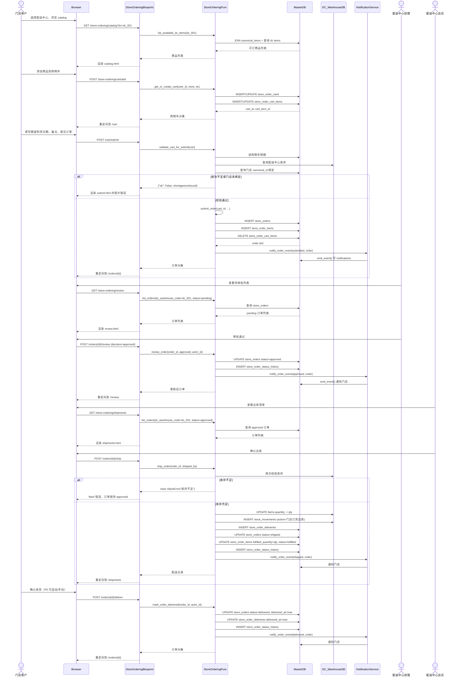
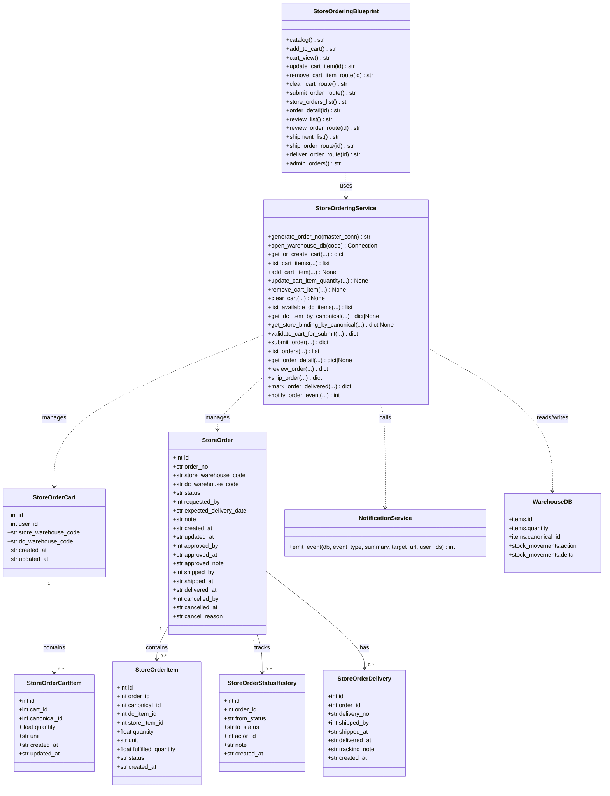

# DailyCheck 门店订货功能系统架构设计

- 日期：2026-10-04
- 作者：software-architect（高见远）
- 分支：`feat/store-ordering`
- 状态：待工程师评审与实现

---

## 1. 实现方案与框架选型

### 1.1 总体思路

本功能严格复用 DailyCheck 现有主栈：**Flask + Jinja2 + SQLite**，不引入新的 Web 框架、ORM 或前端构建链。所有跨仓订货数据统一放在 `master.db`，配送中心与门店各自的库存操作继续复用现有 `db/warehouses/{code}.db` 中的 `items` / `stock_movements` / `categories` 表。

核心设计要点：

1. **配送中心是一种新仓库类型**：在 `warehouses.warehouse_type` 中新增 `'distribution_center'`（简称 `dc`），与 `storefront`、`rd` 并列。配送中心具备实体库存，库存模型与门店完全一致。
2. **订单数据放 `master.db`**：购物车、订单主表、订单明细、状态历史、配送记录全部放在 `master.db`，便于跨两个仓库查询与追踪。
3. **纯逻辑层 + 路由层分离**：参考现有 `canonical_pure.py` / `outbound.py` 等模式，新增 `blueprints/store_ordering_pure.py` 承担所有业务判断与数据库写操作；`blueprints/store_ordering.py` 只负责 HTTP 请求解析、权限校验、模板渲染和重定向。
4. **复用通知基础设施**：通过 `blueprints/notifications_pure.py` 的 `emit_event()` 统一写入 `notifications` 表，新增 5 个门店订货事件类型。
5. **复用权限与上下文体系**：继续使用 `@require_login`、`@require_role`、`@require_warehouse_type`；在 `blueprints/_helpers.py` 的模板上下文中补充 `is_distribution_center` 标志，供导航显隐使用。

### 1.2 技术挑战与应对

| 挑战 | 应对 |
| --- | --- |
| 订单跨两个仓库，库存与订单不在同一 DB | 订单与购物车放 `master.db`；出库时由纯逻辑层打开目标配送中心 `warehouse_db`，在本事务内完成库存扣减与 `stock_movements` 写入，失败则回滚订单侧状态。 |
| 门店未绑定 `canonical_id` 时不能订货 | 提交订单时检查门店仓库 `items.canonical_id` 是否存在对应绑定，缺失则阻止并返回具体品项清单。 |
| 切换配送中心后购物车冲突 | 采用“清空当前购物车并提示”策略；购物车表 `UNIQUE(user_id, store_warehouse_code)` 保证一个门店用户只有一个活跃购物车。 |
| 出库时库存可能已变化 | 出库时再次做实库存校验；若不足则出库失败，订单保持 `approved` 状态。 |
| P0 不允许部分出库 | 一次性按订单全部数量出库；`store_order_items.fulfilled_quantity` 在出库时直接置为 `quantity`。 |
| P0 不自动入库 | 门店收货仅把订单状态改为 `delivered`，不在门店仓 `items.quantity` 中增加库存。 |

### 1.3 架构模式

- **MVC**：Flask 路由作为 Controller，`*.html` 模板作为 View，`blueprints/store_ordering_pure.py` + SQLite 表作为 Model。
- **Pure/Impure 分层**：`store_ordering_pure.py` 不依赖 Flask 上下文（除 `g.user`/`g.warehouse` 外，所有数据库连接由调用方传入），便于单元测试。

---

## 2. 文件列表

### 2.1 基础设施与集成（改动）

- `config.py`
- `app.py`
- `db/__init__.py`
- `permissions.py`
- `blueprints/_helpers.py`
- `blueprints/notifications_pure.py`
- `blueprints/items.py`（允许 `distribution_center` 访问品项管理）
- `templates/base.html`

### 2.2 门店订货领域层（新增）

- `blueprints/store_ordering_pure.py`
- `tests/test_store_ordering_pure.py`
- `tests/conftest.py`（补充 fixture）

### 2.3 门店侧路由与模板（新增/改动）

- `blueprints/store_ordering.py`
- `templates/store_ordering/catalog.html`
- `templates/store_ordering/cart.html`
- `templates/store_ordering/submit.html`
- `templates/store_ordering/orders.html`
- `templates/store_ordering/order_detail.html`
- `tests/test_store_ordering_store_route.py`

### 2.4 配送中心侧路由与模板（新增/改动）

- `blueprints/store_ordering.py`（续）
- `templates/store_ordering/review.html`
- `templates/store_ordering/shipments.html`
- `tests/test_store_ordering_dc_route.py`

### 2.5 集成与验收测试（新增）

- `tests/test_store_ordering_integration.py`
- `tests/test_store_ordering_e2e.py`

---

## 3. 数据结构与接口

### 3.1 `master.db` 新增表结构（最终 SQL）

以下 SQL 将追加到 `db/__init__.py` 的 `MASTER_SCHEMA` 末尾。所有时间字段统一使用 `'YYYY-MM-DD HH:MM:SS'` 格式（与现有代码一致）。

```sql
-- ============================================================
-- 门店订货（Store Ordering）跨仓数据模型
-- ============================================================

-- 购物车：每个门店用户在同一门店下只有一个购物车
CREATE TABLE IF NOT EXISTS store_order_carts (
    id INTEGER PRIMARY KEY AUTOINCREMENT,
    user_id INTEGER NOT NULL,
    store_warehouse_code TEXT NOT NULL,
    dc_warehouse_code TEXT NOT NULL,
    created_at TEXT NOT NULL,
    updated_at TEXT NOT NULL,
    UNIQUE (user_id, store_warehouse_code),
    FOREIGN KEY (user_id) REFERENCES users(id),
    FOREIGN KEY (store_warehouse_code) REFERENCES warehouses(code),
    FOREIGN KEY (dc_warehouse_code) REFERENCES warehouses(code)
);

CREATE INDEX IF NOT EXISTS idx_store_order_carts_user
    ON store_order_carts(user_id, store_warehouse_code);

-- 购物车明细：以 canonical_id 为跨仓统一键
CREATE TABLE IF NOT EXISTS store_order_cart_items (
    id INTEGER PRIMARY KEY AUTOINCREMENT,
    cart_id INTEGER NOT NULL,
    canonical_id INTEGER NOT NULL,
    quantity REAL NOT NULL,
    unit TEXT NOT NULL,
    created_at TEXT NOT NULL,
    updated_at TEXT NOT NULL,
    FOREIGN KEY (cart_id) REFERENCES store_order_carts(id) ON DELETE CASCADE,
    FOREIGN KEY (canonical_id) REFERENCES canonical_items(id)
);

CREATE INDEX IF NOT EXISTS idx_store_order_cart_items_cart
    ON store_order_cart_items(cart_id);

-- 订单主表
CREATE TABLE IF NOT EXISTS store_orders (
    id INTEGER PRIMARY KEY AUTOINCREMENT,
    order_no TEXT NOT NULL UNIQUE,
    store_warehouse_code TEXT NOT NULL,
    dc_warehouse_code TEXT NOT NULL,
    status TEXT NOT NULL DEFAULT 'pending',
    requested_by INTEGER NOT NULL,
    expected_delivery_date TEXT,
    note TEXT,
    created_at TEXT NOT NULL,
    updated_at TEXT NOT NULL,
    approved_by INTEGER,
    approved_at TEXT,
    approved_note TEXT,
    shipped_by INTEGER,
    shipped_at TEXT,
    delivered_at TEXT,
    cancelled_by INTEGER,
    cancelled_at TEXT,
    cancel_reason TEXT,
    FOREIGN KEY (store_warehouse_code) REFERENCES warehouses(code),
    FOREIGN KEY (dc_warehouse_code) REFERENCES warehouses(code),
    FOREIGN KEY (requested_by) REFERENCES users(id),
    FOREIGN KEY (approved_by) REFERENCES users(id),
    FOREIGN KEY (shipped_by) REFERENCES users(id),
    FOREIGN KEY (cancelled_by) REFERENCES users(id)
);

CREATE INDEX IF NOT EXISTS idx_store_orders_store
    ON store_orders(store_warehouse_code, status, created_at DESC);

CREATE INDEX IF NOT EXISTS idx_store_orders_dc
    ON store_orders(dc_warehouse_code, status, created_at DESC);

CREATE INDEX IF NOT EXISTS idx_store_orders_created
    ON store_orders(created_at DESC);

-- 订单明细
CREATE TABLE IF NOT EXISTS store_order_items (
    id INTEGER PRIMARY KEY AUTOINCREMENT,
    order_id INTEGER NOT NULL,
    canonical_id INTEGER NOT NULL,
    dc_item_id INTEGER,                 -- 配送中心仓内 items.id（出库时回填）
    store_item_id INTEGER,              -- 门店仓内 items.id（用于收货/入库，P0 仅记录）
    quantity REAL NOT NULL,             -- 订货数量（基础单位）
    unit TEXT NOT NULL,
    fulfilled_quantity REAL NOT NULL DEFAULT 0,
    status TEXT NOT NULL DEFAULT 'pending', -- pending / fulfilled / partial / cancelled
    created_at TEXT NOT NULL,
    FOREIGN KEY (order_id) REFERENCES store_orders(id) ON DELETE CASCADE,
    FOREIGN KEY (canonical_id) REFERENCES canonical_items(id)
);

CREATE INDEX IF NOT EXISTS idx_store_order_items_order
    ON store_order_items(order_id);

-- 订单状态历史
CREATE TABLE IF NOT EXISTS store_order_status_history (
    id INTEGER PRIMARY KEY AUTOINCREMENT,
    order_id INTEGER NOT NULL,
    from_status TEXT,
    to_status TEXT NOT NULL,
    actor_id INTEGER,
    note TEXT,
    created_at TEXT NOT NULL,
    FOREIGN KEY (order_id) REFERENCES store_orders(id) ON DELETE CASCADE,
    FOREIGN KEY (actor_id) REFERENCES users(id)
);

CREATE INDEX IF NOT EXISTS idx_store_order_status_history_order
    ON store_order_status_history(order_id, created_at DESC);

-- 配送记录
CREATE TABLE IF NOT EXISTS store_order_deliveries (
    id INTEGER PRIMARY KEY AUTOINCREMENT,
    order_id INTEGER NOT NULL,
    delivery_no TEXT NOT NULL UNIQUE,
    shipped_by INTEGER,
    shipped_at TEXT NOT NULL,
    delivered_at TEXT,
    tracking_note TEXT,
    created_at TEXT NOT NULL,
    FOREIGN KEY (order_id) REFERENCES store_orders(id) ON DELETE CASCADE,
    FOREIGN KEY (shipped_by) REFERENCES users(id)
);

CREATE INDEX IF NOT EXISTS idx_store_order_deliveries_order
    ON store_order_deliveries(order_id);
```

### 3.2 与现有表的关系

| 新表 | 关联现有表 | 关系说明 |
| --- | --- | --- |
| `store_order_carts` | `users(id)`, `warehouses(code)` | 购物车属于某个用户及其所在门店，并指向一个配送中心。 |
| `store_order_cart_items` | `store_order_carts(id)`, `canonical_items(id)` | 购物车明细以主数据 `canonical_id` 为统一键。 |
| `store_orders` | `warehouses(code)` ×2, `users(id)` ×4 | 记录订货门店、配送中心、下单人、审批人、出库人、取消人。 |
| `store_order_items` | `store_orders(id)`, `canonical_items(id)` | 记录每个订货品项；`dc_item_id` / `store_item_id` 分别引用两个仓库 `items.id`（逻辑引用，跨 DB 无法设 FK）。 |
| `store_order_status_history` | `store_orders(id)`, `users(id)` | 记录每次状态流转。 |
| `store_order_deliveries` | `store_orders(id)`, `users(id)` | 记录出库配送信息。 |

配送中心仓内继续复用：

- `items.quantity`：出库时扣减。
- `stock_movements`：写入 `action = '门店订货出库'` 的出库记录，备注包含订单号。

### 3.3 核心函数/类签名

> 所有时间参数/返回值统一为 `str`，格式 `'YYYY-MM-DD HH:MM:SS'`；数量统一为 `float`（2 位小数，使用 `parse_qty` 处理）。

#### `blueprints/store_ordering_pure.py`

```python
from __future__ import annotations

import sqlite3
from typing import Any

# ---------- 常量 ----------
WAREHOUSE_TYPE_DC: str = "distribution_center"

ORDER_STATUS_PENDING: str = "pending"
ORDER_STATUS_APPROVED: str = "approved"
ORDER_STATUS_REJECTED: str = "rejected"
ORDER_STATUS_SHIPPED: str = "shipped"
ORDER_STATUS_DELIVERED: str = "delivered"
ORDER_STATUS_CANCELLED: str = "cancelled"

ORDER_ITEM_STATUS_PENDING: str = "pending"
ORDER_ITEM_STATUS_FULFILLED: str = "fulfilled"
ORDER_ITEM_STATUS_PARTIAL: str = "partial"
ORDER_ITEM_STATUS_CANCELLED: str = "cancelled"

EVENT_ORDER_SUBMITTED: str = "store_order_submitted"
EVENT_ORDER_APPROVED: str = "store_order_approved"
EVENT_ORDER_REJECTED: str = "store_order_rejected"
EVENT_ORDER_SHIPPED: str = "store_order_shipped"
EVENT_ORDER_DELIVERED: str = "store_order_delivered"

ALLOWED_TRANSITIONS: dict[str, tuple[str, ...]] = {
    ORDER_STATUS_PENDING: (ORDER_STATUS_APPROVED, ORDER_STATUS_REJECTED, ORDER_STATUS_CANCELLED),
    ORDER_STATUS_APPROVED: (ORDER_STATUS_SHIPPED, ORDER_STATUS_CANCELLED),
    ORDER_STATUS_SHIPPED: (ORDER_STATUS_DELIVERED,),
}


# ---------- 订单号生成 ----------
def generate_order_no(master_conn: sqlite3.Connection) -> str:
    """生成订单号 SO-YYYYMMDD-XXXX，按日自增。"""


# ---------- 数据库连接辅助 ----------
def open_warehouse_db(warehouse_code: str) -> sqlite3.Connection:
    """按仓库 code 打开 db/warehouses/{code}.db，返回 row_factory=Row 的连接。"""


# ---------- 购物车 ----------
def get_or_create_cart(
    master_conn: sqlite3.Connection,
    user_id: int,
    store_warehouse_code: str,
    dc_warehouse_code: str,
) -> dict[str, Any]:
    """获取或创建购物车；若 dc 不一致则先清空再更新目标 dc。"""


def list_cart_items(
    master_conn: sqlite3.Connection,
    cart_id: int,
) -> list[dict[str, Any]]:
    """返回购物车明细，并附带当前配送中心库存、门店绑定状态。"""


def add_cart_item(
    master_conn: sqlite3.Connection,
    cart_id: int,
    canonical_id: int,
    quantity: float,
    unit: str,
) -> None:
    """新增或合并购物车明细。"""


def update_cart_item_quantity(
    master_conn: sqlite3.Connection,
    cart_item_id: int,
    quantity: float,
) -> None:
    """更新购物车品项数量；数量为 0 或负数时删除。"""


def remove_cart_item(
    master_conn: sqlite3.Connection,
    cart_item_id: int,
) -> None:
    """删除购物车单品。"""


def clear_cart(
    master_conn: sqlite3.Connection,
    cart_id: int,
) -> None:
    """清空购物车明细。"""


# ---------- 可订商品 ----------
def list_available_dc_items(
    master_conn: sqlite3.Connection,
    dc_warehouse_code: str,
    category_code: str | None = None,
    keyword: str | None = None,
) -> list[dict[str, Any]]:
    """返回配送中心中可订商品列表：有 canonical_id 且 canonical_items.status='active'。"""


def get_dc_item_by_canonical(
    master_conn: sqlite3.Connection,
    dc_warehouse_code: str,
    canonical_id: int,
) -> dict[str, Any] | None:
    """按 canonical_id 查询配送中心仓内品项（含库存）。"""


def get_store_binding_by_canonical(
    master_conn: sqlite3.Connection,
    store_warehouse_code: str,
    canonical_id: int,
) -> dict[str, Any] | None:
    """查询门店仓内是否已绑定对应 canonical_id。"""


# ---------- 订单提交 ----------
def validate_cart_for_submit(
    master_conn: sqlite3.Connection,
    cart: dict[str, Any],
) -> dict[str, Any]:
    """
    返回 {"ok": bool, "shortages": [...], "unbound": [...]}。
    shortages: canonical_id, name, requested, available。
    unbound: canonical_id, name。
    """


def submit_order(
    master_conn: sqlite3.Connection,
    cart_id: int,
    requested_by: int,
    expected_delivery_date: str | None,
    note: str | None,
) -> dict[str, Any]:
    """购物车转订单，状态 pending，清空购物车，返回 order dict。"""


# ---------- 订单查询 ----------
def list_orders(
    master_conn: sqlite3.Connection,
    *,
    store_warehouse_code: str | None = None,
    dc_warehouse_code: str | None = None,
    status: str | None = None,
    start_date: str | None = None,
    end_date: str | None = None,
    limit: int = 200,
    offset: int = 0,
) -> list[dict[str, Any]]:
    """按门店、配送中心、状态、时间范围查询订单列表。"""


def get_order_detail(
    master_conn: sqlite3.Connection,
    order_id: int,
) -> dict[str, Any] | None:
    """返回订单详情，包含 items、status_history、deliveries。"""


# ---------- 审批 ----------
def review_order(
    master_conn: sqlite3.Connection,
    order_id: int,
    decision: str,                  # 'approved' | 'rejected'
    actor_id: int,
    note: str | None = None,
) -> dict[str, Any]:
    """审批订单，写入状态历史，返回更新后的 order。"""


# ---------- 出库 ----------
def ship_order(
    master_conn: sqlite3.Connection,
    order_id: int,
    shipped_by: int,
    tracking_note: str | None = None,
) -> dict[str, Any]:
    """
    一次性全部出库：校验配送中心库存，扣减 items.quantity，写入 stock_movements，
    生成 delivery 记录，订单状态变为 shipped。若库存不足则抛出 ValueError，订单保持 approved。
    """


# ---------- 送达 ----------
def mark_order_delivered(
    master_conn: sqlite3.Connection,
    order_id: int,
    actor_id: int,
) -> dict[str, Any]:
    """订单状态变为 delivered；P0 不增加门店库存。"""


# ---------- 取消（P1） ----------
def cancel_order(
    master_conn: sqlite3.Connection,
    order_id: int,
    cancelled_by: int,
    reason: str,
) -> dict[str, Any]:
    """P1 预留：pending 或 approved 状态下取消订单。"""


# ---------- 通知 ----------
def notify_order_event(
    master_conn: sqlite3.Connection,
    event_type: str,
    order: dict[str, Any],
    actor_user_id: int | None = None,
) -> int:
    """计算目标用户并调用 emit_event()，返回写入通知行数。"""
```

#### `blueprints/store_ordering.py`（Controller 层，主要路由）

```python
from __future__ import annotations

from flask import Blueprint, flash, g, redirect, render_template, request, url_for

from db import get_master_db
from permissions import require_login, require_role, require_warehouse_type

bp = Blueprint("store_ordering", __name__, url_prefix="/store-ordering")

# ---------- 门店侧 ----------
@bp.route("/catalog", methods=["GET"])
@require_login
def catalog() -> str: ...

@bp.route("/cart/add", methods=["POST"])
@require_login
def add_to_cart() -> str: ...

@bp.route("/cart", methods=["GET"])
@require_login
def cart_view() -> str: ...

@bp.route("/cart/update/<int:cart_item_id>", methods=["POST"])
@require_login
def update_cart_item(cart_item_id: int) -> str: ...

@bp.route("/cart/remove/<int:cart_item_id>", methods=["POST"])
@require_login
def remove_cart_item_route(cart_item_id: int) -> str: ...

@bp.route("/cart/clear", methods=["POST"])
@require_login
def clear_cart_route() -> str: ...

@bp.route("/cart/submit", methods=["GET", "POST"])
@require_login
def submit_order_route() -> str: ...

@bp.route("/orders", methods=["GET"])
@require_login
def store_orders_list() -> str: ...

@bp.route("/orders/<int:order_id>", methods=["GET"])
@require_login
def order_detail(order_id: int) -> str: ...

# ---------- 配送中心侧 ----------
@bp.route("/review", methods=["GET"])
@require_warehouse_type("distribution_center")
@require_role("manager")
def review_list() -> str: ...

@bp.route("/orders/<int:order_id>/review", methods=["POST"])
@require_warehouse_type("distribution_center")
@require_role("manager")
def review_order_route(order_id: int) -> str: ...

@bp.route("/shipments", methods=["GET"])
@require_warehouse_type("distribution_center")
@require_role("staff")
def shipment_list() -> str: ...

@bp.route("/orders/<int:order_id>/ship", methods=["POST"])
@require_warehouse_type("distribution_center")
@require_role("staff")
def ship_order_route(order_id: int) -> str: ...

# ---------- 门店收货 ----------
@bp.route("/orders/<int:order_id>/deliver", methods=["POST"])
@require_login
@require_role("manager")
def deliver_order_route(order_id: int) -> str: ...

# ---------- 平台管理员看板 ----------
@bp.route("/admin/orders", methods=["GET"])
@require_role("admin")
def admin_orders() -> str: ...
```

---

## 4. 程序调用流程

### 4.1 时序图：提交订单 → 审批 → 出库 → 通知



---

## 5. 任务分解

### 5.1 依赖包列表

沿用现有依赖，**不新增** Python/JS 包：

- `Flask==3.1.1`
- `gunicorn==23.0.0`
- 现有测试依赖（pytest 等，已在开发环境安装）

### 5.2 任务列表（按依赖顺序）

#### T01：项目基础设施与集成

**依赖**：无
**优先级**：P0
**源文件**：

- `config.py`
- `app.py`
- `db/__init__.py`
- `permissions.py`
- `blueprints/_helpers.py`
- `blueprints/notifications_pure.py`
- `blueprints/items.py`
- `templates/base.html`

**工作内容**：

1. `config.py`：增加配送中心类型常量（可选）`WAREHOUSE_TYPE_DC = "distribution_center"`。
2. `db/__init__.py`：将 §3.1 中的 `store_order_*` 表追加到 `MASTER_SCHEMA`；确保 `init_master_db()` 会自动创建这些表。
3. `permissions.py`：`require_warehouse_type` 已支持任意类型，无需改动；可视需要新增 `distribution_center_only` 装饰器。
4. `blueprints/_helpers.py`：在 `register_template_context()` 中注入 `is_distribution_center`，与现有 `is_storefront`/`is_rd` 并列。
5. `blueprints/notifications_pure.py`：在 `ALLOWED_EVENT_TYPES` 中追加 5 个门店订货事件常量。
6. `blueprints/items.py`：`_require_storefront` 放行 `distribution_center`，使配送中心可管理品项与库存。
7. `app.py`：注册新 blueprint `store_ordering`。
8. `templates/base.html`：在桌面端与移动端导航中增加“门店订货”入口，按仓库类型/角色显隐。

#### T02：门店订货领域模型与纯逻辑

**依赖**：T01
**优先级**：P0
**源文件**：

- `blueprints/store_ordering_pure.py`（新增）
- `tests/test_store_ordering_pure.py`（新增）
- `tests/conftest.py`（改动）

**工作内容**：

1. 实现 §3.3 中的全部常量、状态机 `ALLOWED_TRANSITIONS`、订单号生成 `generate_order_no()`。
2. 实现 `open_warehouse_db()`，按 `code` 打开独立仓库数据库。
3. 实现购物车 CRUD：`get_or_create_cart()`、`list_cart_items()`、`add_cart_item()`、`update_cart_item_quantity()`、`remove_cart_item()`、`clear_cart()`，并处理切换配送中心时清空购物车的逻辑。
4. 实现可订商品查询：`list_available_dc_items()`、`get_dc_item_by_canonical()`、`get_store_binding_by_canonical()`。
5. 实现订单提交与校验：`validate_cart_for_submit()`、`submit_order()`。
6. 实现订单查询与详情：`list_orders()`、`get_order_detail()`。
7. 实现审批、出库、送达：`review_order()`、`ship_order()`、`mark_order_delivered()`。
8. 实现通知：`notify_order_event()` 及辅助函数 `_recipients_for_dc_reviewers()`、`_recipients_for_store_users()`、`_exclude_self()`。
9. `tests/conftest.py` 补充门店/配送中心/用户的测试 fixture。
10. `tests/test_store_ordering_pure.py` 对纯函数做单元测试（购物车、提交校验、出库、通知目标用户计算）。

#### T03：门店侧路由与模板

**依赖**：T02
**优先级**：P0
**源文件**：

- `blueprints/store_ordering.py`（新增，门店相关路由）
- `templates/store_ordering/catalog.html`（新增）
- `templates/store_ordering/cart.html`（新增）
- `templates/store_ordering/submit.html`（新增）
- `templates/store_ordering/orders.html`（新增）
- `templates/store_ordering/order_detail.html`（新增）
- `tests/test_store_ordering_store_route.py`（新增）

**工作内容**：

1. 实现门店侧路由：`catalog`、`add_to_cart`、`cart_view`、`update_cart_item`、`remove_cart_item_route`、`clear_cart_route`、`submit_order_route`、`store_orders_list`、`order_detail`。
2. 权限：`@require_login` + 当前仓库为 `storefront` 或 `is_admin`；提交、加购等不要求经理权限（staff 可做）。
3. 模板：
   - `catalog.html`：配送中心选择器、可订商品列表（含库存）、加购表单。
   - `cart.html`：数量调整、删除、清空、去提交。
   - `submit.html`：期望到货日期（默认明天，≥今天）、备注、库存/绑定校验错误展示。
   - `orders.html`：本店订单列表，支持按状态/时间筛选。
   - `order_detail.html`：订单明细、审批记录、配送记录、状态流转。
4. 单元/路由测试覆盖：加购、提交成功、库存不足阻止、未绑定阻止、列表查询。

#### T04：配送中心侧路由与模板

**依赖**：T03
**优先级**：P0
**源文件**：

- `blueprints/store_ordering.py`（续，DC 相关路由）
- `templates/store_ordering/review.html`（新增）
- `templates/store_ordering/shipments.html`（新增）
- `tests/test_store_ordering_dc_route.py`（新增）

**工作内容**：

1. 实现配送中心侧路由：`review_list`、`review_order_route`、`shipment_list`、`ship_order_route`。
2. 权限：使用 `@require_warehouse_type("distribution_center")` + `@require_role("manager")`（审批）/`@require_role("staff")`（出库）。
3. 拒绝审批时必须填写原因；通过后订单进入 `approved`。
4. 出库时再次校验库存；库存不足时 flash 错误并保持 `approved`。
5. 出库成功后写入配送中心 `stock_movements`，`action='门店订货出库'`，备注包含订单号。
6. 模板：
   - `review.html`：待审批列表、通过/拒绝表单、库存余量展示。
   - `shipments.html`：已审批待出库列表、出库确认按钮。
7. 路由测试：审批通过/拒绝、出库成功、出库库存不足、权限拦截。

#### T05：端到端集成、通知与验收测试

**依赖**：T04
**优先级**：P0
**源文件**：

- `blueprints/store_ordering.py`（最终权限与边界修补）
- `blueprints/store_ordering_pure.py`（边界情况处理）
- `tests/test_store_ordering_integration.py`（新增）
- `tests/test_store_ordering_e2e.py`（新增）

**工作内容**：

1. 打通“提交 → 审批 → 出库 → 送达 → 通知”完整流程，确保 `notifications` 表在 4 个节点正确写入。
2. 验证角色权限矩阵：门店角色不能审批/出库，DC 角色不能代表门店提交。
3. 验证配送中心库存扣减、`stock_movements` 记录、订单状态历史一致性。
4. 验证门店未绑定 canonical_id 时提交被阻止；切换配送中心购物车清空。
5. 验证 P0 不自动入库：门店收货后 `items.quantity` 不变。
6. 跑通全量测试，修复边界 bug（如重复提交、空购物车提交、非法状态流转）。

### 5.3 任务依赖图

```mermaid
graph TD
    T01[\"/T01 项目基础设施与集成/\"]
    T02[\"/T02 领域模型与纯逻辑/\"]
    T03[\"/T03 门店侧路由与模板/\"]
    T04[\"/T04 配送中心侧路由与模板/\"]
    T05[\"/T05 端到端集成与验收/\"]

    T01 --> T02
    T02 --> T03
    T03 --> T04
    T04 --> T05
```

---

## 6. 共享知识 / 跨文件约定

### 6.1 订单号生成规则

- 格式：`SO-YYYYMMDD-XXXX`
- `YYYYMMDD` 为订单创建日期；`XXXX` 为当日自增序号，从 `0001` 开始。
- 实现：`generate_order_no()` 在 `store_ordering_pure.py` 中，通过 `LIKE 'SO-YYYYMMDD-%'` 查询当日最大号并 +1。

### 6.2 状态机定义

```python
ALLOWED_TRANSITIONS = {
    "pending": ("approved", "rejected", "cancelled"),
    "approved": ("shipped", "cancelled"),
    "shipped": ("delivered",),
}
```

- `cancelled` 为终态（P1 实现）。
- 任何非法状态转换应抛出 `ValueError` 并在路由中 flash 错误。

### 6.3 通知事件类型常量

在 `blueprints/notifications_pure.py` 的 `ALLOWED_EVENT_TYPES` 中追加：

- `store_order_submitted`
- `store_order_approved`
- `store_order_rejected`
- `store_order_shipped`
- `store_order_delivered`

通知目标用户规则：

- `submitted`：该配送中心的 `manager`/`admin`、平台管理员。
- `approved` / `rejected`：下单人、该门店的 `manager`/`admin`。
- `shipped` / `delivered`：下单人、该门店的 `manager`/`admin`。
- 不通知提交人自己（除非他也是目标角色）。

### 6.4 权限装饰器使用方式

```python
# 门店侧：登录即可，staff 及以上都能操作
@bp.route("/cart/submit", methods=["GET", "POST"])
@require_login
def submit_order_route(): ...

# 配送中心审批：必须当前仓库为 dc，且角色 >= manager
@bp.route("/orders/<int:order_id>/review", methods=["POST"])
@require_warehouse_type("distribution_center")
@require_role("manager")
def review_order_route(order_id): ...

# 配送中心出库：必须当前仓库为 dc，且角色 >= staff
@bp.route("/orders/<int:order_id>/ship", methods=["POST"])
@require_warehouse_type("distribution_center")
@require_role("staff")
def ship_order_route(order_id): ...
```

- `require_warehouse_type` 对 `g.user["is_admin"]` 放行，便于开发测试；生产环境中管理员默认不代操作。

### 6.5 与现有 `warehouse_type` 判断逻辑的集成点

1. **`blueprints/items.py:_require_storefront()`**：需要把 `distribution_center` 与 `storefront` 同等对待，允许品项 CRUD 与库存查阅。
2. **`blueprints/_helpers.py:register_template_context()`**：新增 `is_distribution_center`，供 `base.html` 和后续模板判断。
3. **`templates/base.html`**：导航入口按 `is_storefront or is_distribution_center or is_admin` 显示“门店订货”。
4. **出库权限**：`outbound.py` 仅允许 `storefront`；门店订货出库走自己的 `ship_order()`，不共用 `outbound.py`。

### 6.6 数量与时间格式

- 所有数量通过 `blueprints._helpers.parse_qty()` 处理，保留 2 位小数。
- 所有时间使用 `blueprints._helpers.now()`，格式 `'YYYY-MM-DD HH:MM:SS'`。
- 期望到货日期使用 HTML `<input type="date">`，提交前校验 `>= today()`。

### 6.7 跨仓库存写入约定

- 出库扣减在 `ship_order()` 中完成，直接对配送中心 `items.quantity` 做 `UPDATE`。
- 同步写入 `stock_movements`，`action = '门店订货出库'`，`delta = -qty`，`note` 包含订单号（如 `门店订货出库 #SO-20261004-0001`）。
- 出库失败时，`store_orders` 保持 `approved`，不生成 `store_order_deliveries` 和 `stock_movements`。

---

## 7. 类图



---

## 8. 待明确事项

1. **P0 送达触发方式**：
   - 当前设计采用“门店经理/管理员手动点击确认收货”将状态从 `shipped` 改为 `delivered`。
   - 若团队希望 P0 在出库后自动变为 `delivered`，则需在 `ship_order()` 末尾直接调用 `mark_order_delivered()` 并合并通知。

2. **订单号日序号宽度**：
   - 当前采用 4 位 `XXXX`（0001-9999）。若单日订单量可能过万，建议改为 5 位或更大。

3. **配送中心品项“可订”范围细化**：
   - 已按团队决策实现为“所有 `canonical_id` 非空且 `canonical_items.status='active'` 的品项”。
   - 是否需要排除 `is_store_exclusive=1` 的门店专属品项？（配送中心理论上不应存在门店专属品项，但需确认。）

4. **平台管理员提交订单时的门店选择**：
   - 当前设计管理员需先切换到某个 `storefront` 仓库，再以该门店身份提交。
   - 是否需要管理员在提交页额外选择“代哪个门店下单”？P0 建议保持简单，管理员通过切换仓库模拟门店。

5. **`distribution_center` 仓库的初始化**：
   - 当前 `init_warehouse_db()` 默认按 `FIXED_CATEGORIES` 初始化品类，适用于配送中心。
   - 是否需要为配送中心单独维护一套品类？P0 建议沿用固定品类。

6. **取消订单的 P0 范围**：
   - PRD 将取消放在 P1，但表结构中已预留 `cancelled_by/cancelled_at/cancel_reason`。
   - 若 P0 必须支持“pending 前取消”，需把 `cancel_order()` 与前端入口纳入 T03。

7. **出库后库存扣减与采购建议缓存**：
   - 是否需要在出库扣减后调用 `blueprints.procurement.mark_procurement_invalid(item_id)` 使采购建议失效？建议复用现有逻辑。

---

## 附录：序列图与类图单独文件

- 序列图已单独保存至：`docs/2026-10-04-store-ordering-sequence.mermaid`
- 类图已单独保存至：`docs/2026-10-04-store-ordering-class.mermaid`
