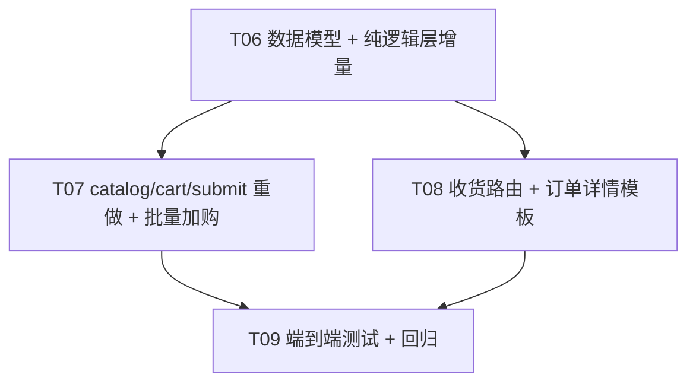

# DailyCheck 门店订货功能迭代 v2 系统架构设计

- 日期：2026-10-05
- 作者：software-architect（高见远）
- 分支：`feat/store-ordering`
- 关联文档：
  - PRD：`docs/2026-10-04-store-ordering-prd.md`
  - 设计 v1：`docs/2026-10-04-store-ordering-design.md`
  - **增量 PRD：`docs/2026-10-05-store-ordering-iteration.md`**（本文档唯一驱动）
- 定位：**增量调整**。在 v1 已落地的 CRUD/审批/出库/通知体系之上，补全 Eric 试用反馈的 6 类问题（A1~A6），并将 P1 的「门店收货入库」提升为 P0。

---

## 0. 阅读须知

- 本文不重复 v1 已实现的细节（订单状态机、通知目标用户计算、跨仓库存出库等），需要时回看 v1 设计第 3.3 / 4 / 6 节。
- 本文中所有「增量改动」均显式指出文件路径与函数/模板段，不模糊处理。
- 凡涉及原 v1 函数的新签名，单独标注 `v2 签名` 段落，不直接覆盖 v1 描述。

---

## 1. 改动概览（对应增量 PRD §A）

| 反馈 | 影响文件 | 改动 |
| --- | --- | --- |
| **A1** 卡片排版错位 | `templates/store_ordering/catalog.html` | 彻底重写卡片结构为 `.inv-card` / `.inv-card-head` / `.inv-card-body`；移除卡片内嵌 `.grid cols-3` 加购表单，改为「点卡片→弹窗→底部批量加购」 |
| **A2** 品类显示英文 | `blueprints/store_ordering_pure.py`、`templates/store_ordering/catalog.html`、`templates/store_ordering/cart.html` | 纯逻辑 `list_available_dc_items` / `list_cart_items` 追加 `category_name` 字段（中文，来自 DC 仓 `categories.name`，优先；缺失时再用 `canonical_categories.name`）；模板显示中文，去掉 `category_code` 输出 |
| **A3** 点卡片无弹窗 | `templates/store_ordering/catalog.html` | 新增 `.modal-overlay` / `.modal` / `.pill-group` 弹窗结构，沿用 `restock_session.html` 的 `openModal/closeModal/confirmModal` 模式；卡片自带 `data-*` 属性驱动弹窗回填 |
| **A4** 购物车没总金额 | `templates/store_ordering/cart.html` | 表头新增「单价」「小计」列；页底新增「购物车总金额 ¥ XX.XX」+「继续购物」+「发送」三按钮 |
| **A5** 提交 → 发送 | `templates/store_ordering/cart.html`、`templates/store_ordering/submit.html` | 全部「提交/去提交订单/确认提交」按钮文案改为「发送」 |
| **A6** P0 自动入库 + 部分收货 | `db/__init__.py`、`blueprints/store_ordering_pure.py`、`blueprints/store_ordering.py`、`templates/store_ordering/order_detail.html`、`tests/test_store_ordering_pure.py`、`tests/test_store_ordering_e2e.py`、`tests/test_store_ordering_receive.py`（新增） | 新增 `store_order_receipts` 表 + `receive_order_item()` 纯函数 + `POST /orders/<id>/receive` 路由 + 订单详情页收货表单 + 配套测试 |

> 说明：A1/A3 与 A6 的实现会引入新的批量加购路由 `POST /cart/add-batch`，详见 §6。

---

## 2. 数据模型变更（增量 PRD §D）

### 2.1 新增 `store_order_receipts` 表

挂在 `master.db` 的 `MASTER_SCHEMA` 末尾（紧跟 `store_order_deliveries` 之后），由 `init_master_db()` 自动创建。`db/__init__.py` 改动位置：`MASTER_SCHEMA` 字符串内，紧邻 §2025。

```sql
-- ============================================================
-- 门店订货收货（Store Order Receiving）—— v2 P0
-- 多次部分收货：fulfilled_quantity 累计；全部收齐 → delivered
-- ============================================================
CREATE TABLE IF NOT EXISTS store_order_receipts (
    id INTEGER PRIMARY KEY AUTOINCREMENT,
    order_id INTEGER NOT NULL,
    order_item_id INTEGER NOT NULL,
    quantity REAL NOT NULL,
    received_by INTEGER NOT NULL,
    note TEXT,
    created_at TEXT NOT NULL,
    FOREIGN KEY (order_id) REFERENCES store_orders(id) ON DELETE CASCADE,
    FOREIGN KEY (order_item_id) REFERENCES store_order_items(id) ON DELETE CASCADE,
    FOREIGN KEY (received_by) REFERENCES users(id)
);

CREATE INDEX IF NOT EXISTS idx_store_order_receipts_order
    ON store_order_receipts(order_id, created_at DESC);

CREATE INDEX IF NOT EXISTS idx_store_order_receipts_item
    ON store_order_receipts(order_item_id, created_at DESC);
```

### 2.2 不引入 `partial_received` 中间状态

订单主表状态保持五态 `pending / approved / rejected / shipped / delivered / cancelled`。多次部分收货期间订单主表停在 `shipped`，所有 `store_order_items.fulfilled_quantity == quantity` 才转 `delivered`。已落地「货架场景不引入中间态」决策（PRD §D.2）。

### 2.3 `store_order_items` 状态复用既有枚举

- `pending`（默认；下单后、shipped 之前）
- `partial`（shipped 后 `0 < fulfilled_quantity < quantity`）
- `fulfilled`（shipped 后 `fulfilled_quantity == quantity`）
- `cancelled`（P1，订单取消时连带）

`partial` 之前已存在于 `store_ordering_pure.py:36`，本版本首次实际写入。`receive_order_item()` 写完库存后顺手把明细状态从 `pending` 推进到 `partial` / `fulfilled`。

---

## 3. 纯逻辑层函数（增量）签名

文件：`blueprints/store_ordering_pure.py`

### 3.1 新增 `receive_order_item` （v2 核心）

```python
def receive_order_item(
    master_conn: sqlite3.Connection,
    order_id: int,
    order_item_id: int,
    qty: float,
    actor_id: int,
    note: str | None = None,
) -> dict[str, Any]:
    """
    门店部分/全部收货：
      - 校验订单 status == 'shipped'
      - 校验 order_item_id 属于该订单，且 qty > 0 且 qty <= (quantity - fulfilled_quantity)
      - 写入 store_order_receipts 一行
      - UPDATE store_order_items.fulfilled_quantity += qty；status 推到 partial / fulfilled
      - 打开门店仓 db：items.canonical_id 不存在则 INSERT（quantity=0）；UPDATE items.quantity += qty；
        INSERT stock_movements (action='门店订货入库', delta=+qty, note 含订单号)
      - 若所有 store_order_items 都 fulfilled → UPDATE store_orders status='delivered', delivered_at=now()，
        并写 status_history
      - 不在本函数内发通知（由路由层调 notify_order_event()，避免纯层引入 Flask 依赖）

    返回 dict：{"order_id", "order_item_id", "receipt_id", "fulfilled_quantity",
              "new_order_status", "is_fully_received"}
    抛 ValueError：
      - 订单状态非 shipped
      - qty 越界（<=0 或 > 待收量）
      - order_item_id 不属于该订单
    """
```

实现要点：

1. **门店仓未绑定 canonical_id 时自动创建**（决策 A）：

   - 打开门店仓 db 后，先按 `canonical_id` 查 `items`；无则按 `canonical_items.name / unit / category_code` 推导门店仓 `category_id`（优先用同名中文分类；若门店仓 `categories` 没有该名，跳过插入 `items` 直接抛 `ValueError('门店仓未建立品类 {name}')`，避免空指针）。
   - 自动插入 `items` 时 `quantity=0`、`safety_stock=0`、`unit_cost=0`、`selling_price=0`（沿用 v1 已建仓库存策略：未维护售价视为 0；不影响本次收货的金额预览）。
   - 创建后立刻 `UPDATE items.quantity += qty`，保证第一次入库后数量正确。

2. **库存校验**：`qty` 上限为 `quantity - fulfilled_quantity`，禁止超收；`qty <= 0` 抛错。

3. **事务**：门店仓 db 与 master_conn 都用 `commit()` 提交；任一失败则 `master_conn.rollback()` + 门店仓 `rollback()` + raise。

4. **`fulfilled_quantity == quantity` 后**：直接更新明细 `status='fulfilled'`；并比对所有明细，若全部 fulfilled → `store_orders.status='delivered'`、`delivered_at=now()`、`_insert_status_history()`；返回 `is_fully_received=True`。

### 3.2 新增辅助函数

```python
def list_order_receipts(
    master_conn: sqlite3.Connection,
    order_id: int,
) -> list[dict[str, Any]]:
    """返回订单的全部收货行 JOIN receiver(s) 用于 order_detail 展示。"""

def get_order_item_pending_qty(
    master_conn: sqlite3.Connection,
    order_item_id: int,
) -> float:
    """返回 quantity - fulfilled_quantity。供收货表单的 max 上限。"""
```

### 3.3 既有函数调整

| 函数 | 调整 |
| --- | --- |
| `submit_order` | **不变**。已在 v1 落地。 |
| `review_order` | **不变**。已在 v1 落地。 |
| `ship_order` | **不变**。P0 出库仍是「一次性全部」。 |
| `mark_order_delivered` | **保留但标记弃用**（DEPRECATED）。路由层新增 `/orders/<id>/receive`；保留 `deliver_order_route` 作为「老管理员一次性全部确认收货」快捷入口，且只在「无任何收货记录 + 用户明确选择」时调用 `receive_order_item()` 一次性收齐（避免两条入口并存造成数据不一致）。 |
| `list_available_dc_items` | **增强**：返回字段增加 `category_name`（中文，JOIN 门店仓 `categories`）、`selling_price`（用于卡片金额预览）。 |
| `list_cart_items` | **增强**：返回字段增加 `category_name`、`unit_price`（`selling_price` 或 `unit_cost`，优先 `selling_price`）。 |
| `get_order_detail` | **增强**：返回 `receipts` 列表（按时间倒序）。 |

#### `list_available_dc_items` 增强字段

```python
# 伪代码：原 SELECT 后 LEFT JOIN 门店仓 categories + dc items.selling_price
sql = """
SELECT i.*, c.name AS category_name, ci.selling_price AS canonical_selling_price
FROM items i
LEFT JOIN categories c ON c.id = i.category_id
LEFT JOIN canonical_items ci  ON ci.id = i.canonical_id
WHERE i.canonical_id IS NOT NULL ...
"""
# 然后在 master 侧拿 canonical_items.name / canonical_categories.name 兜底 category_name
```

返回 dict 增加键：`category_name`, `unit_price`，缺失时为 `None`。

### 3.4 `mark_order_delivered` 改为转发

```python
def mark_order_delivered(master_conn, order_id, actor_id) -> dict[str, Any]:
    """DEPRECATED. v2 起请走 receive_order_item 多次收货。
    仍保留：若订单已 shipped 且无任何收货行，则一次性收齐所有 store_order_items 后再调
    receive_order_item() 推进状态。
    """
```

为避免破坏 `tests/test_store_ordering_pure.py::test_mark_order_delivered`，实现保持兼容：行为等价于「一次性全部收货 + delivered」，但内部走 `receive_order_item` 多次循环。

---

## 4. 路由层变更（增量 PRD §C.1 + §C.3）

文件：`blueprints/store_ordering.py`

### 4.1 既有路由微调

| 路由 | 调整 |
| --- | --- |
| `GET /catalog` | 不改 URL。模板渲染时多传 `category_name` 等数据（见 §5.1）。 |
| `POST /cart/add` | **保留为单条加购兼容入口**，但 catalog.html 不再调用；仅在 cart.html 单行「+1」按钮等场景使用。 |
| `GET /cart` | 模板传入 `cart_total` 字段（v2 算 pure 数据）。 |
| `POST /cart/update/<id>` | 不变。 |
| `POST /cart/remove/<id>` | 不变。 |
| `POST /cart/clear` | 不变。 |
| `GET/POST /cart/submit` | 模板渲染时按钮文案改为「发送」（仅文案）。 |
| `GET /orders` | 不变。 |
| `GET /orders/<id>` | 模板传入 `receipts` 列表（来自 `list_order_receipts`）；`can_receive`=True 时显示收货表单。 |
| `GET /review`、`POST /orders/<id>/review`、`GET /shipments`、`POST /orders/<id>/ship`、`POST /orders/<id>/deliver`、`GET /admin/orders` | **不变**。`deliver` 路径保留为兼容入口。 |

### 4.2 新增路由

#### 4.2.1 `POST /cart/add-batch`（v2）

```python
@bp.route("/cart/add-batch", methods=["POST"])
@require_login
@_storefront_or_admin
def cart_add_batch() -> str:
    """批量加购：遍历表单中的 selected[] / qty[] / unit[] 三组并行字段。

    期望的表单结构（由 catalog.html 提交）：
      <input name="selected[]" value="<canonical_id>" />
      <input name="qty[]"      value="<float>" />
      <input name="unit[]"     value="base|aux" />

    实现：
      1. 解析三组并行字段，过滤掉 qty<=0 的项。
      2. 校验 dc_code 合法（取自 session 或 hidden dc）。
      3. 调 sop.get_or_create_cart()，逐项 sop.add_cart_item()。
      4. flash("已加入购物车 X 项")，重定向到 /cart。
    """
```

#### 4.2.2 `POST /orders/<int:order_id>/receive`（v2 P0）

```python
@bp.route("/orders/<int:order_id>/receive", methods=["POST"])
@require_login
@_storefront_or_admin
def receive_order_route(order_id: int) -> str:
    """门店部分/全部收货 → 门店仓自动入库。

    表单字段：
      order_item_id: 明细 id
      quantity:      实收数量（基础单位）
      note:          备注（可选）

    权限：
      - 当前 warehouse_type == 'storefront'，g.role in ['manager','admin'] 或 is_admin
      - 订单必须属于当前门店（_order_viewable 校验）

    行为：
      1. 调 sop.receive_order_item() 拿到 is_fully_received
      2. 若 is_fully_received：调 sop.notify_order_event(EVENT_ORDER_DELIVERED, ...)
      3. flash 成功消息，重定向到 /orders/<id>
    """
```

### 4.3 权限与边界

- `_storefront_or_admin` 已放行 `storefront` + 管理员（DC 用户会被重定向）。`/receive` 复用同一装饰器 + 模板里只在 `can_receive` 为 True 时渲染表单。
- 「可收货」角色：`can_receive = (wh_type=='storefront' and role in ('manager','admin')) or is_admin`。
- 重复提交防护：路由层不做 token 校验；`receive_order_item` 内部 qty 校验保证不超收。

---

## 5. 模板调整（增量 PRD §C）

### 5.1 `templates/store_ordering/catalog.html` 重写

整体结构沿用 `inventory.html`：

```html

门店订货

<div class="page-header">
  <h2>门店订货</h2>
  <a class="btn-sm" href="{{ url_for('store_ordering.cart_view') }}">
    购物车 {{ cart_summary.count }} 项 / ¥ {{ cart_summary.total_amount | fmt_money }}
  </a>
</div>


  <!-- DC 选择器：沿用现有 .inv-grid / .inv-card -->

  <p class="muted">
    当前配送中心：<strong>{{ selected_dc }}</strong>
    <a href="{{ url_for('store_ordering.catalog') }}">切换</a>
  </p>

  <form method="get" class="inv-search">
    <input type="hidden" name="dc" value="{{ selected_dc }}" />
    <input name="q" value="{{ keyword }}" placeholder="搜索品项" />
    <button type="submit">查询</button>
  </form>

  
  <div class="cat-bar">…品类 chips…</div>
  

  <!-- 批量加购表单：所有卡片内置在同一 form 里 -->
  <form method="post" action="{{ url_for('store_ordering.cart_add_batch') }}" id="catalog-form">
    <input type="hidden" name="dc" value="{{ selected_dc }}" />

    <div class="inv-grid">
      
      <div class="inv-card"
           data-canonical-id="{{ item.canonical_id }}"
           data-name="{{ item.canonical_name }}"
           data-unit="{{ item.canonical_unit or item.unit }}"
           data-aux-unit="{{ item.aux_unit or '' }}"
           data-aux-rate="{{ item.aux_rate }}"
           data-stock="{{ item.quantity | fmt_qty }}"
           data-unit-price="{{ item.unit_price or 0 }}"
           data-cat="{{ item.category_code }}"
           onclick="openCatalogModal(this)">
        <div class="inv-card-head">
          <div class="inv-card-name">
            <span class="inv-cat">{{ item.category_name or item.category_code }}</span>
            <span class="inv-name">{{ item.canonical_name }}</span>
          </div>
          <div class="inv-card-status">
            <span class="status-pill danger">0 库存</span>
            <span class="status-pill ok">库存 {{ item.quantity | fmt_qty }}</span>
          </div>
        </div>
        <div class="inv-card-body">
          <div class="inv-metric">
            <span class="metric-label">单价</span>
            <span class="metric-value small">¥ {{ (item.unit_price or 0) | fmt_money }}</span>
          </div>
          <div class="inv-metric">
            <span class="metric-label">已填</span>
            <span class="metric-value small" data-display-qty>—</span>
          </div>
        </div>
        <div class="inv-card-foot">
          <span class="muted">点击卡片选数量</span>
        </div>
        <!-- 弹窗 confirm 后由 JS 写入以下三个 hidden -->
        <span class="catalog-hidden" hidden>
            <input name="selected[]" value="{{ item.canonical_id }}" />
            <input name="qty[]"      value="" data-input-qty />
            <input name="unit[]"     value="base" data-input-unit />
          </span>
      </div>
      
    </div>

    <div class="actions" style="margin-top:16px;display:flex;gap:8px;justify-content:flex-end;">
      <button type="button" class="btn-sm" onclick="document.getElementById('catalog-form').reset()">清空选择</button>
      <button type="submit" class="btn">加入购物车</button>
    </div>
  </form>


<!-- 弹窗：沿用 restock_session.html 的 .modal-overlay / .modal / .pill-group 结构 -->
<div id="catalog-modal" class="modal-overlay" hidden onclick="closeCatalogModal(event)">
  <div class="modal" onclick="event.stopPropagation()">
    <button class="modal-close" onclick="closeCatalogModal()">&times;</button>
    <h3 id="cm-name"></h3>
    <p class="modal-stock" id="cm-stock"></p>

    <div class="pill-group" id="cm-pills">
      <button type="button" class="pill pill--active" data-u="base" id="cm-pill-base"></button>
      <button type="button" class="pill" data-u="aux" id="cm-pill-aux"></button>
    </div>

    <label style="font-size:13px;color:var(--muted);display:block;margin-bottom:4px">数量</label>
    <input id="cm-qty" type="number" step="0.01" min="0" inputmode="decimal"
           style="width:100%;padding:10px 12px;font-size:16px;border:1.5px solid var(--border);border-radius:10px;box-sizing:border-box" />

    <!-- v2 新增：金额预览 -->
    <div id="cm-amount" class="calc-hint" style="margin:8px 0 0">金额 ¥ 0.00</div>

    <div style="display:flex;gap:10px;margin-top:16px">
      <button type="button" class="btn-cancel" style="flex:1" onclick="closeCatalogModal()">取消</button>
      <button type="button" class="btn" style="flex:1" onclick="confirmCatalogModal()">确认</button>
    </div>
  </div>
</div>

<script>
// 沿用 restock_session.html 的 openModal/closeModal 模式，命名为 openCatalogModal。
// 关键差异：
//   1. confirmCatalogModal 写入卡片 span.catalog-hidden 的 qty / unit hidden input，
//      并打 data-saved-qty / data-saved-unit 用于「已填」展示。
//   2. updateCatalogAmount：实时计算 qty × unit_price 展示金额。
//   3. 卡片 .card--filled + .card-summary 的显示逻辑与 restock_session 一致。
//   4. 提交时遍历 [data-input-qty] 不为空的卡片，qty 已经写到 hidden input，无需 JS 干预。
</script>

```

**关键点**：

- 卡片 `.inv-cat` 显示中文（`category_name`），失败兜底 `category_code`。
- 单价来源：`item.unit_price`（由 pure 层 `selling_price` 优先 / `unit_cost` 兜底返回）。
- 弹窗内金额预览：`qty × unit_price`，两位小数。
- 「加入购物车」按钮一次性提交所有「已填」卡片；未填卡片因为 hidden qty 为空，路由层过滤掉。

### 5.2 `templates/store_ordering/cart.html` 重写

```html

购物车

<div class="page-header">
  <h2>购物车</h2>
  <span class="muted">配送中心：{{ dc_code }}</span>
</div>


<table class="data-table">
  <thead>
    <tr>
      <th>品项</th>
      <th>品类</th>
      <th>单位</th>
      <th>单价</th>
      <th>数量</th>
      <th>小计</th>
      <th></th>
    </tr>
  </thead>
  <tbody>
    
    <tr>
      <td>{{ item.name }}</td>
      <td>{{ item.category_name or item.category_code }}</td>
      <td>{{ item.cart_unit }}</td>
      <td>¥ {{ (item.unit_price or 0) | fmt_money }}</td>
      <td>
        <form method="post" action="{{ url_for('store_ordering.update_cart_item', cart_item_id=item.cart_item_id) }}" class="inline-form">
          <input name="quantity" type="number" min="0" step="0.01" value="{{ item.quantity | fmt_qty }}" required />
          <button type="submit" class="btn-sm">更新</button>
        </form>
      </td>
      <td>¥ {{ (item.line_subtotal or 0) | fmt_money }}</td>
      <td>
        <form method="post" action="{{ url_for('store_ordering.remove_cart_item_route', cart_item_id=item.cart_item_id) }}" class="inline-form">
          <button type="submit" class="btn-sm danger">删除</button>
        </form>
      </td>
    </tr>
    
  </tbody>
  <tfoot>
    <tr>
      <th colspan="5" style="text-align:right">购物车总金额</th>
      <th colspan="2">¥ {{ cart_total | fmt_money }}</th>
    </tr>
  </tfoot>
</table>

<div class="actions" style="margin-top:16px;display:flex;gap:8px;">
  <form method="post" action="{{ url_for('store_ordering.clear_cart_route') }}">
    <button type="submit" class="btn-sm">清空购物车</button>
  </form>
  <a class="btn-sm" href="{{ url_for('store_ordering.catalog') }}">继续购物</a>
  <a class="btn" href="{{ url_for('store_ordering.submit_order_route') }}">发送</a>
</div>

<p class="empty">购物车为空</p>


```

要点：

- 表头新增「品类」「品类」<sup>※</sup>「单价」「小计」。
- 末尾 `<tfoot>` 展示购物车总金额。
- 底部按钮：「清空购物车」 + 「继续购物」 + 「发送」（替代「去提交订单」）。
- 路由 `cart_view` 端需在 items 之外额外计算并传入 `cart_total`（见 §4.1）。

### 5.3 `templates/store_ordering/submit.html` 按钮改名

- 「确认提交」按钮文案改为「发送」。
- 不改逻辑。

### 5.4 `templates/store_ordering/order_detail.html` 收货表单

在 `shipped` 状态下、且 `can_receive` 为 True 时，对每条 `store_order_items` 渲染收货表单：

```html

<h3>门店收货</h3>
<table class="data-table">
  <thead>
    <tr>
      <th>品项</th><th>订货数</th><th>已收</th><th>待收</th><th>本次实收</th><th>备注</th><th></th>
    </tr>
  </thead>
  <tbody>
    
    
    <tr>
      <td>{{ item.canonical_name }}</td>
      <td>{{ item.quantity | fmt_qty }}</td>
      <td>{{ item.fulfilled_quantity | fmt_qty }}</td>
      <td>{{ pending | fmt_qty }}</td>
      <td>
        
        <form method="post" action="{{ url_for('store_ordering.receive_order_route', order_id=order.id) }}" class="inline-form">
          <input type="hidden" name="order_item_id" value="{{ item.id }}" />
          <input name="quantity" type="number" min="0.01" step="0.01" max="{{ pending }}" required />
          <input name="note" placeholder="可选备注" />
          <button type="submit" class="btn-sm ok">收货</button>
        </form>
        <span class="status-pill ok">已收齐</span>
      </td>
    </tr>
    
  </tbody>
</table>

```

并在明细表下方新增收货历史表（始终显示，有数据时才出现）：

```html

<h3>收货历史</h3>
<table class="data-table">
  <thead>
    <tr><th>时间</th><th>品项</th><th>数量</th><th>收货人</th><th>备注</th></tr>
  </thead>
  <tbody>
    
    <tr>
      <td>{{ r.created_at }}</td>
      <td>{{ r.canonical_name }}</td>
      <td>{{ r.quantity | fmt_qty }}</td>
      <td>{{ r.receiver_username or r.received_by }}</td>
      <td>{{ r.note or '—' }}</td>
    </tr>
    
  </tbody>
</table>

```

`can_receive` 由路由层传入（`order_detail` 已存在 `can_review`/`can_ship`/`can_deliver`，新增 `can_receive`）。

---

## 6. 前端 JS 调整（增量 PRD §C.1）

实现策略：**不引入新依赖**，完全沿用 `restock_session.html` 的 `openModal/closeModal/confirmModal` 模式，复制为 `openCatalogModal/closeCatalogModal/confirmCatalogModal`，重点改动 3 处：

1. **弹窗内金额预览**：

   ```js
   function updateCatalogAmount() {
       var v = parseFloat(document.getElementById('cm-qty').value || '0');
       var price = parseFloat(_currentUnitPrice || '0');
       var line = isNaN(v) ? 0 : Math.round(v * price * 100) / 100;
       document.getElementById('cm-amount').textContent = '金额 ¥ ' + line.toFixed(2);
   }
   ```

   `cm-qty` 的 `input` 事件 + pill 切换都触发刷新（pill 切换不影响金额，因为基础单位都是同一价格口径；如未来需要 aux 单位的不同单价，再扩展）。

2. **confirmModal 写回卡片**：

   ```js
   window.confirmCatalogModal = function() {
       var v = document.getElementById('cm-qty').value.trim();
       var unit = document.querySelector('#cm-pills .pill--active').getAttribute('data-u');
       var card = document.querySelector('.inv-card[data-canonical-id="' + _currentId + '"]');
       if (!card) return;

       // 写 hidden input
       var qtyInput = card.querySelector('[data-input-qty]');
       qtyInput.value = v;
       var unitInput = card.querySelector('[data-input-unit]');
       unitInput.value = unit;

       card.setAttribute('data-saved-qty', v);
       card.setAttribute('data-saved-unit', unit);

       // 视觉
       var display = card.querySelector('[data-display-qty]');
       if (v && parseFloat(v) > 0) {
           card.classList.add('card--filled');
           display.textContent = v + ' ' + (unit === 'aux' ? _currentAuxUnit : _currentUnit);
       } else {
           card.classList.remove('card--filled');
           display.textContent = '—';
       }
       closeCatalogModal();
   };
   ```

3. **批量提交**：路由 `cart_add_batch` 解析 `selected[] / qty[] / unit[]` 三组并行 hidden input（卡片渲染时已自带），未填的卡片 qty 为空字符串，路由层跳过。

**pill 切换逻辑**（沿用 restock_session）：`base` / `aux` 两 pill，`aux` pill 仅在卡片 `data-aux-unit` 非空且 `data-aux-rate > 0` 时显示。切换 pill 时不影响金额预览（v2 简化：弹窗金额一律按基础单位单价 × qty 显示），但仍保留 `aux` 标记，让后端按 `aux_rate` 换算到基础单位入库（与 restock_session 一致）。

---

## 7. 任务分解（增量，T06~T09）

> 沿用 v1 的 5 个任务编号 T01~T05；本轮 v2 调整为 4 个增量任务 **T06~T09**。

### T06 — 数据模型 + 纯逻辑层增量（P0）

- **优先级**：P0
- **依赖**：v1 已完成
- **源文件**：
  - `db/__init__.py`
  - `blueprints/store_ordering_pure.py`
  - `tests/test_store_ordering_pure.py`
- **工作内容**：
  1. 在 `MASTER_SCHEMA` 末尾追加 §2.1 的 `store_order_receipts` DDL + 两条索引。
  2. 实现 `receive_order_item()`：校验、写 receipt、推进明细、自动创建门店仓 `items`（缺失时）+ 入库 + 写 stock_movements、判断是否全员解封；不内嵌通知。
  3. 实现 `list_order_receipts()`、`get_order_item_pending_qty()`。
  4. 增强 `list_available_dc_items()` / `list_cart_items()`：返回 `category_name` / `unit_price`。
  5. 增强 `get_order_detail()`：返回 `receipts` 字段。
  6. 调整 `mark_order_delivered()`：保留兼容，内部循环 `receive_order_item()` 一次性收齐。
  7. 在 `tests/test_store_ordering_pure.py` 增补：
     - `test_receive_order_item_basic`：单次收货、库存 +qty、stock_movements 记录、明细 `fulfilled_quantity` 推进。
     - `test_receive_order_item_partial`：两次收货后 `delivered`，状态流转正确。
     - `test_receive_order_item_overcollect_rejected`：超收抛错。
     - `test_receive_order_item_auto_creates_store_item`：门店仓未绑定 canonical_id 时自动创建后入库。
     - `test_list_order_receipts_ordering`：按 `created_at DESC` 排序。
     - `test_mark_order_delivered_legacy_compat`：旧函数仍可一次性收齐。
     - `test_list_available_dc_items_includes_category_name_and_unit_price`。

### T07 — catalog / cart / submit 重做 + 批量加购路由（A1~A5）

- **优先级**：P0
- **依赖**：T06（依赖 `list_available_dc_items` 增强、`receive_order_item` 的纯逻辑；本任务不直接调 `receive_order_item`）
- **源文件**：
  - `blueprints/store_ordering.py`
  - `templates/store_ordering/catalog.html`
  - `templates/store_ordering/cart.html`
  - `templates/store_ordering/submit.html`
- **工作内容**：
  1. 路由层：
     - `GET /catalog` 模板渲染时多传 `category_name` / `unit_price` 字段（由 `list_available_dc_items` 提供）。
     - 新增 `POST /cart/add-batch`（§4.2.1）。
     - `GET /cart` 多算 `cart_total`（`sum(line_subtotal)`，由 `list_cart_items` 返回的 `line_subtotal` 求和；纯函数内部算）。
     - `GET /orders/<id>` 模板传 `receipts` + `can_receive` 标志位。
  3. 模板层：
     - `catalog.html` 按 §5.1 重写为 `.inv-card` + 弹窗 + 批量加购 form。
     - `cart.html` 按 §5.2 重写：单价/小计/tfoot 总金额 + 「继续购物」+「发送」。
     - `submit.html` 「确认提交」→「发送」。
  4. JS：照搬 `restock_session.html` 的 `openModal/closeModal/confirmModal` 模式到 catalog.html；含金额预览；含已填视觉。

### T08 — 收货路由 + 订单详情模板（A6 UI 部分）

- **优先级**：P0
- **依赖**：T06
- **源文件**：
  - `blueprints/store_ordering.py`
  - `templates/store_ordering/order_detail.html`
  - `tests/test_store_ordering_receive.py`（新建）
- **工作内容**：
  1. 路由 `POST /orders/<int:order_id>/receive`（§4.2.2）：表单解析 → `sop.receive_order_item()` → 若 `is_fully_received` → `sop.notify_order_event(EVENT_ORDER_DELIVERED)` → 重定向。
  2. `order_detail.html`：新增 §5.4 的「门店收货」表格（`shipped` 状态 + `can_receive`）+ 收货历史表（`receipts`）。
  3. `tests/test_store_ordering_receive.py`：
     - `test_store_manager_can_receive_one_item`：POST /receive 后门店仓 `items.quantity` +1、`stock_movements` 新增、订单明细 `fulfilled_quantity` =1，订单主表仍 `shipped`。
     - `test_multiple_partial_receipts_then_delivered`：分两次收齐后订单主表变 `delivered`，通知写入。
     - `test_receive_other_store_order_forbidden`：非本店订单 POST /receive 返回 403。
     - `test_receive_overcollect_rejected`：表单 qty 超过 `pending` 时路由 flash 错误，明细不变。

### T09 — 端到端测试 + 回归（P0 验收）

- **优先级**：P0
- **依赖**：T06 / T07 / T08
- **源文件**：
  - `tests/test_store_ordering_e2e.py`
  - `tests/test_store_ordering_store_route.py`
  - `tests/test_store_ordering_integration.py`
- **工作内容**：
  1. **e2e 增量**（与增量 PRD §F 一一对应，见 §8）：
     - F1 选 DC 后 catalog 渲染：断言响应里包含 `inv-card` / `inv-cat`（中文）/ `inv-name` / `status-pill` / 单价；断言 `selected[]` hidden 在 DOM 内。
     - F2 点卡片弹窗：通过 `data-attributes` 验证卡片可被 JS 识别（DOM 树层断言）；JS 行为在浏览器层手动验收，自动化测试仅断言元素存在。
     - F3 填数量金额预览：纯函数层已覆盖 `unit_price`。
     - F4/F5 「已填」视觉 + 批量加购：测试 POST `/cart/add-batch` 多字段并行能正确写入购物车（cart_items 行数 = selected 条数）。
     - F6 cart 总金额 + 小计：断言 `cart_total` 数值 = `sum(line_subtotal)`。
     - F7 「发送」按钮文案：断言响应里含「发送」文本、不含「去提交订单」。
     - F11/F12 部分收货 + 全收齐：复用 §9 的 receive 测试。
     - F13 stock_movements：DC 端 `门店订货出库`、门店端 `门店订货入库` 双侧校验。
     - F14 通知：submitted / approved / shipped / delivered 四个事件分别在 `notifications` 表里有 1+ 行。
  2. **回归**：跑现有 `tests/test_store_ordering_*.py` 全集，确保 v1 的 P0 用例（加购、提交、库存校验、审批、出库、送达）仍通过。`test_mark_order_delivered` 兼容路径在 §8 中保留。
  3. **手动冒烟**：开 dev server，按增量 PRD §B 走一遍 user journey。

---

### 任务依赖图



---

## 8. 测试路径对应（增量 PRD §F）

| PRD §F 步骤 | 对应测试 | 关键断言 |
| --- | --- | --- |
| F1 选 DC → 渲染中文品类 | `test_store_ordering_e2e::test_catalog_renders_chinese_categories` | 响应里包含 `inv-card`；包含中文字符（`包材`、`辅料` 等），不包含 `PACKAGING`/`CONSUMABLE`/`SAUCE` 等英文 code；`inv-cat` span 文本是中文字符串 |
| F2 卡片排版字段齐全 | 同上 | DOM 中每张 `.inv-card` 包含 `.inv-cat` / `.inv-name` / `.status-pill` + 单价 `¥` 字符 + 库存 metric |
| F3 点卡片 → 弹窗 + 金额预览 | `test_catalog_modal_elements_present` | 响应里包含 `.modal-overlay` / `.modal` / `.pill-group` / `#cm-qty` / `#cm-amount`；金额计算单元覆盖在 `test_store_ordering_pure::test_unit_price_prefers_selling_price` |
| F4 关闭弹窗 → 「已填 X」 | 浏览器手动 | DOM `data-saved-qty` 被写入；`.card--filled` 类被添加（自动化测试断言 hidden `qty[]` 的 value 不为空） |
| F5 页底批量加购 | `test_cart_add_batch` | POST `/cart/add-batch` 传 `selected[]`×N + `qty[]`×N + `unit[]`×N 后，`store_order_cart_items` 行数 = 有效 N（qty>0 的项数）；未填项被过滤 |
| F6 cart 总金额 + 小计 | `test_cart_view_renders_total_and_subtotals` | 响应 HTML 含 `小计` 列；`¥ 123.45` 字符串存在；`cart_total` 在 pure 层断言 = `sum(line_subtotal)` |
| F7 发送按钮 | `test_submit_button_text_is_send` | 响应里含「发送」字样；不含「去提交订单」 |
| F8 DC admin 看到 pending | `test_review_list`（已有） | 响应含 `SO-` |
| F9 审批通过 → approved | `test_review_approve`（已有） | `status='approved'` |
| F10 出库 → DC -N + shipped | `test_shipment_list_and_ship`（已有） | DC `items.quantity` 减；`stock_movements.action='门店订货出库'`；订单 `shipped` |
| F11 收货 1 件 → 门店库存 +1 + fulfilled=1 | `test_store_manager_can_receive_one_item`（新增） | 门店 `items.quantity` += 1；`stock_movements.action='门店订货入库'`；明细 `fulfilled_quantity=1, status='partial'`；订单主表仍 `shipped` |
| F12 全部收齐 → delivered | `test_multiple_partial_receipts_then_delivered`（新增） | 第 N 次收齐后 `status='delivered'`、`delivered_at` 非空；`notifications` 表新增 1 行 `store_order_delivered` |
| F13 双侧 stock_movements | `test_dual_side_stock_movements`（新增） | DC 端至少 1 行 `门店订货出库`；门店端至少 1 行 `门店订货入库` |
| F14 通知 4 节点齐全 | `test_notify_all_four_events`（新增） | `submitted` / `approved` / `shipped` / `delivered` 四种 `event_type` 在 `notifications` 表都有 ≥1 行 |

---

## 9. 风险与边界

### 9.1 收货时门店未绑定 canonical_id 的自动创建策略

**决策 A**：收货时由 `receive_order_item` 自动在门店仓创建 `items` 行（`quantity=0`），随后立即 `+= qty`。理由：

- 不阻塞订单流程，符合 PRD §E 的「倾向 A」。
- 创建的 `items` 默认 `unit_cost=0`、`selling_price=0`，不影响本次收货的金额（金额显示在前端 catalog/cart 阶段已用过 DC 端的 `unit_price`）。
- 仅在门店仓 `categories` 表中能找到对应的中文分类时创建；找不到 → `ValueError`，提示门店先建立品类。

**边界**：自动创建出的 `items` 没有 `safety_stock`、没有 `selling_price_updated_at`、没有与 `canonical_items` 的别名关联；门店若要在 inventory 页看到「7 日消耗」「库存金额」等指标，需要单独走 `canonical_publish` 主数据流程补齐。本设计**不**在收货路径上做主数据写入。

### 9.2 部分收货与库存校验的关系

- 收货路径**不再校验配送中心库存**——配送中心出库已经一次性扣完 `stock_movements (action='门店订货出库')`。
- 收货路径**校验门店仓 pending 数量**：`qty <= (quantity - fulfilled_quantity)`；超收抛错，前端表单 `max="{{ pending }}"` 做前端兜底。
- 收货路径**校验订单状态**：必须是 `shipped`。`pending`/`approved`/`rejected`/`delivered`/`cancelled` 状态都拒绝（`delivered` 已收齐，`cancelled` 不应继续收货）。

### 9.3 通知：delivered 触发条件

**决策**：仅在「全部明细 `fulfilled_quantity == quantity`」时由路由层显式调用 `notify_order_event(EVENT_ORDER_DELIVERED, ...)`。

- 部分收货（明细 `partial`、订单主表仍 `shipped`）不发通知，避免刷屏。
- 这意味着「最后一次部分收货」与「订单 delivered 通知」是同一次 POST 请求；用户在 UI 看到 `delivered` 状态时，通知已写入。
- 旧的 `mark_order_delivered` 兼容路径不再单独发通知（已统一走 `receive_order_item` 内部循环）。

### 9.4 价格字段来源（selling_price vs unit_cost）

**决策**：catalog / cart 金额预览统一读 **DC 仓** `items.selling_price`；`selling_price` 为 NULL/0 时回退到 `items.unit_cost`；两者都为 0 时显示 `¥ 0.00`。

- **金额预览**展示在前端 catalog 弹窗与 cart 表里，**不入库**（入库只增加数量）。
- **库存金额**与 inventory.html 保持一致口径（`selling_price * quantity`）。
- 价格仅用于展示，不影响订单校验、不写进 `store_orders` / `store_order_items`。

实现细节：`list_available_dc_items` 在 SQL 层 `COALESCE(selling_price, unit_cost, 0)`；纯函数封装成 `unit_price` 字段返回给模板。

### 9.5 状态机不变

继续使用 v1 的 `ALLOWED_TRANSITIONS`：

```python
ALLOWED_TRANSITIONS = {
    "pending":   ("approved", "rejected", "cancelled"),
    "approved":  ("shipped", "cancelled"),
    "shipped":   ("delivered",),
}
```

- `receive_order_item` 不直接改订单主表状态；只在全员 `finalize` 后改 `delivered`。`pending`/`approved` 阶段不开放收货。
- 部分收货期间订单主表状态保持 `shipped`，UI 通过「门店收货」表格的 `pending` 列提示「待收」数量。

### 9.6 兼容性

- `deliver_order_route`（POST `/orders/<id>/deliver`）保留为「一次性全部收货」兼容入口，内部循环 `receive_order_item` 多次收齐。
- v1 测试 `test_mark_order_delivered` 在 T06 末通过 `mark_order_delivered` 重写为转发到 `receive_order_item` 后仍然能跑通。
- v1 的 `store_order_receipts` 不存在导致 v1 测试 `test_ship_order_success` 中 P0 断言「门店 inventory 不变」仍然成立——v2 收货路径**只在显式 POST /receive 后**才写门店库存。

### 9.7 通知事件类型（v2 不新增事件）

`receive_order_item` 不新增事件类型（`store_order_partial_received` 之类）；仅在「全收齐」时复用 `EVENT_ORDER_DELIVERED`。理由：避免通知刷屏 + 简化 v2 范围。

---

## 10. 共享知识（跨文件约定）

- **价格字段**：catalog/cart 展示用 `items.selling_price`（缺则 `unit_cost`，都缺则 0）。展示文案 `¥ {value | fmt_money}`，两位小数。
- **品类中文**：显示中文品类名（`items.category.name` 优先，其次 `canonical_categories.name`，最后 `category_code`）；code 仅用于内部筛选 / 链接参数。
- **批量加购表单**：所有字段名以 `[]` 结尾形成 list；路由层按索引对齐；空 qty 视为「不加入」。
- **收货时自动创建 `items`**：仅在门店仓 `categories` 中能找到同名分类时执行；找不到则抛错，由运营手工处理。
- **库存写入约定**：`stock_movements.action` 使用 `'门店订货入库'`（v2 新增，与 v1 `'门店订货出库'` 对称）。
- **通知事件类型**：`ALLOWED_EVENT_TYPES` 已包含 5 个 store_order_* 事件（v1 已落地），v2 不新增。
- **状态字段**：订单主表 6 态；明细 4 态（pending / partial / fulfilled / cancelled）。
- **角色权限**：收货 `门店 ≥ manager`；与 v1 `deliver` 同口径；v2 不放宽到 staff。
- **样式**：复用 `.inv-card` / `.inv-card-head` / `.inv-card-body` / `.inv-card-foot` / `.inv-card-name` / `.inv-cat` / `.inv-name` / `.status-pill` / `.inv-metric` / `.metric-label` / `.metric-value` / `.modal-overlay` / `.modal` / `.modal-close` / `.pill-group` / `.pill` / `.pill--active` / `.card--filled` / `.card-summary` / `.calc-hint`，无需新加 CSS 类。
- **目录中文筛选**：catalog 顶部 chips 仍按 `category_code` 过滤，链接里带 `cat=CODE`；点击时 URL 仍传英文 code（前端不展示）。
- **catalog 表单提交按钮**：「加入购物车」按钮（catalog 页底）；「发送」按钮（cart 页底 → /cart/submit）；两者文案不混用。

---

## 11. Anything UNCLEAR

1. **catalog 卡片点击的可达性**：v2 卡片整体可点击（`ons`），但 `/cart/add` 兼容路由仍保留单条加购；本次不引入「单卡片右侧悬浮 +1 按钮」之类的快捷交互，避免改动过散。
2. **`selling_price` 在配送中心是否已存在**：DC 仓的 `items.selling_price` 是 v1 schema 的一部分（`db/__init__.py:886` 的 column add），但实际录入数据可能不全。已在 §9.4 用 `COALESCE` 兜底。
3. **平台管理员「代门店收货」**：`is_admin=True` + 不绑定 storefront 仓库的情况下，v1 的 `_order_viewable` 已允许查看订单详情，但 `can_receive` 仍要 `wh_type='storefront'`。管理员代收货需要切换仓库。这与 v1 一致，本版本不调整。
4. **门店仓 `categories` 缺失时的报错**：在 §9.1 决策 A 中提到「找不到时抛错」，意味着运营需要先初始化品类。DailyCheck 的 `init_warehouse_db()` 默认按 `FIXED_CATEGORIES` 初始化所有 9 个中文品类，所以「缺失」仅在极端运维场景发生；本设计不做自动恢复。
5. **批量加购失败回滚**：`add_cart_item` 内部已 commit 单条；批量过程中失败一条不影响已成功的行；整体行为是「尽力而为」，flash 提示具体哪条失败。
7. **收货时 `order_item_id` 跨订单校验**：`receive_order_item` 必须校验 `order_item_id` 属于传入的 `order_id`；这是 §3.1 抛 `ValueError` 的第三种情形。
8. **再次切换 DC 后老 cart_items 不补回**：v1 已实现 `get_or_create_cart` 在 DP 变化时清空；本版本沿用。

---

## 附录：单独产物

- 序列图：`docs/2026-10-05-store-ordering-sequence-v2.mermaid`
- 类图：`docs/2026-10-05-store-ordering-class-v2.mermaid`