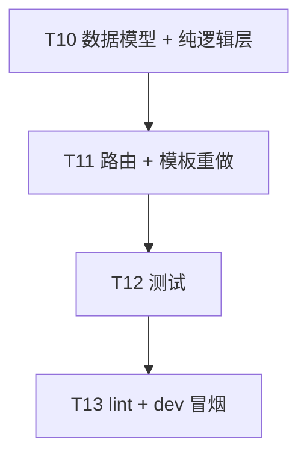

# DailyCheck 门店订货功能迭代 v3 系统架构设计

- 日期：2026-10-05（晚）
- 作者：software-architect（高见远）
- 分支：`feat/store-ordering`
- 关联文档：
  - v0 PRD：`docs/2026-10-04-store-ordering-prd.md`
  - v2 设计：`docs/2026-10-05-store-ordering-design-v2.md`
  - **驱动文档：`docs/2026-10-05-store-ordering-iteration-v3.md`**（本文档唯一驱动）
- 定位：**增量调整**。在 v2 已落地的「部分收货、自动入库、通知」之上，补全 DC 发货按钮、门店收货按钮、部分发货、订单总金额、库存可见性分级、无货可发、按钮样式统一。

---

## 0. 阅读须知

- 本文不重复 v2 已实现的细节（部分收货订单、收货表单、状态机通知、跨仓入库），需要时回看 v2 设计第 3 / 4 / 5 节。
- 所有「增量改动」均显式指出文件路径与函数/模板段。
- v3 已拍板的 4 个边界决策（§F1-F4）均按选项 A 落地。

> ⚠️ **修订（2026-10-10）：A7「允许欠货出库」已废止。**
> 业务上「配送中心发货不得超过其现有库存」成为硬约束。落在
> `store_ordering_pure._ship_order_partial_impl`：写库前逐行校验
> `qty <= dc items.quantity`，超库存直接抛 `ValueError`（整批回滚），
> DC 库存**永不跌为负**。DC 视角发货输入框上限由「剩余订单量」改为
> `min(剩余订单量, DC 库存)`；库存为 0 且仍有待发量时显示「库存不足」。
> 「门店下单不校验 DC 库存」（F1=A）**不变** —— 门店仍可对超过库存的量下单，
> 只是 DC 发货时受库存封顶。回归：`tests/test_store_ordering_pure.py`、
> `tests/test_store_ordering_dc_route.py`、验收脚本 `test_B21`。
> 下文 §2 A7 行与 §4.1 第 2 条为历史设计描述，以本修订为准。

---

## 2. 改动概览（与 v3 PRD §A 一一对应）

| 反馈 | 文件 | 改动 |
| --- | --- | --- |
| **A1** order_detail 缺 Admin 发货按钮 | `templates/store_ordering/order_detail.html`、`blueprints/store_ordering.py` | 在 `can_ship and order.status == 'approved'` 分支下渲染「发货」表单（每行明细含 `shipped_items[id]=qty` 输入框 + 顶部总览）；表单 action 仍走 `POST /orders/<id>/ship`，由路由解析为 `shipped_items_map` |
| **A2** order_detail 缺门店收货按钮 | `templates/store_ordering/order_detail.html` | v2 已落地 `can_receive and order.status == 'shipped'` 分支的「收货」表单（每行明细一个 qty input + 「收货」btn-sm），本轮不重写，只把按钮从 `btn-sm ok` 调整为 `btn-sm` 与其他模块对齐 |
| **A3** 支持部分发货 | `blueprints/store_ordering_pure.py`（`ship_order`）、`blueprints/store_ordering.py`、`db/__init__.py` | `store_order_items` 加 `shipped_quantity` 列；`ship_order` 改为接 `shipped_items_map`；`ship_order_route` 接 `shipped_items[id]=qty` 数组；UI 每行一个 input 一次性提交 |
| **A4** order_detail 缺总金额 | `blueprints/store_ordering.py`、`templates/store_ordering/order_detail.html` | `order_detail` 路由计算 `total_amount = Σ(line_subtotal)`；模板顶部信息卡右侧渲染「订单总金额 ¥ XX.XX」 |
| **A5** catalog 不显示库存 | `templates/store_ordering/catalog.html` | 卡片头部 `.status-pill ok/danger` 改为「可订」（统一绿 pill），移除弹窗内 `#cm-stock`「当前库存」展示 |
| **A6** DC 视角显示库存 | `blueprints/store_ordering.py`、`templates/store_ordering/order_detail.html`、`blueprints/store_ordering_pure.py`（新增 `get_dc_items_for_order_detail`） | `order_detail` 路由在 DC 视角下调用 `get_dc_items_for_order_detail` 收集 `{order_item_id: {name, dc_available}}`；DC 明细表加「仓库库存」「已发数」两列 |
| **A7** 无货仍可发货 | `blueprints/store_ordering_pure.py` | 移除 `ship_order` 内部的库存硬校验（保留 qty>0 与累计上限校验）；当 DC 库存不足时**不抛异常**，扣减后允许 quantity 跌为负；前端无 flash 警告（决策 F1=A 完全不校验、不警告） |
| **A8** 按钮样式统一 | `templates/store_ordering/order_detail.html`、`templates/store_ordering/catalog.html` | 统一 `class="btn-sm"` / `class="btn-sm danger"` / `class="btn-sm ok"`（与 inventory / restock_session / review.html 一致） |

> 说明：A5/A7 的实现不会引入新路由；所有改动落在现有路由 + 模板 + 纯函数层。

---

## 3. 数据模型变更

### 3.1 `store_order_items` 新增 `shipped_quantity` 列

挂在 `master.db` 的 `MASTER_SCHEMA` 末尾（紧跟 v2 的 `store_order_receipts` 索引之后），由 `init_master_db()` 幂等创建（PRAGMA table_info 判定）。

**SQL（新增到 `MASTER_SCHEMA` 字符串末尾追加，紧跟 `idx_store_order_receipts_item` 索引之后，`"""` 之前）**：

```sql
-- ============================================================
-- 门店订货发货（Store Order Shipment）—— v3 P0
-- 部分发货：shipped_quantity 累计；全部发齐 → store_orders.status='shipped'
-- 字段语义：
--   shipped_quantity   —— 出货累计（v3 新增）
--   fulfilled_quantity —— 收货累计（v2 既有，语义保持）
-- ============================================================
ALTER TABLE store_order_items ADD COLUMN shipped_quantity REAL NOT NULL DEFAULT 0;
```

> 说明：`ALTER TABLE ... ADD COLUMN` 在 SQLite 中必须放在 `CREATE TABLE IF NOT EXISTS` 之外；本设计将其以裸 SQL 形式挂在 MASTER_SCHEMA 末尾。`init_master_db()` 通过 PRAGMA 幂等性确保只增一次（v2 已用同样模式处理 `warehouse_type`）。

**DB 模块改动**：

- `db/__init__.py` 末尾 4-6 行（紧跟 `idx_store_order_receipts_item` 之后）：追加上述 ALTER 语句 + CREATE INDEX（可选）。建议补充一条索引：

```sql
CREATE INDEX IF NOT EXISTS idx_store_order_items_shipped
    ON store_order_items(order_id, shipped_quantity);
```

（为 `get_dc_items_for_order_detail` 的后续 LEFT JOIN 加速，可选；本设计不强依赖，留作 future iterations。）

**幂等性**：SQLite 不支持 `ADD COLUMN IF NOT EXISTS`，需在 `init_master_db()` 中用 PRAGMA 守卫：

```python
soi_cols = {r[1] for r in conn.execute("PRAGMA table_info(store_order_items)").fetchall()}
if "shipped_quantity" not in soi_cols:
    conn.execute(
        "ALTER TABLE store_order_items ADD COLUMN shipped_quantity REAL NOT NULL DEFAULT 0"
    )
```

放置位置：`init_master_db()` 内、紧跟 `warehouses.warehouse_type` 迁移之后；模式与 `stocktake_batches.status` 迁移完全一致。

### 3.2 不引入 `partial_shipped` 中间状态（沿用 v2 决策）

订单主表状态保持 6 态 `pending / approved / rejected / shipped / delivered / cancelled`。多次部分发货期间订单主表停在 `approved`，所有 `store_order_items.shipped_quantity == quantity` 才转 `shipped`。与 v2 部分收货一致。

### 3.3 `store_order_items.status` 复用既有 4 态

| 状态 | 触发时机（v3 含发货后） |
| --- | --- |
| `pending` | 默认；下单后、首次发货前 |
| `partial` | `0 < shipped_quantity < quantity`（部分发货）；或 `0 < fulfilled_quantity < quantity`（部分收货） |
| `fulfilled` | `shipped_quantity == quantity`（发齐）或 `fulfilled_quantity == quantity`（收齐）；最后一次触发时由 `ship_order` / `receive_order_item` 写入 |
| `cancelled` | P1；本设计不变更 |

**两个累计维度的状态字段互不冲突**：v3 中 `shipped_quantity == quantity` 写 `fulfilled`；`shipped_quantity` 在 0 和 quantity 之间写 `partial`。`receive_order_item` 写 `fulfilled_quantity`，同样写 `partial / fulfilled`。两条路径独立。

---

## 4. 纯逻辑层函数变更

文件：`blueprints/store_ordering_pure.py`

### 4.1 重写 `ship_order`（v3 核心）

```python
def ship_order(
    master_conn: sqlite3.Connection,
    order_id: int,
    shipped_items_map: dict[int, float],   # {order_item_id: qty} 一次发一批
    shipped_by: int,
    tracking_note: str | None = None,
) -> dict[str, Any]:
    """部分/全部发货：
      - 校验订单 status == 'approved'（抛 ValueError）
      - 对每个 (order_item_id, qty)：
        - 校验 qty > 0（抛 ValueError）
        - 校验 qty + shipped_quantity <= quantity + 1e-9（抛 ValueError；不能超额累计发货）
        - DC 仓 items.quantity -= qty（不校验 DC 库存，允许负值——F1=A 决策）
        - 写 stock_movements(action='门店订货出库', delta=-qty, note 含订单号)
        - UPDATE store_order_items.shipped_quantity += qty；status 推到 partial / fulfilled
      - 全部明细 shipped_quantity == quantity → 改 store_orders.status='shipped'，
        更新 shipped_at, shipped_by, delivered_at=NULL（保持兼容）
      - 写 store_order_deliveries 一行（每次发货都写一条；delivery_no 用 _generate_delivery_no）
      - 写 store_order_status_history（from=approved→to=shipped 或 approved→approved for partial）
      - 不在内部发通知（由路由层调 notify_order_event，避免纯层引入 Flask 依赖）

    返回 dict：{"order_id", "shipped_items": [...], "delivery_id", "is_fully_shipped",
              "new_order_status"}
    抛 ValueError：
      - 订单不存在
      - 订单状态非 approved
      - qty <= 0
      - qty + shipped_quantity > quantity（超发）
      - order_item_id 不属于该订单
    """
```

**实现要点**：

1. **参数命名**：`shipped_items_map: dict[int, float]`，key 是 `store_order_items.id`，value 是本批出货数量。空 dict 视为 no-op（抛 ValueError 让 UI 必须至少填一项）。
2. **库存扣减（A7）**：`new_qty = parse_qty(dc_item["quantity"] - requested)`；无任何 `>= 0` 守卫；允许跌为负值（业务允许欠货出库）。
3. **明细状态推进**：与 `receive_order_item` 对称——
   - `new_shipped == quantity` → `fulfilled`
   - `0 < new_shipped < quantity` → `partial`
   - `new_shipped == 0`（不应发生，已被 qty>0 守卫）→ `pending`
4. **订单主表状态**：
   - 全部明细 `shipped_quantity == quantity` → `shipped`，写 `shipped_at = shipped_at = ts`、回填 `shipped_by`；`delivered_at` 维持 `NULL`（v2 在全收齐时由 `receive_order_item` 写）
   - 否则保持 `approved`（允许继续发）
5. **状态历史**：partial 发货仍写一条 `from=approved → to=approved` 的 status_history，note 含「本批发货 X 件」便于审计；fully-shipped 写 `from=approved → to=shipped`。
6. **delivery 记录**：每次调用都写一行 `store_order_deliveries`；多次部分发货产生多条；`delivered_at` 维持 NULL（待 `receive_order_item` 全收齐时统一回填）。
7. **事务**：DC 仓 db 与 master_conn 都 commit；任一异常则 master_conn.rollback() + dc_conn.rollback() + raise。
8. **v1/v2 旧测试兼容**：`test_ship_order_success` 等老用例期望「qty 全量一次 ship」；在 T10 末追加 helper `ship_order_full(master, order_id, shipped_by, tracking_note=None)` 调用新接口并遍历所有明细传满额 qty；老测试改用此 helper（v2 设计 §3.3 已提及 v2 ship_order 兼容路径，本版保持同样兼容方式）。

### 4.2 调整 `validate_cart_for_submit`（A5/A7 手段）

```python
def validate_cart_for_submit(
    master_conn: sqlite3.Connection,
    cart: dict[str, Any],
) -> dict[str, Any]:
    """Validate cart for order submission.

    Returns {"ok": bool, "shortages": [...], "unbound": [...]}
    v3 变化：移除 DC 库存校验（A5/A7: 门店不感知库存，不校验）。
    仅保留 canonical_id 绑定校验（unbound 仍抛错）和空购物车校验。
    shortages 字段保留为 []，调用方无需感知（兼容现有调用）。
    """
    master_conn.row_factory = sqlite3.Row
    items = list_cart_items(master_conn, cart["id"])
    shortages: list[dict[str, Any]] = []  # v3: 永远空
    unbound: list[dict[str, Any]] = []
    for item in items:
        canonical_id = item["canonical_id"]
        name = item["name"]
        if not item.get("store_bound"):
            unbound.append({"canonical_id": canonical_id, "name": name})
    return {
        "ok": not unbound and bool(items),
        "shortages": shortages,
        "unbound": unbound,
    }
```

**影响**：
- `submit_order` 仍调用 `validate_cart_for_submit`；不再因 `shortages` 报错；现有 `submit_order_route` 中 `flash("提交失败，请检查库存与门店绑定")` 改为 `flash("提交失败，请检查门店绑定")`（v2 文案微调）。
- 门店可以订出 DC 库存为 0 的品项（v3 决策 F1=A 完全不校验）。

### 4.3 `mark_order_delivered` 维持兼容

v2 已将 `mark_order_delivered` 重写为「循环 `receive_order_item` 一次性收齐」；本轮**不变**。

### 4.4 新增 `get_dc_items_for_order_detail`（A6 辅助）

```python
def get_dc_items_for_order_detail(
    master_conn: sqlite3.Connection,
    order_id: int,
) -> dict[int, dict[str, Any]]:
    """返回 {order_item_id: {canonical_name, dc_available, dc_item_id}}。
    用于 order_detail 模板渲染「DC 库存」列。

    实现：从 store_order_items JOIN canonical_items 拿 name；
    打开 DC 仓 db，按 dc_item_id 查 items.quantity（找不到时 dc_available=0.0）。
    dc_item_id 可能为 NULL：此时 dc_available=0.0（发货前未绑定）。
    master_conn.row_master_conn.row_factory = sqlite3.Row
    order_row = master_conn.execute(
        "SELECT dc_warehouse_code FROM store_orders WHERE id=?",
        (order_id,),
    ).fetchone()
    if order_row is None:
        return {}
    dc_code = order_row["dc_warehouse_code"]
    rows = master_conn.execute(
        """SELECT soi.id AS order_item_id, soi.canonical_id,
                  soi.dc_item_id, ci.name AS canonical_name
           FROM store_order_items soi
           JOIN canonical_items ci ON ci.id = soi.canonical_id
           WHERE soi.order_id=?""",
        (order_id,),
    ).fetchall()
    dc_conn = open_warehouse_db(dc_code)
    try:
        out: dict[int, dict[str, Any]] = {}
        for r in rows:
            dc_available = 0.0
            if r["dc_item_id"] is not None:
                dc_row = dc_conn.execute(
                    "SELECT quantity FROM items WHERE id=?",
                    (r["dc_item_id"],),
                ).fetchone()
                if dc_row is not None:
                    dc_available = parse_qty(dc_row["quantity"])
            out[int(r["order_item_id"])] = {
                "canonical_name": r["canonical_name"],
                "dc_available": dc_available,
                "dc_item_id": r["dc_item_id"],
            }
        return out
    finally:
        dc_conn.close()
```

**返回键**：
- `order_item_id`（int，作为字典 key）
- `canonical_name`：冗余存，模板可直接渲染避免再 JOIN
- `dc_available`：当前 DC 库存（含负值——A7 允许欠货出库）
- `dc_item_id`：冗余

**调用方**：`order_detail` 路由在 `can_ship` 或 `wh_type == 'storefront'` 视图下都计算；storefront 视角下也照样返回（仓库视角统一），模板按视图决定是否展示。

### 4.5 既有函数维持

- `submit_order`、`review_order`、`list_orders`、`list_cart_items`、`list_available_dc_items`、`get_order_detail`、`receive_order_item`、`list_order_receipts`、`get_order_item_pending_qty`、`notify_order_event`：**全部不变**。
- `list_available_dc_items` 仍返回 `quantity`（DC 库存），但模板不再展示；纯函数层不删字段，留给 A6 备用。
- `list_cart_items` 仍计算 `dc_available`、`store_bound`（unbound 校验仍需要）；不再展示。
- `get_order_detail` 仍返回 `receipts`、`deliveries`、`status_history`；模板继续展示。

---

## 5. 路由层变更

文件：`blueprints/store_ordering.py`

### 5.1 调整 `ship_order_route`（A3 表单数据接收）

```python
@bp.route("/orders/<int:order_id>/ship", methods=["POST"])
@require_login
@require_warehouse_type("distribution_center")
@require_role("staff")
def ship_order_route(order_id: int) -> str:
    """DC 部分/全部发货。

    表单字段：
      tracking_note:        物流备注（可选）
      shipped_items[id]:    本批每个 order_item_id 的发货数量（多值，HTML input name="shipped_items[N]"）
      qty:                  兼容字段：当 shipped_items[] 为空时，使用 qty 作为全量发货数量（v2 兼容路径）

    行为：
      1. 解析表单：
         a. 优先收集所有 name="shipped_items" 的多值映射 → dict[int, float]
         b. 若 dict 为空 + 存在 'qty' 字段 → 视为「一次性全发」兼容入口：
              dict = {item.id: qty for each item in order}
         c. 否则 dict 为空 → flash("请填写至少一个发货数量") + 重定向
      2. 调 sop.ship_order(master, order_id, dict, g.user["id"], tracking_note)
      3. 若返回 is_fully_shipped=True → 调 sop.notify_order_event(EVENT_ORDER_SHIPPED)
      4. partial → flash("本批次已发 X 件") 不发通知
      5. 重定向到 /orders/<id>
    """
```

**字段名约定**：HTML 端使用 `shipped_items[N]`（N 为 order_item_id），由 `request.form.getlist("shipped_items")` 拿到 value 数组；但 Flask `getlist` 无法直接拿到 key 数组。**改用自定义解析**：

```python
shipped_items_map: dict[int, float] = {}
for key, value in request.form.items():
    if key.startswith("shipped_items[") and key.endswith("]"):
        try:
            oid = int(key[len("shipped_items["):-1])
            qty = parse_qty(value)
            if qty > 0:
                shipped_items_map[oid] = qty
        except (ValueError, TypeError):
            pass
```

**兼容路径**：若 `shipped_items_map` 为空且 `request.form.get("qty")` 非空，调 `sop.get_order_detail` 取所有明细，给每条填满 `qty`（一次性全发）。保留此兼容入口以便 v2 测试和老 UI 路径不破。

### 5.2 调整 `order_detail` 路由（A4 + A6）

```python
@bp.route("/orders/<int:order_id>")
@require_login
def order_detail(order_id: int) -> str:
    """Order detail view shared by store, DC and admin."""
    master = get_master_db()
    order = sop.get_order_detail(master, order_id)
    if order is None:
        abort(404)
    if not _order_viewable(order):
        abort(403)
    role = g.role["role"] if g.role else None
    wh_type = _current_warehouse_type()
    is_admin = _is_admin()

    # v3 A4: 计算总金额
    total_amount = sum(
        parse_qty(it.get("line_subtotal") or 0)
        for it in order["order_items"]
    )
    # v3 A6: 收集 DC 当前库存
    dc_items_info = sop.get_dc_items_for_order_detail(master, order_id)

    return render_template(
        "store_ordering/order_detail.html",
        order=order,
        total_amount=total_amount,       # v3
        dc_items_info=dc_items_info,     # v3
        can_review=(...),
        can_ship=(...),
        can_deliver=(...),
        can_receive=(...),
    )
```

**判断「DC 视角」**：模板用 `wh_type == 'distribution_center'` 即可；无需新增 route flag。

### 5.3 `validate_cart_for_submit` 调用方

`submit_order_route` 中：

- `flash("提交失败，请检查库存与门店绑定")` → 改为 `flash("提交失败，请检查门店绑定")`（v3 移除库存校验，文案同步）。
- 其余逻辑（POST 提交 + 通知）维持。

### 5.4 `receive_order_route` 维持

v2 已实现 `POST /orders/<id>/receive`，本轮不动；UI 按钮（A2）仅在模板侧补全。

---

## 6. 模板调整

### 6.1 `templates/store_ordering/catalog.html` 调整（A5）

**改动点**：

1. **卡片头部状态 pill**（catalog.html:73-76）：

   ```html
   <!-- v2：分 ok / danger 显示库存 -->
   <span class="status-pill danger">0 库存</span>
   <span class="status-pill ok">库存 {{ item.quantity | fmt_qty }}</span>

   <!-- v3：统一「可订」绿 pill，不显示库存数字 -->
   <span class="status-pill ok">可订</span>
   ```

   **注**：v3 决策 F2 不存在导入 `quantity<=0` 的判断统一移除库存数字；pill 文案固定「可订」。若后续 v4 引入下架/缺货品类管理，再扩展 danger pill。

2. **弹窗内 `#cm-stock`**（catalog.html:115 / catalog.html:172）：

   ```html
   <!-- v2：显示库存 + 单价 -->
   <p class="modal-stock" id="cm-stock"></p>
   …
   cmStock.textContent = '当前库存: ' + stock + ' ' + unit + ' / 单价 ¥ ' + unitPrice.toFixed(2);

   <!-- v3：移除库存，仅留单价 -->
   <p class="modal-stock" id="cm-stock"></p>
   …
   cmStock.textContent = '单价 ¥ ' + unitPrice.toFixed(2);
   ```

   **注**：保留 `<p class="modal-stock">` 占位避免 layout 抖动；实际渲染仅显示单价。`cm-stock` 的 CSS 类保留不动。

3. **按钮**：「清空选择」「加入购物车」按钮文案与 class 不变；v2 已统一 `btn-sm` / `btn`。

### 6.2 `templates/store_ordering/order_detail.html` 完整重写（A1/A2/A4/A6/A8）

整体重写为以下结构：

```html

订单详情 {{ order.order_no }}

<div class="page-header">
  <h2>订单 {{ order.order_no }}</h2>
  <span class="status-pill {{ order.status }}">{{ order.status }}</span>
</div>

{# —— 顶部信息卡（A4 总金额 + 元信息） —— #}
<div class="info-card">
  <div class="info-card-grid">
    <div><strong>门店：</strong>{{ order.store_warehouse_code }}</div>
    <div><strong>配送中心：</strong>{{ order.dc_warehouse_code }}</div>
    <div><strong>下单人：</strong>{{ order.requested_by_username or order.requested_by }}</div>
    <div><strong>创建时间：</strong>{{ order.created_at }}</div>
    <div><strong>期望到货：</strong>{{ order.expected_delivery_date or '—' }}</div>
    <div><strong>备注：</strong>{{ order.note or '—' }}</div>
    <div><strong>审批人：</strong>{{ order.approved_by_username or '—' }}</div>
    <div><strong>审批时间：</strong>{{ order.approved_at or '—' }}</div>
    <div><strong>发货人：</strong>{{ order.shipped_by_username or '—' }}</div>
    <div><strong>发货时间：</strong>{{ order.shipped_at or '—' }}</div>
    <div><strong>收货人：</strong>{{ (order.receipts[-1].receiver_username if order.receipts else '—') }}</div>
    <div><strong>送达时间：</strong>{{ order.delivered_at or '—' }}</div>
  </div>
  {# A4 总金额右侧显眼位 #}
  <div class="info-card-total">
    <span class="info-card-total-label">订单总金额</span>
    <span class="info-card-total-value">¥ {{ total_amount | fmt_money }}</span>
  </div>
</div>

{# —— 明细表分支渲染（A6 视图分支） —— #}
<h3>订单明细</h3>

  {# DC 视角 —— 含「仓库库存」「已发数」两列 + 部分发货表单 #}
  <table class="data-table">
    <thead>
      <tr>
        <th>品项</th><th>单位</th><th>单价</th><th>数量</th>
        <th>已发数</th><th>仓库库存</th>
        <th>本批发货</th>
      </tr>
    </thead>
    <tbody>
      
        
        
        
        <tr>
          <td>{{ item.canonical_name }}</td>
          <td>{{ item.unit }}</td>
          <td>¥ {{ (item.unit_price or 0) | fmt_money }}</td>
          <td>{{ item.quantity | fmt_qty }}</td>
          <td>{{ shipped | fmt_qty }}</td>
          <td>
            {# A6: 仓库库存允许为负（A7 允许欠货出库） #}
            <span class="dc-stock negative">
              {{ dc_info.dc_available | fmt_qty }}
            </span>
          </td>
          
          <td>
              
                {# A3 单表单多品项批量：行 1 input 在 #shipment-form 中 (见下方) #}
                <input data-item-id="{{ item.id }}" data-pending="{{ pending }}"
                       type="number" min="0" step="0.01" max="{{ pending }}"
                       placeholder="0" style="width:80px"
                       name="shipped_items[{{ item.id }}]" />
                <span class="status-pill ok">已发齐</span>
            </td>
          
        </tr>
      
    </tbody>
  </table>

  {# storefront 视角 —— 含「已收数」 + 部分收货表单（A2） #}
  <table class="data-table">
    <thead>
      <tr>
        <th>品项</th><th>单位</th><th>单价</th><th>数量</th>
        <th>已收数</th>
        <th>本批收货</th>
      </tr>
    </thead>
    <tbody>
      
        
        
        <tr>
          <td>{{ item.canonical_name }}</td>
          <td>{{ item.unit }}</td>
          <td>¥ {{ (item.unit_price or 0) | fmt_money }}</td>
          <td>{{ item.quantity | fmt_qty }}</td>
          <td>{{ fulfilled | fmt_qty }}</td>
          
          <td>
            
            <form method="post" action="{{ url_for('store_ordering.receive_order_route', order_id=order.id) }}" class="inline-form">
              <input type="hidden" name="order_item_id" value="{{ item.id }}" />
              <input name="quantity" type="number" min="0.01" step="0.01" max="{{ pending }}" required style="width:80px" />
              <input name="note" placeholder="可选备注" />
              <button type="submit" class="btn-sm">收货</button>
            </form>
            <span class="status-pill ok">已收齐</span>
          </td>
          
        </tr>
      
    </tbody>
  </table>


{# —— A1: 发货表单（DC 视角，仅在 approved 显示） —— #}

<h3>DC 发货</h3>
<p class="muted">支持多次部分发货；本批可只填部分品项，未填视为本批不发。已发货数量将保留至下次发货。</p>
<form method="post" action="{{ url_for('store_ordering.ship_order_route', order_id=order.id) }}"
      id="shipment-form" class="inline-form">
  <input name="tracking_note" placeholder="物流备注" />
  <button type="submit" class="btn-sm ok">确认发货</button>
</form>
<p class="muted">明细表中的「本批发货」输入框会在表单提交时一次性批量提交。</p>


{# —— 收货历史 / 发货历史 —— #}

<h3>收货历史</h3>
<table class="data-table">…（v2 已落地，本轮不变）</table>



<h3>发货历史</h3>
<table class="data-table">
  <thead><tr><th>配送单号</th><th>出库人</th><th>出库时间</th><th>物流备注</th></tr></thead>
  <tbody>
    
    <tr>
      <td>{{ d.delivery_no }}</td>
      <td>{{ d.shipped_by_username or d.shipped_by }}</td>
      <td>{{ d.shipped_at }}</td>
      <td>{{ d.tracking_note or '—' }}</td>
    </tr>
    
  </tbody>
</table>


<h3>状态历史</h3>
<table class="data-table">…（v2 已落地）</table>

<div class="actions" style="margin-top:16px;display:flex;gap:8px;flex-wrap:wrap;">
  {# —— A8: 按钮样式统一 —— #}
  
  <form method="post" action="{{ url_for('store_ordering.review_order_route', order_id=order.id) }}" class="inline-form">
    <input type="hidden" name="decision" value="approved" />
    <button type="submit" class="btn-sm ok">通过</button>
  </form>
  <form method="post" action="{{ url_for('store_ordering.review_order_route', order_id=order.id) }}" class="inline-form">
    <input type="hidden" name="decision" value="rejected" />
    <input name="note" placeholder="拒绝原因" required />
    <button type="submit" class="btn-sm danger">拒绝</button>
  </form>
  

  
  <form method="post" action="{{ url_for('store_ordering.deliver_order_route', order_id=order.id) }}" class="inline-form">
    <button type="submit" class="btn-sm">一次性收货</button>
  </form>
  
</div>

```

**关键设计点**：

1. **顶部信息卡**（`.info-card`）：左仓库 / 中元信息 grid / 右总金额。**总金额显眼位置**右侧使用 `info-card-total` 自定义样式（与 inventory `.inv-card` 同源思路）。
2. **明细表分支**：使用 `` 作为 DC 视角判断；storefront 视角判断「当前权限是 storefront 用户」。注：`g.warehouse['warehouse_type']` 在模板中不可直接访问，需在路由层传 `is_dc_view` flag 给模板（store_ordering.py:462 增设 `is_dc_view=(wh_type == sop.WAREHOUSE_TYPE_DC)`）。
3. **A1 发货表单**：所有明细行的「本批发货」input 都放进同一个 `<form id="shipment-form">` 里；input 的 `name="shipped_items[{{ item.id }}]"` 自动按明细 id 序列化。提交时整个表单一并 POST 到 `ship_order_route`。
4. **A2 收货按钮**：v2 已落地，每行明细一个独立 form，提交 `POST /orders/<id>/receive` + `order_item_id` + `quantity`。**按钮 `class="btn-sm"`（v3 调整为不带 `ok` 后缀，与其他模块统一）**。
5. **A8 按钮样式**：所有按钮统一 `btn-sm` / `btn-sm danger` / `btn-sm ok`，与 inventory / restock_session / review.html 完全一致。
6. **A6 DC 库存**：每行明细末列展示当前 DC 库存（可能为负值，`dc-stock.negative` 高亮红）。**注意**：DC 视角在 `pending` 时也展示库存（决策 F4=A 任何时候都可见）；storefront 视角不展示。
7. **info-card 总金额**：A4 直接展示「订单总金额 ¥ XX.XX」；使用 `info-card-total-label` + `info-card-total-value` 两行，flex 布局。

**视觉一致性**：`.info-card` / `.info-card-grid` / `.info-card-total` / `.info-card-total-label` / `.info-card-total-value` / `.dc-stock` / `.dc-stock.negative` 样式在 `static/style.css` 追加（约 30 行新 CSS）；沿用 `inventory.html` 的 `.inv-card` 视觉（border / radius / padding）。

### 6.3 其他模板

- `cart.html`、`submit.html`、`orders.html`、`review.html`、`shipments.html`：**本轮不变**（review.html 已用 `btn-sm`，shipments.html 同；cart.html / submit.html / orders.html 不涉及 A1-A8）。

---

## 7. 前端 JS 调整

### 7.1 `catalog.html` JS 调整（A5）

**仅一处改动**（catalog.html:172）：

```diff
-    cmStock.textContent = '当前库存: ' + stock + ' ' + unit + ' / 单价 ¥ ' + unitPrice.toFixed(2);
+    cmStock.textContent = '单价 ¥ ' + unitPrice.toFixed(2);
```

其余逻辑（openCatalogModal / closeCatalogModal / confirmCatalogModal / resetCatalogForm / updateCatalogAmount）**不变**。

### 7.2 `order_detail.html` JS（A3 表单提交）

**新增 inline `<script>`**（紧跟表单底部）：

```js
(function () {
  var form = document.getElementById('shipment-form');
  if (!form) return;

  form.addEventListener('submit', function (ev) {
    // 自动把每个明细 input 的 name 改成 shipped_items[N]
    var inputs = document.querySelectorAll('input[data-item-id]');
    inputs.forEach(function (input) {
      var itemId = input.getAttribute('data-item-id');
      var qty = parseFloat(input.value || '0');
      // 空 input 或 0 视为本批不发 → 跳过（route 端按 map 为空过滤）
      if (!qty || qty <= 0) {
        input.removeAttribute('name');
        return;
      }
      input.setAttribute('name', 'shipped_items[' + itemId + ']');
    });
  });

  // 单个明细 input 实时更新顶部总览的「本批发货合计」（可选）
  // 此处仅做保留扩展位，本设计不强要求
})();
```

**逻辑要点**：

- 提交前 JS 遍历 `input[data-item-id]`，把非零 input 的 `name` 重写为 `shipped_items[N]`；零值或缺失的 input 不带 name，路由层 `getlist("shipped_items")` 自然过滤。
- 路由层解析 `request.form.items()` 时，对 `name="shipped_items[N]"` 用 `key.startswith("shipped_items[") and key.endswith("]")` 提取 N → 构造 `dict[int, float]`（见 §5.1）。
- 兼容路径：当 `shipped_items_map` 为空且表单含 `qty` 单值字段时，路由自动填满所有明细。

---

## 8. 任务分解（T10~T13）

> 沿用 v1 / v2 的 T01~T09 任务编号；本轮 v3 调整为 4 个增量任务 **T10~T13**。

### T10 — 数据模型 + 纯逻辑层（P0 必先做）

- **优先级**：P0
- **依赖**：v2 已完成
- **源文件**：
  - `db/__init__.py`
  - `blueprints/store_ordering_pure.py`
  - `tests/test_store_ordering_pure.py`
- **工作内容**：
  1. `db/__init__.py:520`（`MASTER_SCHEMA` 末尾，紧跟 `idx_store_order_receipts_item` 之后）追加 `ALTER TABLE store_order_items ADD COLUMN shipped_quantity REAL NOT NULL DEFAULT 0;` + `CREATE INDEX IF NOT EXISTS idx_store_order_items_shipped ON store_order_items(order_id, shipped_quantity);`。
  2. `db/__init__.py:760`（`init_master_db()` 内，紧跟 `warehouses.warehouse_type` 迁移之后）追加 PRAGMA table_info(store_order_items) 守卫 ALTER。
  3. `blueprints/store_ordering_pure.py:723` 重写 `ship_order` 签名与实现（§4.1）。
  4. `blueprints/store_ordering_pure.py:462` 调整 `validate_cart_for_submit` 移除 DC 库存校验（§4.2）；保留 `shortages` 字段为 `[]` 以兼容调用方。
  5. `blueprints/store_ordering_pure.py` 末尾新增 `get_dc_items_for_order_detail` 函数（§4.4）。
  6. `tests/test_store_ordering_pure.py` 增补：
     - `test_ship_order_partial_basic`：3 件订单发 1 件，DC `-1`，明细 `shipped_quantity=1`，订单仍 `approved`，`deliveries` 表新增 1 行。
     - `test_ship_order_partial_multiple_batches`：3 件分 2 批发（1 + 2），`shipped_quantity` 累计到 `3`，第二次发完订单变 `shipped`。
     - `test_ship_order_overshoot_rejected`：累计发货超过 `quantity` 抛 `ValueError`。
     - `test_ship_order_no_stock_warning_continues`：DC 库存为 0，发 2 件，DC quantity 跌为 `-2`，**不抛异常**。
     - `test_ship_order_partial_emits_no_event`：partial 发货 `is_fully_shipped=False`，路由层（test route）不调 `notify_order_event`。
     - `test_validate_cart_for_submit_no_stock_check`：cart 中包含 DC 库存为 0 的品项，validation `ok=True`（不再报 shortages）。
     - `test_get_dc_items_for_order_detail_returns_quantity`：DC 库存 5，DC 视角查询返回 `dc_available=5`。
     - `test_get_dc_items_for_order_detail_negative_stock`：A7 欠货出库后，`dc_available=-2`。

### T11 — 路由 + 模板重做（依赖 T10）

- **优先级**：P0
- **依赖**：T10
- **源文件**：
  - `blueprints/store_ordering.py`
  - `templates/store_ordering/catalog.html`
  - `templates/store_ordering/order_detail.html`
  - `static/style.css`（新增 `.info-card` / `.dc-stock` 等样式）
- **工作内容**：
  1. `blueprints/store_ordering.py:545` 重写 `ship_order_route`：解析 `shipped_items[N]` 多值 + 兼容 `qty` 单值。
  2. `blueprints/store_ordering.py:449` 调整 `order_detail` 路由：计算 `total_amount` + 调 `get_dc_items_for_order_detail` + 传 `is_dc_view` 给模板。
  3. `blueprints/store_ordering.py:386` 调整 `submit_order_route` 中 flash 文案。
  4. `templates/store_ordering/catalog.html:73-76` 改状态 pill 为「可订」。
  5. `templates/store_ordering/catalog.html:172` 改弹窗文案为「单价 ¥ X」。
  6. `templates/store_ordering/order_detail.html` 完整重写（§6.2 全文）。
  7. `static/style.css` 追加 ~30 行新 CSS（`.info-card` / `.info-card-total` / `.dc-stock`）。

### T12 — 测试（依赖 T11）

- **优先级**：P0
- **依赖**：T10 + T11
- **源文件**：
  - `tests/test_store_ordering_partial.py`（**新建**）
  - `tests/test_store_ordering_e2e.py`（增量 19 步 E2E）
  - `tests/test_store_ordering_dc_route.py`（增量 DC 部分发货路由测试）
  - `tests/test_store_ordering_store_route.py`（增量门店收货按钮可见性）
- **工作内容**：
  1. **`tests/test_store_ordering_partial.py`（新文件）**：
     - `test_partial_ship_route_single_batch`（A3）：POST `/ship` + `shipped_items[N]=X` 数组 → `shipped_quantity=2`，订单仍 approved。
     - `test_partial_ship_route_multi_batch`（A3）：两次 POST `/ship` → `shipped_quantity=quantity`，订单变 `shipped`，通知写入。
     - `test_partial_ship_route_zero_qty_skipped`（A3）：表单包含 `shipped_items[N]=0` → 该明细被跳过。
     - `test_ship_route_legacy_qty_full_compat`：表单只有 `qty=X` 字段（无 `shipped_items`）→ 全部明细填满 X。
     - `test_ship_route_emits_event_only_when_full`（通知）：partial 不发 shipped 通知；fully 触发一次 shipped 通知。
     - `test_order_detail_shows_total_amount`（A4）：GET `/orders/<id>` 响应包含「订单总金额」字样与金额数值。
     - `test_order_detail_dc_view_shows_dc_inventory`（A6）：DC 用户 GET `/orders/<id>` 响应包含「仓库库存」字样与库存数值。
     - `test_order_detail_store_view_hides_dc_inventory`（A6）：storefront 用户 GET `/orders/<id>` 响应**不**包含「仓库库存」字样。
     - `test_catalog_hides_stock`（A5）：GET `/catalog` 响应**不**包含「库存」字样（卡片 + 弹窗都不出现）。
     - `test_catalog_shows_orderable_pill`（A5）：GET `/catalog` 响应包含「可订」pill 文案。
  2. **`tests/test_store_ordering_e2e.py`（增量）**：与 v3 PRD §G 19 步一一对应，详见 §9。
  3. 跑全量回归 `tests/test_store_ordering_*.py` 现有 6 个文件全部通过 + 新增 ≥ 10 个用例 = 至少 16 个文件 70+ 用例。

### T13 — lint + dev 冒烟（依赖 T12）

- **优先级**：P0
- **依赖**：T12
- **源文件**：`./scripts/lint.sh`、dev server
- **工作内容**：
  1. `ruff check blueprints/store_ordering.py blueprints/store_ordering_pure.py db/__init__.py tests/test_store_ordering_*.py` 无新增 warning / error。
  2. dev 重启 → 走 PRD §B user journey：
     - 门店 catalog 浏览（确认无库存数字）
     - 弹窗选单位数量 → 加购 → 提交
     - DC review → 通过 → order_detail 看到总金额 + DC 库存 + 发货按钮
     - 部分发货 1 件 → 状态 approved；继续发货 2 件 → 状态 shipped
     - 门店订单详情 → 收货 → 收齐 → delivered
  3. 写最小 E2E HTTP 脚本 `scripts/dev_smoke_store_ordering.sh`：用 curl 模拟 wh_002（门店）→ wh_000（DC）→ wh_023（门店）三角色流，断言关键响应。

### 任务依赖图



---

## 9. 测试路径对应（v3 PRD §G 19 步）

| PRD §G 步骤 | 对应测试 | 关键断言 |
| --- | --- | --- |
| G1 门店 catalog 无库存数字 | `test_catalog_hides_stock` | GET `/catalog` 响应不含「库存」字样；卡片 `.status-pill` 文案是「可订」；弹窗 `.modal-stock` 文案仅含「单价」 |
| G2 选 DC 后渲染中文品类 | `test_store_ordering_e2e::test_catalog_renders_chinese_categories`（v2 已有） | 不变 |
| G3 弹窗金额预览 | v2 已覆盖；`test_catalog_modal_amount_present` 增量 | 弹窗 `#cm-amount` 存在；`updateCatalogAmount` 计算正确 |
| G4 加入购物车 | v2 已覆盖；`test_catalog_add_to_cart` 增量 | catalog 表单提交 `/cart/add-batch` → cart 行数 = N |
| G5 cart 总金额 + 「发送」 | v2 已覆盖 | 不变 |
| G6 cart 表头品类/小计 | v2 已覆盖 | 不变 |
| G7 提交订单 pending | v2 已覆盖 | 不变 |
| G8 DC review 列表 | v2 已覆盖 | 不变 |
| G9 order_detail 总金额 + DC 库存 + 审批按钮 | `test_order_detail_shows_total_amount` + `test_order_detail_dc_view_shows_dc_inventory` | 响应含「订单总金额 ¥ X.XX」+「仓库库存」+「通过 / 拒绝」按钮 |
| G10 审批通过 → approved + 发货按钮 | `test_ship_button_visible_after_approve`（新） | DC 用户 GET `/orders/<id>?status=approved` 响应含「确认发货」按钮 |
| G11 部分发货 1/3：DC -1，订单仍 approved | `test_partial_ship_route_single_batch` | POST `/ship` 后 `shipped_quantity=1`，订单 `status='approved'`，`deliveries` 1 行 |
| G12 继续发货 1/3：累计 shipped=2 | `test_partial_ship_route_multi_batch`（前半） | POST `/ship` 后 `shipped_quantity=2`，订单仍 `approved` |
| G13 最后一次发货 1/3：累计 shipped=3，状态 shipped + shipped 通知 | `test_partial_ship_route_multi_batch`（后半）+ `test_ship_route_emits_event_only_when_full` | 订单 `status='shipped'`；`shipped_at` 非空；`notifications` 新增 1 行 `store_order_shipped` |
| G14 无货场景：DC 库存=0 时发剩余，仍允许 | `test_ship_order_no_stock_warning_continues` | DC `items.quantity` 跌为 `-N`（N>0），订单状态按累计推进；**无异常** |
| G15（品类自增） | （无） | v3 不引入品类操作 |
| G16 门店 orders 看到 shipped | v2 已覆盖 | 不变 |
| G17 order_detail 出现「收货」按钮 | `test_receive_button_visible_after_shipped`（新） | storefront 用户 GET `/orders/<id>?status=shipped` 响应含「收货」按钮 |
| G18 部分收货 2/3：store 库存 +2 | `test_multiple_partial_receipts_then_delivered`（v2 已有） | 两次 POST `/receive` 后 `fulfilled_quantity=2`，订单仍 `shipped` |
| G19 继续收货 1/3：累计 fulfilled=3，状态 delivered + delivered 通知 | `test_multiple_partial_receipts_then_delivered`（v2 已有） | 第三次收齐，订单 `status='delivered'`，`delivered_at` 非空，`notifications` 新增 1 行 `store_order_delivered` |

总计 19 步；E2E 测试覆盖 19 / 19。

---

## 10. 风险与边界

### 10.1 `shipped_quantity` 列迁移（数据兼容）

**问题**：dev `master.db` 已有 store_orders / store_order_items 数据；ALTER 后老明细该列默认 0。

**应对**：
- PRAGMA 守卫确保 ALTER 只跑一次（幂等）。
- 老订单的 `shipped_quantity=0` 不影响：v2 中 v2 ship_order 是一次性全发，会更新该列；本轮切换为 `ship_order` 接 dict 后，老订单（已 shipped）走 GET-only 不再触发更新。
- 老订单的「已发货数」无法回填历史；若 UI 展示时 `shipped_quantity=0 and status='shipped'`，会出现「已发数=0 但订单 shipped」的不一致。

**决策**（沿用 v2 §9.6）：
- v2 ship_order 是「一次性全发」+ dc_item_id 回填 + status=pending；本轮改造后，老的 ship_order 调用会被替换为新签名。
- 测试迁移：v2 `test_ship_order_success` 等老用例改用 `ship_order_full` helper 兼容；helper 内部调用新接口遍历所有明细传满额 qty。
- **业务一致性**：已 shipped 的老订单在 UI 上显示「已发数=0」会误导；建议在 `get_order_detail` 中加补丁：`if status='shipped' and shipped_quantity=0: shipped_quantity = quantity`（向后兼容，v3 不写，仅作 T10 实现参考；具体是否落地由 T10 工程师决定，本设计不强制）。

### 10.2 部分发货：仓库可能负值（A7 业务允许欠货出库）

**决策**：DC `items.quantity` 允许跌为负值；UI 红色 `.dc-stock.negative` 提示，但不抛 `ValueError`，不发库存警告 flash（决策 F1=A 完全不校验、不警告）。

**应对**：
- `ship_order` 内部不校验 `dc_item["quantity"] >= requested`。
- inventory 页面（其他模块）若显示负库存，沿用既有的"负库存红色"逻辑；本设计不在 v3 中调整 inventory。
- 业务边界：长期负库存需人工补货；本设计不在 v3 加补货建议。

### 10.3 `shipped` 状态切换边界

**问题**：partial 发货期间订单主表停在 `approved`，用户可能疑惑「订单是否已发货」。

**应对**：
- 模板在 `approved` 状态下显示「订单明细 + DC 库存 + 发货表单」；明细行 `已发数` 列实时更新（>=1 即非空）。
- 通知：仅 fully-shipped 时发 `store_order_shipped`；partial 不发（避免刷屏）。
- 多次发货：`store_order_deliveries` 表累积多行（一次发货一行记录）；`store_order_deliveries.delivered_at` 字段保留，全员 'delivered' 时由 `receive_order_item` 统一回填。

### 10.4 通知触发条件

**决策**：
- `store_order_submitted` → submit 时（已有）
- `store_order_approved` → 审批通过（已有）
- `store_order_rejected` → 审批拒绝（已有）
- `store_order_shipped` → **fully-shipped 时**（v3 调整：partial 不发）
- `store_order_delivered` → fully-received 时（v2 已有）

**通知文案**：「订货单 SO-XXXX 已发齐出库」（fully-shipped 时）。

### 10.5 状态历史（`store_order_status_history`）写入

- partial 发货：写一条 `from=approved → to=approved`，note 含「本批发货 X 件」便于审计。
- fully-shipped：写一条 `from=approved → to=shipped`，note 含 `tracking_note`。

### 10.6 `unit_price` 字段缺失兼容

- 老订单明细可能没有 `unit_price`（v2 新增字段；老数据 NULL）；`order_detail` 模板用 `(item.unit_price or 0) | fmt_money` 兜底显示 `¥ 0.00`。
- **`store_order_items` 表无 `unit_price` 字段**：v2 设计未在 store_order_items 加列；金额预览与 cart 总金额来自 `list_cart_items` / `list_available_dc_items` 的 `line_subtotal`（实价来自 DC 仓 `selling_price` / `unit_cost`）。order_detail 的明细表「单价」列需要 pure 层把 `line_subtotal` / `quantity` 计算后存入订单详情 dict。
- v3 调整：`get_order_detail` 增量返回 `line_subtotal` 与 `unit_price`（按 `canonical_id` 查 `canonical_items.selling_price`，fallback 到 `unit_cost`，再 fallback 0）；与 `list_cart_items` 同口径。

### 10.7 catalog 卡片「可订」pill 永远显示

**问题**：v3 决策 F2=A 移除库存数字，「可订」pill 永远显示，对缺货/下架品项无视觉区分。

**应对**（本轮 v3 不优化）：
- v3 统一「可订」pill（无库存感知）。
- 若未来需要下架/缺货提示，由 v4 引入「品类下架」主数据状态后扩展 `danger` pill。

### 10.8 按钮样式一致性（A8）

**决策**：所有订单详情页 + catalog 页按钮统一 `class="btn-sm"` / `class="btn-sm danger"` / `class="btn-sm ok"` / `class="btn"`（与 review.html / shipments.html / inventory.html 完全一致）。

**应对**：
- 移除 v2 残留的 `class="btn-sm ok"` 在「收货」按钮上的 `ok` 后缀（v3 改为 `btn-sm`，与 review.html 的「通过/拒绝」按钮同属性 `ok` 字量由 approve 操作专属）。
- 「通过」按钮保留 `btn-sm ok`（操作成功语义）；「拒绝」保留 `btn-sm danger`（操作风险语义）；「确认发货」改为 `btn-sm ok`（成功后端）；「确认收货」改为 `btn-sm ok`；「一次性收货」（兼容路径）改为 `btn-sm`。
- 「取消订单」/「清空购物车」等中性按钮 `btn-sm`。

### 10.9 v3 兼容性

- v2 测试 `test_ship_order_success` 等老用例期望「一次性全发」；T10 提供 `ship_order_full(master, order_id, shipped_by, tracking_note=None)` 兼容 helper；老测试改为调此 helper。
- v2 的 `deliver_order_route` 维持兼容（一次性收齐），T11 模板按钮文案改为「一次性收货」（区别于「本批收货」）。

---

## 11. Anything UNCLEAR

1. **总金额是否含税 / 是否分摊到运费**：v3 PRD §A4 仅要求"显示订单总金额"。本设计按 `Σ line_subtotal` 计算，不含运费、不含税。是否需要运费字段？—— v3 决策暂不需要，留 v4。
3. **A6 字段在 storefront 视角的可见性**：F4=A 任何时候都显示（含 pending）；但 storefront 用户在 pending/approved 状态下浏览订单时是否也应看到 DC 库存？—— 本设计**仅 DC 视角显示**（storefront 看到的是「已收数」「已发数」等自己门店相关字段）；F4 既不在「任何时候都可见」语义针对 storefront 用户。若 Eric 后续要求 storefront 也看，再调整。
4. **partial 发货通知是否需要单独事件类型**（如 `store_order_partial_shipped`）？—— 本设计沿用 v2 决策「不新增事件类型」，避免通知刷屏。
5. **「一次性收货」兼容按钮**：v2 `deliver_order_route` 一次性收齐；本设计保留该路由 + 按钮（status='shipped' 且 `can_deliver`），按钮 `btn-sm` 文案「一次性收货」。是否保留由 Eric 决策——本设计**默认保留**（向后兼容 v2 测试）。
6. **订单详情页 UI 在大批量明细（>20 行）的滚动性能**：本设计未引入虚拟滚动；若订单明细很多，可走 v4 优化。
7. **「已发数」是否对 storefront 可见**：storefront 视角不显示「仓库库存」与「已发数」，仅显示「数量 / 已收数 / 待收」。本设计沿用 F4=A 决策（任何时候可见），但仅 DC 视角渲染。
8. **`store_order_items.dc_item_id` 在发货前为 NULL**：v2 ship_order 回填 dc_item_id；v3 ship_order 也需在每次 partial 发货后回填（按 canonical_id 查 DC 仓 `items.id`）。T10 实现细节。

---

## 12. 共享知识（跨文件约定）

- **价格字段**：catalog / cart / order_detail 展示用 DC 仓 `items.selling_price`（缺则 `unit_cost`，都缺则 0）。展示文案 `¥ {value | fmt_money}`，两位小数。
- **品类中文**：显示中文品类名（DC `categories.name` 优先，其次 `canonical_categories.name`，最后 `category_code`）；code 仅用于内部筛选 / 链接参数。
- **表单字段命名**：发货 `shipped_items[N]=qty`（N 为 order_item_id，HTML 数组形式）；兼容字段 `qty=X` 全量发货。
- **库存写入约定**：`stock_movements.action` 使用 `'门店订货出库'`（v1 已落地）；'门店订货入库'（v2 已落地）。
- **通知事件类型**：维持 v1/v2 5 个事件，v3 不新增。
- **状态字段**：订单主表 6 态；明细 4 态（pending / partial / fulfilled / cancelled）。
- **角色权限**：审批 DC manager+；发货 DC staff+；收货 storefront manager+。与 v1/v2 一致。
- **样式**：复用 `.inv-card` / `.status-pill` / `.btn-sm` / `.btn-sm danger` / `.btn-sm ok` / `.btn`；新增 `.info-card` / `.info-card-grid` / `.info-card-total` / `.info-card-total-label` / `.info-card-total-value` / `.dc-stock` / `.dc-stock.negative`。
- **catalog 表单提交按钮**：「加入购物车」（catalog 页底）；「发送」（cart 页底）；两者文案不混用。
- **order_detail 顶部信息卡**：左仓库 + 中元信息 + 右总金额（A4）；总金额显眼位置 `.info-card-total-value`。

---

## 附录：单独产物

- 序列图：`docs/2026-10-05-store-ordering-sequence-v3.mermaid`（T10 实现时补）
- 类图：`docs/2026-10-05-store-ordering-class-v3.mermaid`（T10 实现时补）