# DailyCheck 技术架构

> **本文件是 Eric 拍板的硬性要求**：每次开发前必读，每次 commit 触及架构子系统时必同步。
> 门禁：`scripts/git-hooks/pre-commit`（已装）— 触及子系统但本文件未在同 commit 改动 → 拒绝。
> 辅助：`scripts/arch_touched_sections.py` — 基于 `git diff --cached` 提示需更新章节。
> 维护成本：< 5 分钟/次。**不维护的代价**：下一个开发者必然踩坑。

---

## 目录

1. [项目一句话](#1-项目一句话)
2. [系统拓扑（容器视角）](#2-系统拓扑容器视角)
3. [部署拓扑](#3-部署拓扑)
4. [数据架构](#4-数据架构)
5. [应用层模块图](#5-应用层模块图)
6. [蓝图依赖关系](#6-蓝图依赖关系)
7. [请求生命周期](#7-请求生命周期)
8. [鉴权架构](#8-鉴权架构)
9. [MCP 架构](#9-mcp-架构)
10. [业务领域模型](#10-业务领域模型)
11. [PWA / 移动端](#11-pwa--移动端)
12. [测试架构](#12-测试架构)
13. [关键约定与坑](#13-关键约定与坑)
14. [pre-existing 风险清单](#14-pre-existing-风险清单)
15. [文档索引](#15-文档索引)

---

## 1. 项目一句话

**单租户、多仓、带主数据治理的轻量库存管理系统，对 AI Agent 通过 MCP 协议开放 13 个工具。**

- **目标用户**：连锁餐饮/零售的小企业（5–50 仓规模），现场用手机做日常操作。
- **核心问题**：让一家公司能管 N 个门店/DCN/R&D 的库存，并让 AI Agent 读得到。
- **核心约束**：单租户、单 SQLite 部署，**未做多租户隔离**（商业化首要改造项）。

---

## 2. 系统拓扑（容器视角）

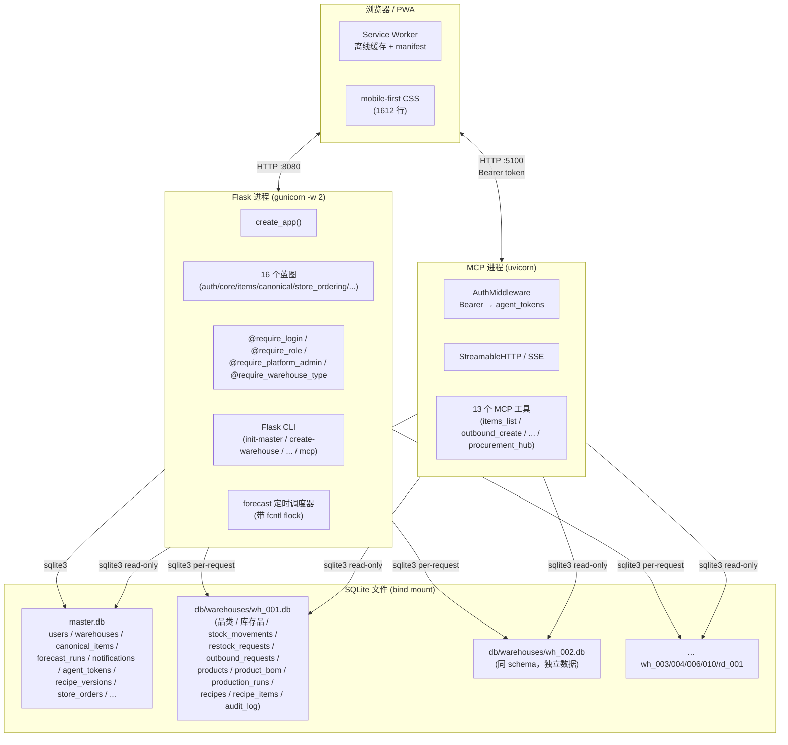

---

## 3. 部署拓扑

### 3.1 Dev 环境

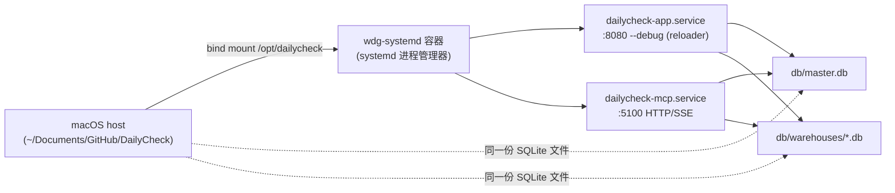

**关键**：bind mount 实时同步，**改 .py Flask 自动 reload**，**MCP 进程无 reloader**，改 `mcp_server/*.py` 必须手工 `systemctl restart dailycheck-mcp`。

### 3.2 Prod 环境

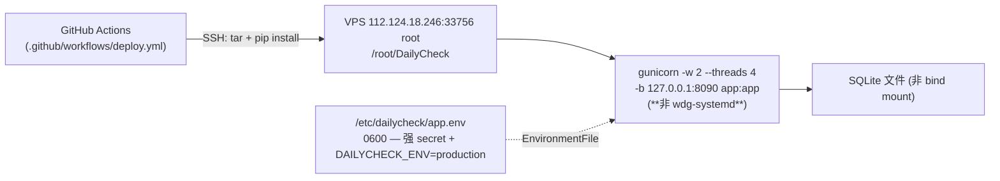

### 3.3 ⚠️ 部署重大差异（必读）

| 维度 | Dev | Prod |
|------|-----|------|
| **时区** | UTC | **Asia/Shanghai (CST+8)**，unit 未设 TZ |
| **数据库路径** | bind mount（容器/host 同一文件） | 本地文件系统 |
| **进程管理器** | systemd in container | gunicorn -D（无 systemd） |
| **Flask reload** | `--debug` 自动 reload | 无 |
| **MCP 进程** | systemd unit | **未部署**（MCP 只在 dev 跑） |
| **部署方式** | mount + edit | `pkill gunicorn → tar → pip install → gunicorn -D`（无回滚） |
| **入口端口** | :8080 / :5100 | :8090（仅 Flask） |

---

## 4. 数据架构

### 4.1 整体形态

```
db/
├── master.db                          # 单文件，全局
└── warehouses/
    ├── wh_001.db  (中央仓 storefront)
    ├── wh_002.db  (新世界 storefront)
    ├── wh_003.db  (新天地 storefront)
    ├── wh_004.db  (韩国街 storefront)
    ├── wh_006.db  (浦发时光里 storefront)
    ├── wh_010.db  (泰柯富阳 storefront)
    ├── wh_000.db  (配送中心 distribution_center)
    └── rd_001.db  (研发 rd)
```

### 4.2 master.db 核心表（ER 简图）

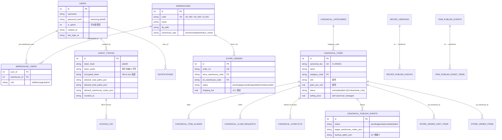

### 4.3 warehouse.db 核心表（ER 简图）

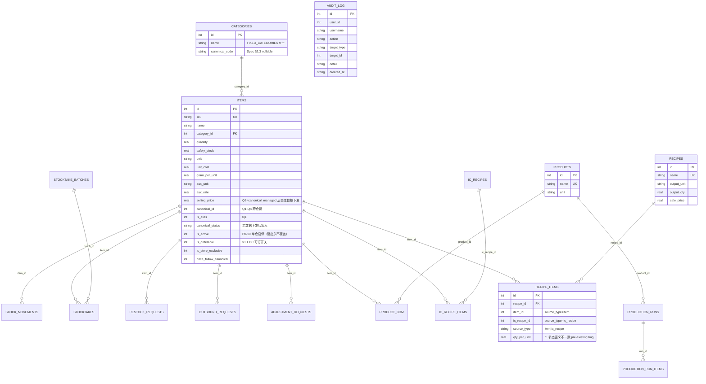

### 4.4 Schema 迁移约定（铁律）

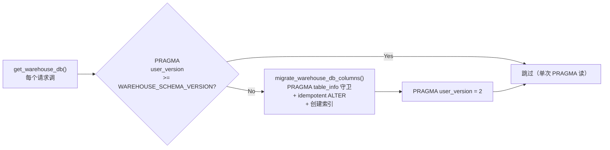

- **`WAREHOUSE_SCHEMA_VERSION = 2`**，改了 ALTER 块必须 bump。
- **新增 items 列只加到 `migrate_warehouse_db_columns()`，不加进 `WAREHOUSE_SCHEMA`**（tests 断言 WAREHOUSE_SCHEMA 不含 is_orderable）。
- **`init_master_db()`** 用 `fcntl.flock` 保护 gunicorn 多 worker 并发 ALTER。
- **所有绕过 `get_warehouse_db()` 直连 sqlite3 的代码（CLI / 测试 / MCP）必须先调 migrate**。

---

## 5. 应用层模块图

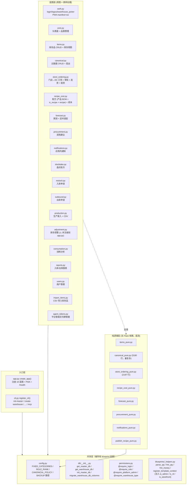

**约定**：`xxx.py`（蓝图，含 Flask 视图）和 `xxx_pure.py`（纯函数/类，便于测试和复用）成对出现。改业务规则时**优先改 pure**，再让蓝图调它。

---

## 6. 蓝图依赖关系

```mermaid
flowchart LR
    classDef root fill:#fef3c7,stroke:#f59e0b,stroke-width:2px
    classDef pure fill:#dbeafe,stroke:#2563eb
    classDef bp fill:#e0e7ff,stroke:#4f46e5

    Shared["config / db / permissions<br/>(_helpers)"]:::root

    Auth[auth.py]:::bp --> Shared
    Auth -->|audit()| RecipeCost
    Items[items.py]:::bp --> Shared
    Items --> ItemsPure[items_pure.py]:::pure
    Canonical[canonical.py]:::bp --> Shared
    Canonical --> CanonicalPure[canonical_pure.py]:::pure
    StoreOrdering[store_ordering.py]:::bp --> Shared
    StoreOrdering --> StoreOrderingPure[store_ordering_pure.py]:::pure
    StoreOrderingPure --> Procurement[procurement.py]:::bp
    StoreOrderingPure --> NotificationsPure[notifications_pure.py]:::pure
    StoreOrderingPure --> ProcurementPure[procurement_pure.py]:::pure
    RecipeCost[recipe_cost.py]:::bp --> Shared
    RecipeCost --> RecipeCostPure[recipe_cost_pure.py]:::pure
    RecipeCost --> PublishRecipePure[publish_recipe_pure.py]:::pure
    RecipeCost -->|audit()| Auth
    Forecast[forecast.py]:::bp --> Shared
    Forecast --> ForecastPure[forecast_pure.py]:::pure
    Procurement --> ProcurementPure
    Notifications[notifications.py]:::bp --> Shared
    Notifications --> NotificationsPure
    Users[users.py]:::bp --> Shared
    AgentTokens[agent_tokens.py]:::bp --> Shared
    Others["stocktake/restock/outbound/production/<br/>adjustment/consumption/reports/<br/>core/import_items"]:::bp --> Shared
```

**依赖原则**：
- 蓝图层可以调 **pure 层 + 其他蓝图层**（如 `recipe_cost` 调 `auth.audit()`）。
- **pure 层不依赖 Flask 上下文**（不 import flask），便于测试和跨场景复用。
- `store_ordering_pure` 是跨最多业务的纯模块（订货同时触发采购缓存重建 + 通知事件）。

---

## 7. 请求生命周期

### 7.1 Web（Cookie 会话）

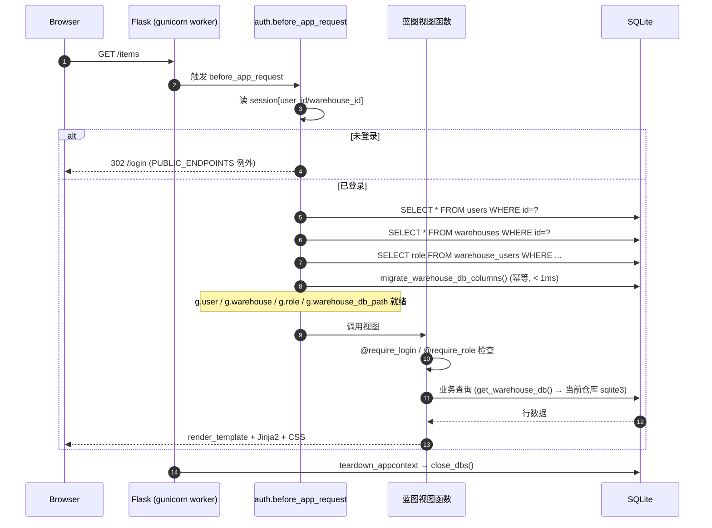

### 7.2 MCP（HTTP Bearer）

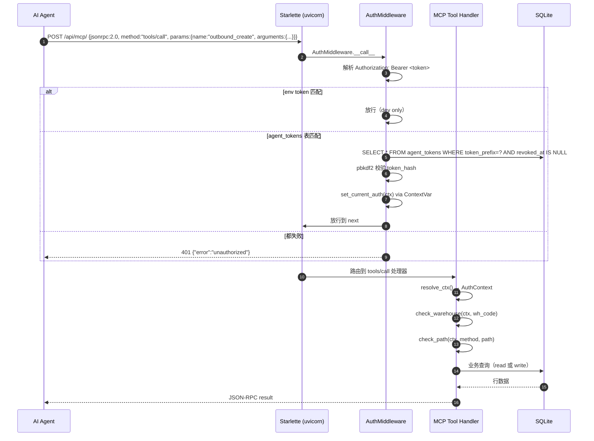

---

## 8. 鉴权架构

### 8.1 三种身份

| 身份 | 用途 | 凭证 | 鉴权位置 |
|------|------|------|----------|
| **Web 用户** | 浏览器访问 | Flask session cookie（HttpOnly + SameSite=Lax，prod Secure） | `auth.before_app_request` |
| **MCP Bearer** | AI Agent 通过 HTTP 调用 | `Authorization: Bearer <token>` | `mcp_server/main.py:AuthMiddleware` |
| **CLI** | `flask ...` 命令 | 无（进程级，信任部署环境） | 直接 sqlite3 |

### 8.2 装饰器

| 装饰器 | 文件 | 作用 |
|--------|------|------|
| `@require_login` | `permissions.py` | 必须登录 + 已选仓库（除非 view 在 `WAREHOUSE_EXEMPT`） |
| `@require_role(min_role)` | 同上 | 必须达 `min_role`（staff=1/manager=2/admin=3）；`is_admin` 平台管理员 bypass |
| `@require_platform_admin` | 同上 | 必须 `g.user.is_admin=1`（不绕过） |
| `@require_warehouse_type(*types)` | 同上 | 当前仓库类型必须在白名单（rd/storefront/dc） |
| `storefront_only` / `distribution_center_only` | 同上 | 上述的白名单语义糖 |

### 8.3 鉴权关键路径

```mermaid
flowchart TB
    Request[HTTP Request] --> Check{endpoint 在<br/>PUBLIC_ENDPOINTS?}
    Check -->|Yes| Skip[跳过鉴权]
    Check -->|No| HasUser{session 有 user_id?}
    HasUser -->|No| Login[302 → /login]
    HasUser -->|Yes| LoadUser[加载 g.user/warehouse/role]
    LoadUser --> Decorator{视图装饰器}
    Decorator -->|@require_login| NeedWh[需要 warehouse_db_path]
    Decorator -->|@require_role| RoleCheck{role 达 min_role?}
    Decorator -->|@require_platform_admin| AdminCheck{is_admin?}
    Decorator -->|@require_warehouse_type| TypeCheck{wh_type 匹配?}
    NeedWh --> RoleCheck
    RoleCheck -->|Yes| Execute[执行视图]
    RoleCheck -->|No| Flash403[flash + abort 403]
    AdminCheck --> TypeCheck
    TypeCheck --> Execute
```

**注意**：`@require_role` 和 `@require_platform_admin` 都允许 `is_admin=1` 通过。`@require_platform_admin` 反而**要求** `is_admin`，这是有意区分（前者"在这个仓库里权限够" vs 后者"全局管理权限"）。

---

## 9. MCP 架构

### 9.1 进程拓扑

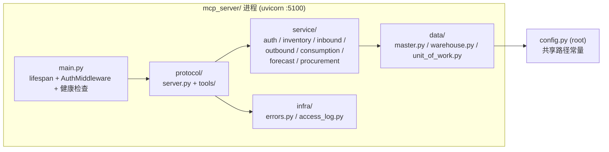

### 9.2 13 个 MCP 工具

| 工具 | 服务模块 | 路径 ACL | 仓库范围 |
|------|----------|----------|----------|
| `items_list` | inventory | read | per-token |
| `items_detail` | inventory | read | per-token |
| `movements_list` | inventory | read | per-token |
| `restock_create` | inbound | write | per-token |
| `restock_list` | inbound | read | per-token |
| `outbound_create` | outbound | write | per-token |
| `outbound_list` | outbound | read | per-token |
| `outbound_rollback` | outbound | write | per-token |
| `warehouse_consumption` | consumption | read | per-token |
| `item_consumption` | consumption | read | per-token |
| `item_forecast` | forecast | read | per-token |
| `procurement_store` | procurement | read | per-token |
| `procurement_hub` | procurement | read | per-token |

### 9.3 双传输模式

| 模式 | 入口 | 鉴权 | 用途 |
|------|------|------|------|
| **stdio** | `flask mcp` | 进程 env `DAILYCHECK_MCP_TOKEN` | 本地 Claude Code |
| **HTTP/SSE + StreamableHTTP** | `python -m mcp_server` (HTTP 模式) | Bearer → agent_tokens 表（per-token 仓库/路径 ACL） | 远程 Agent |

**HTTP 入口路径**：
- `/sse`（legacy SSE）
- `/messages/`（SSE POST）
- `/api/mcp/`（StreamableHTTP，**推荐**）
- `/health`（不需鉴权）

### 9.4 鉴权回退链

```mermaid
flowchart TB
    Req[HTTP Request with Bearer] --> Env{DAILYCHECK_MCP_TOKEN<br/>env 匹配?}
    Env -->|Yes| Pass1[放行（dev/兼容）]
    Env -->|No| Table[查 agent_tokens 表<br/>WHERE token_prefix=?<br/>AND revoked_at IS NULL]
    Table --> Found{找到 + pbkdf2 通过?}
    Found -->|Yes| SetCtx[set_current_auth(ctx)<br/>记录 ContextVar]
    Found -->|No| Legacy[查 NULL 前缀的历史行<br/>回退路径]
    Legacy --> Found
    Found -->|No| Deny[401 unauthorized]
    SetCtx --> Pass2[放行到工具处理器]
    Pass1 --> Pass2
    Pass2 --> Handler[工具 handler 用 resolve_ctx() 取 ctx]
    Handler --> ACL{check_warehouse +<br/>check_path 通过?}
    ACL -->|Yes| Exec[执行业务]
    ACL -->|No| Forbidden[403 ForbiddenError]
```

---

## 10. 业务领域模型

### 10.1 仓库类型

| 类型 | 用途 | 行为 |
|------|------|------|
| `storefront` | 门店（有实体库存） | 出入库/盘点/补货可见 |
| `rd` | 研发中心 | **无库存**；主数据管理；ic_recipe 编写 |
| `distribution_center` | 配送中心 | 给门店供货；store_ordering 审批/发货 |

### 10.2 Canonical 主数据治理（Q1-Q7）

| 策略 | 值（v4） | 含义 |
|------|----------|------|
| Q1 门店自建新主数据 | `deny` | 门店不能自建全新品项（白名单 = 空） |
| Q2 门店自治字段 | `open` | 允许门店自定义字段 |
| Q3 主数据删除 | `deactivate_only` | 只允许停用，禁止物理删除 |
| Q4 扇出冲突 | `freeze` | 冻结冲突字段，人工处理 |
| Q6 价格归属 | `canonical_managed` | 售价/采购价收归主数据 + 扇出下发 |
| Q7 库存零丢失 | `strict` | 扇出前自动备份；写库前 `shutil.copy2`；禁止真库写测试 |

### 10.3 Store Ordering 状态机

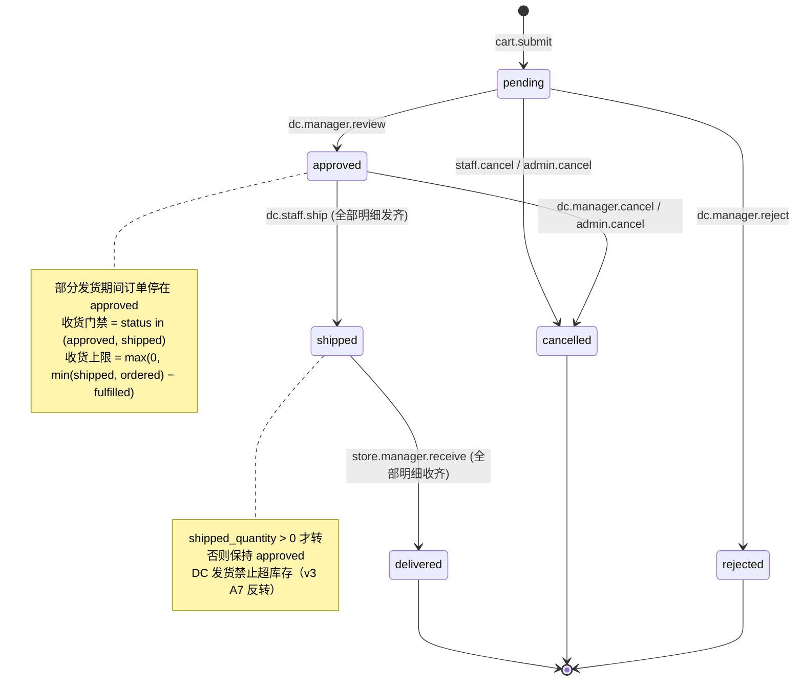

### 10.4 Canonical 扇出流程

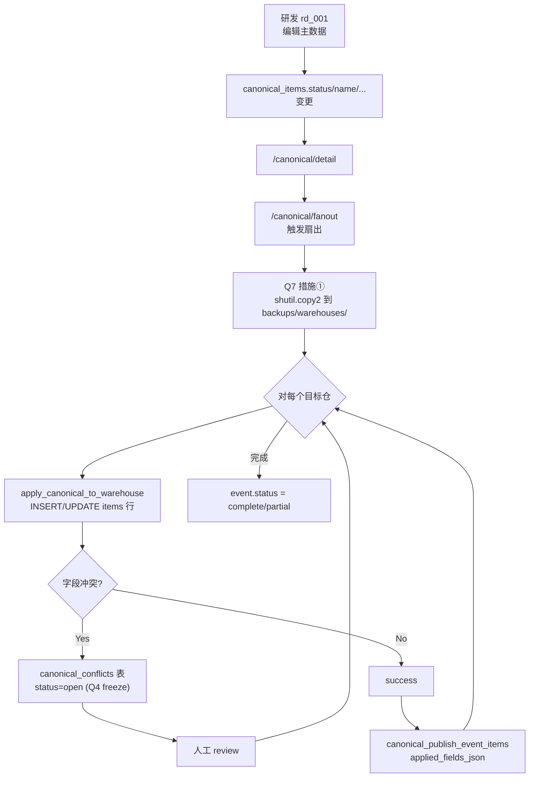

**两道闸门**（`fac7691` 定稿）：
1. **总闸** = `canonical_items.status='active'`（主数据侧）
2. **分闸** = 仓内 `items.is_orderable=1`（DC 单独控制可订）

主数据 disable 后**不自动扇出到仓内**（`is_active` 仍是 1）；仓内列表要等手动 `/canonical/fanout` 才生效。

---

## 11. PWA / 移动端

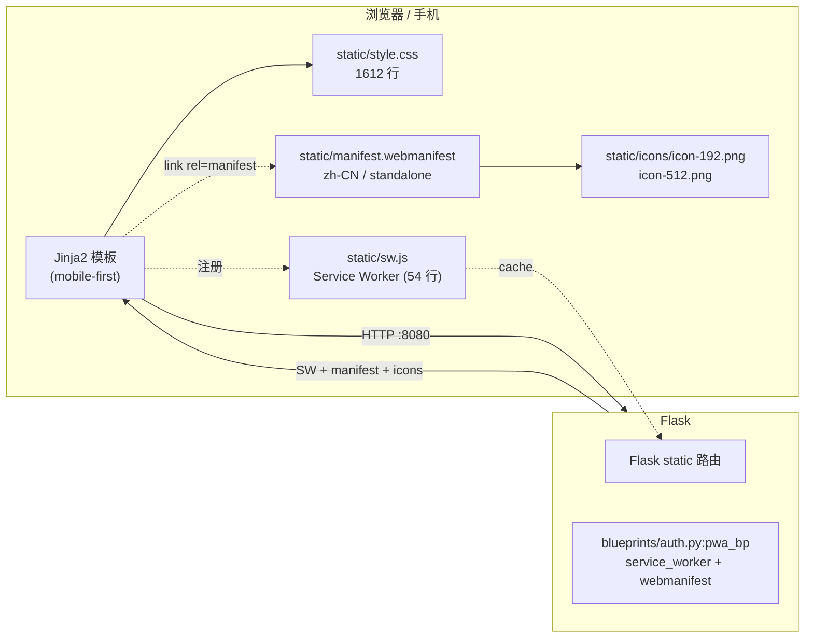

**现状**：
- ✅ Service Worker 离线缓存 + PWA install
- ✅ manifest.webmanifest（standalone、minimal-ui、theme_color teal）
- ❌ **无 push notifications**
- ❌ **无 background sync**（离线写不能排队）
- ❌ iOS Safari PWA 有已知限制（storage quota、push）

---

## 12. 测试架构

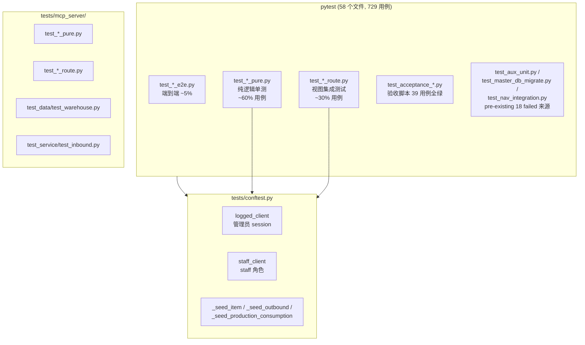

**运行**：
```bash
~/.local/bin/python3.12 -m pytest --basetemp=/tmp/pytest-dc   # 必须带 basetemp
```

**基线（2026-10-10）**：18 failed / 711 passed — 失败集与各次新开发严格逐行一致（owner SOP「零新增对比法」）。

**Pre-existing 18 failed 分布**：
- `mcp_server×2 / aux_unit×2 / forecast_pure×8 / items_route×2 / nav_integration×2 / procurement_route×1 / recipe_cost_route×1`

---

## 13. 关键约定与坑

### 13.1 Schema 迁移

- ✅ 任何新列**只**加到 `migrate_warehouse_db_columns()`，**不**进 `WAREHOUSE_SCHEMA`（tests 断言）
- ✅ 改 ALTER 块必须 bump `WAREHOUSE_SCHEMA_VERSION`（当前 = 2）
- ✅ master.db 任何 schema 变更同步进 `init_master_db()`，否则 prod 首请求 `no such column`
- ✅ `init_master_db()` 用 `fcntl.flock` 保护 gunicorn 多 worker

### 13.2 Jinja2 陷阱

- ❌ **不要**在 `base.html` sidebar block 里 `` — block scope 不传子模板
- ✅ `is_admin` / `is_rd` / `is_storefront` 必须从 `blueprints/_helpers.py:register_template_context` 注入
- ✅ 仓库类型权威来源：`g.warehouse.warehouse_type`

### 13.3 时区不一致（**生产 bug**）

- **dev 容器 = UTC**（`/etc/timezone`）
- **prod 进程 = CST+8**（unit 未设 TZ）
- `datetime.now()` = 进程时区；`datetime('now')` SQL = UTC
- **时间类 bug 在 dev 不可复现、生产必现**

### 13.4 数量精度

- 所有数量用 `Decimal` + 2dp 量化（`_helpers.parse_qty` / `fmt_qty`）
- float 会被 `0.1+0.2=0.30000000000000004` 污染

### 13.5 主数据铁律

- `canonical_pure.NEVER_TOUCH_COLUMNS` 列出扇出永不覆盖的字段（仓内 `is_active` / `is_orderable` 等）
- `fanout` 必须先备份（`backups/warehouses/{code}-{tag}.db`）

### 13.6 dev 副本验证套路

```python
# 1. 复制 db
shutil.copytree('/opt/dailycheck/db', tmp/'db')
# 2. 在 import app 之前覆盖路径（auth.py 用 from config import BASE_DIR 在导入期绑定）
import config, db
config.BASE_DIR = tmp; config.MASTER_DB = tmp/'db/master.db'
config.WAREHOUSE_DB_DIR = tmp/'db/warehouses'
db.MASTER_DB = config.MASTER_DB; db.WAREHOUSE_DB_DIR = config.WAREHOUSE_DB_DIR
# 3. import app 并设 session
from app import create_app
app = create_app()
with app.test_client() as c, c.session_transaction() as s:
    s['user_id'] = ...; s['warehouse_id'] = ...
# 4. 测试
# 5. shutil.rmtree(tmp)
```

⚠️ **坑**：手动 `Cookie: session=<签名串>` 在 `test_client` 里**不被识别**，必须用 `session_transaction()`。

---

## 14. pre-existing 风险清单

| 风险 | 严重度 | 状态 | 处理 |
|------|--------|------|------|
| 18 failed 测试 | 中 | pre-existing | 商业化前必须归零 |
| 时区不一致 | **高** | pre-existing | 多租户改造前必修 |
| 配方成本 qty 语义不一致 | **高** | pre-existing (2026-09-02 起) | 财务对账会出错，待 owner 拍板 |
| `adjustment.py` 未注册 | 低 | pre-existing | 路由 404，前向兼容保留 |
| `fix/mcp-streamable-http` 落后主分支 | **高** | pre-existing | prod 不含本轮任何 P0 收敛 |
| `mcp-server` 进程 prod 未部署 | 中 | pre-existing | 仅 dev 有 |
| PWA push / background sync 缺失 | 中 | pre-existing | 商业化差异化卖点 |

---

## 15. 文档索引

### 必读

- [`CLAUDE.md`](../CLAUDE.md) — 项目权威文档（dev 环境、目录、提交规范）
- [`AGENT.md`](../AGENT.md) — 精简开发指南
- [`docs/DEV_ENV.md`](DEV_ENV.md) — wdg-systemd 容器部署细节
- [`docs/mcp-configuration.md`](mcp-configuration.md) — MCP 接入

### 业务领域

- [`docs/2026-10-09-item-master-unify-plan.md`](2026-10-09-item-master-unify-plan.md) — canonical 主数据统一（P0-1~13）
- [`docs/2026-10-03-canonical-item-design.md`](2026-10-03-canonical-item-design.md) — 主数据原始设计
- [`docs/2026-10-03-canonical-item-prd.md`](2026-10-03-canonical-item-prd.md) — 主数据 PRD
- `docs/2026-10-04-store-ordering-*` — 订货流程 5 篇文档 + 4 张 mermaid
- `docs/2026-10-05-store-ordering-*` — v2/v3 迭代

### 评估 / 计划

- [`docs/2026-10-10-commercialization-gap-assessment.md`](2026-10-10-commercialization-gap-assessment.md) — 商业化差距评估

### 集成

- `docs/integrations/dailycheck-mcp/` — MCP 接入文档 + examples

### 工作记忆

- [`.workbuddy/memory/MEMORY.md`](../.workbuddy/memory/MEMORY.md) — 跨 session 项目约定
- `.workbuddy/memory/YYYY-MM-DD.md` — 每日工作日志
- [issue-reports/](../issue-reports/) — 自动生成的 issue 检查报告（55 份）

---

## 附：维护本文件的工作流

每次 commit 触及下列子系统时，**必须**同步更新对应章节：

| 触及文件 | 须更新章节 |
|----------|-----------|
| `app.py` / `config.py` / `permissions.py` | §2 §3 §8 |
| `db/*.py` | §4 |
| `blueprints/auth.py` | §7 §8 |
| `blueprints/items*.py` | §5 §6 §10 |
| `blueprints/canonical*.py` | §5 §6 §10.2 §10.4 |
| `blueprints/store_ordering*.py` | §5 §6 §10.3 |
| `blueprints/recipe_cost*.py` | §5 §6 |
| `blueprints/forecast*.py` / `procurement*.py` / `notifications*.py` | §5 §6 |
| `blueprints/production.py` / `stocktake.py` / `restock.py` / `outbound.py` / `adjustment.py` / `consumption.py` / `reports.py` | §5 §6 |
| `blueprints/users.py` / `import_items.py` / `agent_tokens.py` | §5 §6 §8 |
| `mcp_server/*.py` | §9 |
| `templates/**` / `static/**` | §11 |
| `tests/**` | §12 |
| `.github/workflows/*` / `deploy/**` / `scripts/**` | §3 §12 §附 |
| `docs/ARCHITECTURE.md`（本文件） | 自更新 |

**门禁脚本**：`scripts/git-hooks/pre-commit` 已装。运行 `python scripts/arch_touched_sections.py` 看本 commit 该改哪些章节。
